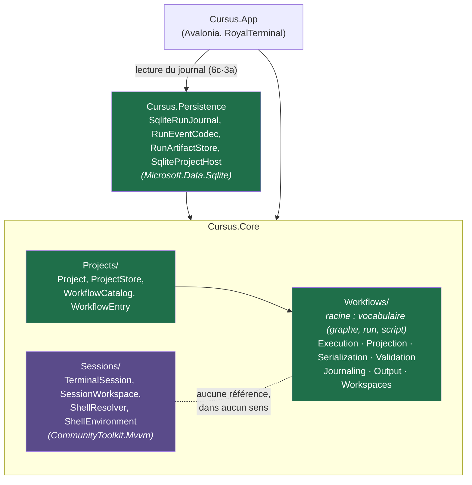
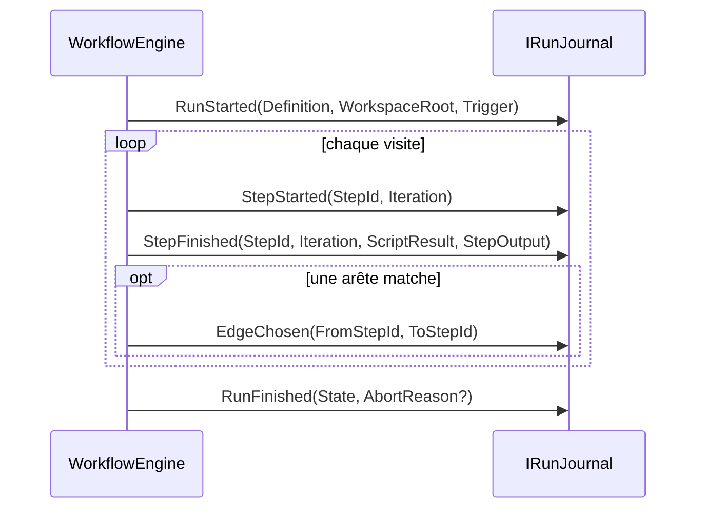

# Architecture de Cursus

> **Statut** : document vivant, à jour du commit `4de576a` (*la vue graphe brute — D-016*). Dernier jalon de code : *le calcul de disposition du graphe — `GraphLayout`, sœur **statique** de `GraphProjection`, layering par couches + arêtes-retour, cœur testable du rendu à venir* (§4.18, `D-017`), par-dessus la vue graphe brute (§4.18) et l'écran de run (6c·3c). Suite de tests : **231 verts** (203 Core + 28 Persistence), build 0 warning.
>
> **Ce document détient l'état réel du dépôt** : ce qui est construit, où, et ce qui n'est pas relié. Il ne redit pas les autres documents :
> - `docs/design/noyau-deterministe.md` — le modèle cible du noyau v0 et ses questions ouvertes ;
> - `docs/design/presentation.md` — le *comment* de la jonction UI : composition, observation d'un run, pièges Avalonia (§7.12 en détient la décision) ;
> - `docs/design/schemas.md` — **le compagnon visuel** : les cartes d'état (modules, coutures, séquences) en Mermaid, et la convention de schéma-delta des plans. N'ajoute aucune décision ; le présent fichier fait foi ;
> - `docs/design/decisions.md` — **le journal de décisions (ADR)** : le récit des pivots et arbitrages dans le temps, append-only, avec les alternatives écartées et les décisions superséedées. Là où le présent fichier décrit l'état *présent*, le journal garde le *pourquoi historique* que l'état ne conserve pas ;
> - `docs/design/parcours.md` — le *quoi* du point de vue de l'utilisateur : la cible d'usage et le parcours réduit du jalon 6 (§7.13 en détient les conséquences) ;
> - `docs/design/modele-metier.md` — le modèle cible orienté agents (couches, entités, machines à états) ;
> - `docs/research/agentic-workflows-landscape.md` — les preuves externes (comparatifs, sandboxing, PTY) ;
> - `docs/research/trackers/synthese.md` — les quatre trackers superposés (Linear, Jira, GitHub, GitLab) et ce que leur terrain impose au port de tâches (§7.13 en détient les conséquences) ;
> - `docs/reference/royalterminal-0.4.0.md` — l'API RoyalTerminal sondée, faute de documentation éditeur ;
> - `docs/design/maquettes/jalon-6.html` — **archive sans autorité**, à ouvrir dans un navigateur : les maquettes du 2026-07-21, conservées pour le visuel. **Non tenues à jour** ; les décisions qu'elles ont produites sont dans `parcours.md` et `presentation.md` §9, qui font seuls foi ;
> - `docs/design/maquettes/run-flux-6c3c.html` — **archive sans autorité** (2026-07-23) : la visualisation du flux de l'écran de run — traversée déroulée (une visite par nœud, boucle explicite), nœud sélectionné pilotant le log, exception sombre du terminal. Même statut que ci-dessus : conservée pour le visuel, non tenue à jour, sans valeur de spécification ;
> - `CLAUDE.md` (racine) — le contrat de travail, qui désigne le présent fichier comme référence et impose son entretien (§8).
>
> Trois registres tenus partout : **CONSTRUIT** / **TRANCHÉ, NON CONSTRUIT** / **QUESTION OUVERTE**.

## Sommaire

1. [État du dépôt et prise en main](#1-état-du-dépôt-et-prise-en-main)
2. [Les deux moitiés et la jonction manquante](#2-les-deux-moitiés-et-la-jonction-manquante)
3. [Le pivot : pourquoi un noyau déterministe d'abord](#3-le-pivot--pourquoi-un-noyau-déterministe-dabord)
4. [Le noyau déterministe](#4-le-noyau-déterministe)
5. [Ajouter un StepKind : la recette](#5-ajouter-un-stepkind--la-recette)
6. [La partie sessions/PTY](#6-la-partie-sessionspty)
7. [Décisions structurantes](#7-décisions-structurantes)
8. [Règles de contribution](#8-règles-de-contribution)
9. [Trous connus et questions ouvertes](#9-trous-connus-et-questions-ouvertes)

---

## 1. État du dépôt et prise en main

**Cursus** vise à devenir un manageur de workflow agentique : orchestrer des agents de code tournant dans de vrais terminaux, avec supervision humaine de première classe. La différence structurante avec le reste du champ : **l'unité d'exécution visée n'est pas un appel LLM, c'est une session — un PTY vivant exécutant un agent comme boîte noire**. Cela rend inapplicables les abstractions « Agent = LLM + tools + instructions », mais parfaitement réutilisable la couche d'orchestration des mêmes frameworks (graphe d'étapes, séparation définition/exécution, checkpoints, HITL).

### 1.1 Ce qui existe — CONSTRUIT

| Moitié | Emplacement | État |
|---|---|---|
| Noyau déterministe | `src/Cursus.Core/Workflows/` (rangé en vocabulaire racine + 7 sous-namespaces — voir §4) | Moteur de traversée, runner de process réel (+ stratégie `PATH`, 6c·3c), contexte de run, validateur de graphe, format de fichier JSON bidirectionnel, vocabulaire d'événements de journal (le flux porte le `runId` dès l'ouverture, 6c·3c), puits de sortie en flux (6a), provisionnement de workspace isolé par worktree git (6b), **deux projections sœurs** (`Projection/`, event-fed) : `RunProjection` plie le flux en trajectoire + statut + contrôle 3 positions (6c·3c), `GraphProjection` le plie en overlay de graphe qui montre le **non-parcouru** (vue graphe) ; à côté, `GraphLayout` en dispose la structure sur une grille par couches (calcul **pur**, statique, arêtes-retour comprises). **152 tests.** Fonctionne bout en bout, sans UI ; plusieurs runs de front sur un même projet. |
| Projet & catalogue | `src/Cursus.Core/Projects/` (9 fichiers) | La disposition `.cursus/`, sa création et sa relecture, la liste et le chargement des workflows **depuis le disque**, l'emplacement des worktrees, le registre machine des projets connus (6c·1) et `ProjectHost` — la racine de composition d'un projet ouvert : lire le passé, **lancer** (6c·3b), **relire les événements** d'un run (`ReadEvents`, 6c·3c). **38 tests.** Voir §4.11, §4.14, §4.16, §4.17. |
| Persistance | `src/Cursus.Persistence/` | Journal SQLite (écriture sérialisée), magasin d'artefacts sur disque avec **suiveur de tail** (6c·3c), et le préréglage SQLite de `ProjectHost`. **28 tests.** Un run survit au process ; le flux live d'un run et sa relecture donnent la **même** projection (preuve end-to-end, 6c·3c). |
| Écran de run & sessions | `src/Cursus.App/` (+ `src/Cursus.Core/Sessions/`) | App Avalonia qui ouvre de vrais terminaux via RoyalTerminal, et l'**écran de run** (6c·3c) : cliquer un workflow le lance et déroule sa trajectoire, le log de la visite sélectionnée se suit en direct, un contrôle à trois positions l'arrête ; un run passé se rouvre en relecture. Présentation non testée (§7.12) ; logique de sessions testée (**13 tests**). |

Le noyau et la persistance se connaissent (le second implémente les contrats du premier) ; **ni l'un ni l'autre n'est relié à la moitié sessions/PTY** (§2). Depuis 6c·3a, **`Cursus.App` référence `Cursus.Persistence`** ; depuis 6c·3c la jonction UI est **close** (§9.4) : l'app lit le passé d'un projet, **lance** ses workflows, **suit** le flux d'un run en direct, **tail** le log de ses visites, et en montre le **graphe** — vue sœur brute du non-parcouru (§4.18).

**Le dépôt est lui-même un projet Cursus** : `.cursus/` porte son `project.json` et deux workflows réels (`build`, `verifier`), gardés valides par `CursusProjectTests`.

### 1.2 Solution, projets, dépendances

`Cursus.slnx` (format XML .NET 10) regroupe `src/Cursus.App` (Avalonia, `OutputType=WinExe`), `src/Cursus.Core` (bibliothèque), `src/Cursus.Persistence` (bibliothèque) et deux projets de tests xUnit. Tous en `net10.0`, `Nullable` activé partout, `ImplicitUsings` sur tout sauf App.



Quatre faits non triviaux, le reste se lit dans les `.csproj` :

- **Le noyau déterministe a zéro dépendance externe** — mais c'est une propriété de `Workflows/` et `Projects/`, **pas du projet `Cursus.Core`**, qui référence `CommunityToolkit.Mvvm` pour `Sessions/` (voir plus bas). `System.Text.Json` et `System.Diagnostics.Process` sont dans le framework. C'est un argument explicite du choix JSON (§7.4), et la raison pour laquelle SQLite vit dans un projet séparé (§7.11).
- **`Cursus.Persistence` épingle `SQLitePCLRaw.bundle_e_sqlite3` en 2.1.12**, au-dessus de la 2.1.11 que tire `Microsoft.Data.Sqlite` 10.0.10 : c'est le **binaire natif** de cette 2.1.11 qui porte une faille de sévérité haute (NU1903). La raison et la condition de sortie sont dans le `.csproj`. C'est le standard « 0 warning » qui l'a fait apparaître.
- `CommunityToolkit.Mvvm` est référencé par `Cursus.Core` mais **utilisé uniquement par `SessionWorkspace`**, jamais par `Workflows/`.
- Le provider VT natif est `RoyalApps.RoyalTerminal.GhosttySharp.Native.OSX` : **`Cursus.App` ne tourne aujourd'hui que sur macOS**. `Cursus.Core` et les tests sont portables POSIX (macOS/Linux) ; le cross-platform revendiqué comme différenciateur est une **cible, pas un acquis** — il exigera un `INativeVtProcessorProvider` par OS.

### 1.3 Faire tourner

```bash
dotnet build                          # attendu : 0 warning
dotnet test                           # attendu : 231 verts (chiffre de référence de ce document)
dotnet run --project src/Cursus.App   # développement
build/package-macos.sh [--install]    # Cursus.app installable (§6.6)
```

Prérequis : SDK .NET 10, macOS pour l'app. Le SDK est **épinglé** par `global.json` (10.0.302, `rollForward: latestFeature`) depuis qu'un build produit un artefact installable — tolérable en `dotnet run`, beaucoup moins quand on distribue. Toujours absents : `Directory.Packages.props`, `NuGet.config`, CI, LICENSE.

### 1.4 Hygiène de dépôt

Branche `main`, seule branche, une quarantaine de commits (le compte exact rote à chaque commit ; c'est `git rev-list --count HEAD` qui fait foi). **Aucun remote configuré** : dépôt strictement local, sans sauvegarde hors machine — c'est le risque le plus concret du dépôt aujourd'hui.

**`README.md` a été refait** (jalon 0) : réduit à ce qu'il est seul à devoir dire — prérequis, commandes de développement, commande d'installation, et les deux pièges de l'application installée (signature ad-hoc, `PATH` tronqué). Il renvoie ici pour tout le reste, plutôt que de dupliquer un état qui se périmerait.

Périmé encore : le « Premier jalon recommandé » qui clôt `docs/research/agentic-workflows-landscape.md` (jalon 1 = détection d'état, jalon 2 = worktree…). Ce plan est **antérieur au pivot** et ne fait plus foi ; la trajectoire courante est celle du §9.

**Convention de langue** : code (classes, méthodes, identifiants) en **anglais**, prose, commentaires, messages de test et documentation en **français**, avec diacritiques complets. Seul écart du dépôt : les commentaires de template Avalonia restés en anglais dans `src/Cursus.App/Program.cs`.

---

## 2. Les deux moitiés et la jonction manquante

C'est le trou principal du dépôt, et la première chose à savoir avant d'y toucher.

Aucun fichier de `Workflows/` ne mentionne `Sessions`, `TerminalSession` ou `SessionWorkspace` ; aucun fichier de `Cursus.App/` ne mentionne `Workflow`. **`WorkflowEngine` n'est appelé que depuis les tests.**

Concrètement :

- **L'UI n'offre aucun moyen** de charger, valider, lancer, visualiser ou annuler un `WorkflowRun`.
- `SessionWorkspace` ne connaît que `AddShellSession()` : pas d'`AddWorkflowSession`, pas d'`AddStepSession`.
- `SessionKind.Agent` est un placeholder mort : jamais produit dans le dépôt, et `TerminalSession.Kind` n'est lu par aucun consommateur de production (seulement asserté dans un test) — bien que le constructeur public l'accepte.
- Les modèles de « où ça tourne » divergent : `TerminalSession.WorkingDirectory` est un chemin **absolu résolu à la création** ; `StepDefinition.WorkingSubdirectory` est **relatif**, absolutisé par `RunContext`. Rien ne fait le pont.

### 2.1 Deux mécanismes d'exécution de process qui s'ignorent

| | Côté UI | Côté noyau |
|---|---|---|
| Point d'entrée | `TerminalControl.StartPty(shellPath, wd, args)` | `IProcessRunner.RunAsync(ScriptSpec, ct)` |
| Nature | interactif, PTY | non interactif, tubes redirigés |
| Sortie | non capturée | stdout/stderr + code de sortie capturés, **en fin de process seulement** |
| Contrôle | aucun timeout, aucune annulation modélisée | timeout + annulation |
| Env | fusionné par-dessus l'app hôte ; `StartPty` **n'expose pas l'env** | surcharge clé par clé sur l'héritage |

**Aucun adaptateur entre les deux.**

### 2.2 Comment les recoudre — QUESTION OUVERTE

Deux coutures sont structurellement disponibles ; **aucune n'est tranchée**, et le choix a des conséquences opposées :

1. **Un `PtyProcessRunner` derrière `IProcessRunner`.** `IProcessRunner` est la seule couture d'exécution du noyau : y brancher RoyalTerminal ne toucherait pas une ligne de `WorkflowEngine`. Mais cela force un PTY interactif dans un contrat conçu pour du non-interactif — pas de code de sortie fiable sans convention supplémentaire, sortie qui n'est pas « rendue » mais « coulée ».
2. **Un `StepKind` distinct (`AgentStep`) avec son propre exécuteur**, derrière la même abstraction de routage. C'est le chemin annoncé par le pari central (§3) et par `noyau-deterministe.md`. Plus de code à écrire, mais chaque monde garde son contrat.

Ce qui manque pour trancher : savoir si un `AgentStep` doit rendre un `ScriptResult` (et donc être routable par les gardes existantes) ou un résultat d'une autre forme.

**Pièges déjà identifiés pour ce jour-là** (sources : `landscape.md`, mémoire de sonde) : `StartPty(shell, wd, args)` n'expose pas l'environnement → passer par `IPty.Start(...)` / `StartSessionAsync(PtyTransportOptions{Command, Environment})` pour injecter port, hooks et allowlist ; `execvp` échoué → exit **127**, même convention que `ProcessRunner` ; passer des chemins absolus ; sur macOS en GUI le `PATH` hérité est tronqué (d'où le `-l` du shell de login) et `SSH_AUTH_SOCK` est absent, ce qui cassera l'auth git/SSH des futurs agents ; préférer `posix_spawn` à `fork()` (deadlock fork-in-multithread) ; centraliser un `ShellEscape` unique.

---

## 3. Le pivot : pourquoi un noyau déterministe d'abord

La trajectoire initiale commençait par le plus visible : une app Avalonia affichant des sessions terminal réelles avec un moteur VT natif. Une phase de recherche a ensuite produit un modèle métier complet orienté agents (`Task > Workspace > Session`, quatre machines à états, HITL, capture de scrollback, confinement OS). Deux commits au même horodatage (`a74d3cc` doc, `e683139` code) actent alors le pivot : on met le modèle agent de côté et on construit d'abord un moteur qui parcourt un graphe d'étapes-scripts et route chaque étape sur son code de sortie, **sans jamais savoir ce qu'est un agent**.

**Les trois raisons**, dans l'ordre :

1. **Le cœur d'orchestration doit rester neutre.** Netflix/Orkes Conductor a greffé l'IA sans réécrire son moteur : les agents y sont de nouveaux *task types*. Câbler l'IA en dur dans le moteur, c'est se condamner à le réécrire.
2. **Le déterministe est intégralement testable.** Le contrat d'une étape-script est fermé : `(commande, args, env, cwd) → (code de sortie, stdout, stderr, durée)`. Aucun PTY, aucun timing, aucune heuristique : on stube `IProcessRunner` avec des codes de sortie en dur et on assert **la traversée du graphe**.
3. **On retire tout ce qui rend Cursus difficile, on garde le squelette** : séparation définition/exécution, `WorkflowRun`/`StepRun`, arêtes gardées, boucles bornées, journal — tout cela existe sans un seul agent.

**Ce que le pivot achète** : pas de PTY (un `Process` à sorties redirigées, pas de `forkpty` — le PTY n'est nécessaire *que* pour un agent interactif, et c'est exactement la frontière entre les deux mondes) ; aucune question de persistance de flux (« le flux **est** l'artefact ») ; une seule machine à états construite au lieu de quatre.

> Nuance de registre : `noyau-deterministe.md` §5.1 prévoit **deux** machines à états v0 (`StepRun` : `Pending→Running→Succeeded/Failed/TimedOut/LaunchFailed`, et `WorkflowRun`). Dans le code, **seule celle du run existe** : `StepRun` est un record `(StepId, Iteration, Result, Output)` sans état ni identité ni horodatage. L'état d'une visite se déduit de son `ScriptResult`.

### 3.1 Limites d'une boucle sans agent

Une boucle déterministe **sait** faire retry, poll, until : une arête arrière n'a de sens que si ré-exécuter le script peut donner un autre résultat (retry d'un fetch réseau, polling d'un service).

Elle **ne sait pas** faire la boucle de dev auto-réparatrice. La boucle canonique `Verify → Dev` suppose qu'un acteur **change le monde entre deux tours** (l'agent corrige le code). Un back-edge purement scripté ré-exécuterait le même script à l'identique, pour un échec identique, jusqu'à `maxVisits`.

Conséquence pratique, aujourd'hui : **`maxVisits: 1` est le bon défaut** pour toute étape dont le résultat ne peut pas changer sans intervention. Une arête arrière qui n'est pas un retry est un bug de déclaration — et **le validateur ne le détecte pas**.

Le noyau déterministe fournit le mécanisme de boucle gardée ; l'agent fournira le seul acteur capable de la faire converger. Les deux moitiés sont complémentaires par construction, pas redondantes.

---

## 4. Le noyau déterministe

Namespace racine `Cursus.Core.Workflows` pour le **vocabulaire partagé**, plus **sept sous-namespaces** pour les services (ci-dessous), et `Cursus.Core.Projects` pour ce qui l'ancre sur un disque (§4.11). Le code est court et commenté : cette section donne la carte, l'artefact utilisateur, et ce qui n'est **pas** déductible d'une lecture.

**Découpage en sous-namespaces** (rangement du fourre-tout d'origine — 43 fichiers, jadis à plat sous un unique `Cursus.Core.Workflows`) : la racine ne garde que le **langage que tout le monde importe**, les services descendent chacun dans sa responsabilité, et **chaque exception suit l'invariant qu'elle protège** (levée par `WorkflowDefinition` → racine, par `WorkflowSerializer` → `Serialization`, par `RunContext` → `Execution`, par `GitWorkspaceProvisioner` → `Workspaces`).

| Namespace | Ce qu'il porte |
|---|---|
| `Cursus.Core.Workflows` (racine) | Le vocabulaire : définition du graphe (`WorkflowDefinition`, `StepDefinition`, `Edge`, `Guard`, `UnknownStepException`), état d'un run (`WorkflowRun`, `StepRun`, `RunSummary`, `RunTrigger`, `WorkflowEvent`), contrat de script/sortie (`ScriptSpec`, `ScriptResult`, `ScriptOutcome`, `StepOutput`, `OutputArtifact`) |
| `…Execution` | `WorkflowEngine`, `WorkflowLauncher`, `RunContext`, `IClock`, `IProcessRunner`, `ProcessRunner`, `PathStrategy`, `PathEscapesWorkspaceException` |
| `…Projection` | `RunProjection` (plie le flux en trajectoire + statut + sélection + contrôle), `RunVisit`, `RunControl` (enum 3 positions) ; **`GraphProjection`** (plie le même flux en overlay de graphe : structure + statut par nœud + arêtes traversées), `GraphNode`, `GraphEdge`, `GraphNodeStatus` ; **`GraphLayout`** (dispose la structure sur une grille par couches — calcul **pur/statique**), `NodePlacement`, `LaidOutEdge`. Deux projections sœurs + un calcul de disposition, cœur testable de l'écran de run (§4.18) |
| `…Serialization` | `WorkflowSerializer`, `WorkflowDocument`, `UnknownGuardException` |
| `…Validation` | `WorkflowValidator`, `ValidationReport` (+ `ValidationIssueKind`, `ValidationIssue`) |
| `…Journaling` | `IRunJournal`, `IRunJournalReader`, `InMemoryRunJournal`, `JournalEntry` |
| `…Output` | `IRunOutputStore`, `InMemoryRunOutputStore`, `IStepOutputSink` |
| `…Workspaces` | `IWorkspaceProvisioner`, `GitWorkspaceProvisioner`, `IProvisionedWorkspace`, `WorkspaceRequest`, `GitNotAvailableException` |

`Execution` et `Workspaces` se citent mutuellement (le moteur provisionne, le provisioner s'exécute) — un couplage tacite dans le fourre-tout, désormais explicite via `using`. La carte par fichier ci-dessous garde son rôle de référence des responsabilités individuelles.

### 4.1 Carte des fichiers

| Fichier | Rôle |
|---|---|
| `WorkflowDefinition.cs` | Le graphe : `EntryStep`, `Steps`, `GetStep(id)` |
| `StepDefinition.cs` | Un nœud : `Id`, `Name`, `Script`, `MaxVisits`, `OutEdges`, `WorkingSubdirectory?` (relatif) |
| `Edge.cs` · `Guard.cs` | `record Edge(Guard, string Target)` · garde abstraite `Matches(ScriptResult)` |
| `ScriptSpec.cs` | Ce qu'on lance : `FileName`, `Arguments`, `WorkingDirectory?`, `Environment?`, `Timeout?` |
| `ScriptOutcome.cs` · `ScriptResult.cs` | `Completed`/`TimedOut`/`LaunchFailed` · ce que le process a fait (`ExitCode`, `Outcome`, `Duration`) + `IsSuccess` |
| `IProcessRunner.cs` · `ProcessRunner.cs` | La seule couture I/O (ruisselle vers deux `Stream`) · son implémentation réelle (applique la `PathStrategy` au lancement) |
| `PathStrategy.cs` | Résout un binaire malgré un `PATH` GUI tronqué : `Resolve` (chemin absolu — .NET ne cherche pas dans le `PATH` de `StartInfo`) + `Enrich` (pour les descendants). Voir §9.2-15, `D-014` |
| `IRunOutputStore.cs` · `IStepOutputSink.cs` · `InMemoryRunOutputStore.cs` | Le puits de sortie : ouvrir avant l'étape · deux flux + `StepOutput` · l'implémentation volatile. Voir §4.12 |
| `StepOutput.cs` · `OutputArtifact.cs` | Ce qu'une visite a laissé : liste d'artefacts `(Name, Path?, Size)` |
| `IWorkspaceProvisioner.cs` · `IProvisionedWorkspace.cs` · `WorkspaceRequest.cs` · `GitWorkspaceProvisioner.cs` | Le workspace isolé d'un run : provisionner par `runId` · le porter puis le démonter · `NewWork(base)`/`Review(ref)` · l'implémentation worktree git (via `IProcessRunner`). Voir §4.13 |
| `RunContext.cs` | Racine du workspace et résolution des sous-chemins |
| `WorkflowEngine.cs` | La traversée du graphe (reçoit le `runId` de l'appelant, ne le forge plus ; émet `RunStarted` avec ce runId) |
| `WorkflowLauncher.cs` | Le montage d'un vrai run : forge le runId, provisionne un worktree, assemble le moteur, estampille la provenance. Voir §4.17 |
| `Projection/RunProjection.cs` · `RunVisit.cs` · `RunControl.cs` | Plie une séquence de `WorkflowEvent` en trajectoire + statut + contrôle 3 positions, source-agnostique (flux live ou relecture). Voir §4.18, `D-013` |
| `Projection/GraphProjection.cs` · `GraphNode.cs` | Plie le **même** flux en overlay de graphe : structure apprise du `RunStarted`, statut par nœud (dernière issue + `VisitCount`), arêtes traversées (`EdgeChosen`). Vue sœur qui montre le **non-parcouru**. Voir §4.18, `D-016` |
| `Projection/GraphLayout.cs` | Dispose un `WorkflowDefinition` sur une grille par couches : profondeur en plus-long-chemin, ordre dans la couche, arêtes classées **avant/retour** (les boucles retirées pour ne pas diverger). Calcul **pur/statique**, sans pixel. Voir §4.18, `D-017` |
| `WorkflowRun.cs` · `StepRun.cs` | `RunState`, `AbortReason`, historique · une visite (`Result` + `Output`) |
| `WorkflowValidator.cs` · `ValidationReport.cs` | Validité du graphe · `ValidationIssueKind` (9 valeurs), `ValidationIssue`, `ValidationReport` |
| `WorkflowSerializer.cs` · `WorkflowDocument.cs` | JSON ⟷ modèle, `LoadResult` · les DTO `internal` |
| `UnknownStepException.cs` · `PathEscapesWorkspaceException.cs` · `UnknownGuardException.cs` | Voir §4.6 |
| `WorkflowEvent.cs` · `JournalEntry.cs` | Les 5 événements (variantes imbriquées) · l'enveloppe `RunId`/`Seq`/`At` |
| `IRunJournal.cs` · `IRunJournalReader.cs` · `InMemoryRunJournal.cs` | Écrire · relire · l'implémentation volatile. Voir §4.10 |
| `RunSummary.cs` · `RunTrigger.cs` · `IClock.cs` | Un run listé · la cause d'un run · l'heure injectable |

Deux subtilités que les signatures ne disent pas :

- **`ScriptSpec` n'est jamais interprétée par le moteur** : elle est transmise telle quelle au runner. `FileName` est sans expansion de `~` ni de variable ; `Arguments` sont des tokens d'argv transmis verbatim (`ProcessStartInfo.ArgumentList`, aucun quoting à gérer).
- **`Guard.ExitCodeGuard` exige `Outcome == Completed`** : `exit:127` **ne matche pas** un `LaunchFailed`, alors que `OnFailure` et `Default` le matchent. `Guard` expose trois singletons statiques (`OnSuccess`, `OnFailure`, `Default`) et une fabrique paramétrée (`OnExitCode(int)`) ; les quatre variantes sont des records publics **pour être filtrables par motif** par le sérialiseur, pas pour être construites à la main.

### 4.2 Le format de fichier, par l'exemple

C'est aujourd'hui l'interface utilisateur du noyau. Deux exemples réels sont commités sous `.cursus/workflows/` (§4.11) ; en voici un plus complet, qui exerce des formes qu'ils n'utilisent pas :

```json
{
  "entryStep": "preparer",
  "steps": [
    {
      "id": "preparer",
      "name": "Préparer",
      "maxVisits": 1,
      "script": { "fileName": "/bin/sh", "arguments": ["-c", "make deps"] },
      "edges": [
        { "guard": "success", "target": "tester" },
        { "guard": "default", "target": "rapport" }
      ]
    },
    {
      "id": "tester",
      "name": "Tester",
      "maxVisits": 3,
      "workingSubdirectory": "backend",
      "script": {
        "fileName": "/bin/sh",
        "arguments": ["-c", "./run-tests.sh"],
        "environment": { "CI": "1" },
        "timeoutSeconds": 120
      },
      "edges": [
        { "guard": "exit:3", "target": "tester" },
        { "guard": "success", "target": "rapport" }
      ]
    },
    {
      "id": "rapport",
      "name": "Rapport",
      "maxVisits": 1,
      "script": { "fileName": "/bin/sh", "arguments": ["-c", "cat > rapport.txt"] },
      "edges": []
    }
  ]
}
```

Et les lignes qui le chargent et l'exécutent — information qui n'existe que dans les tests d'assemblage (`WorkflowExecutionTests` pour la variante « document en mémoire », `ProjectRunTests` pour la variante « fichier dans un projet », plus proche de l'usage réel) :

```csharp
var load = WorkflowSerializer.Read(json);                                     // rend une définition, ou des raisons
var run  = await new WorkflowEngine(new ProcessRunner(), journal, artifacts)   // journal ET puits obligatoires (§4.10, §4.12)
    .ExecuteAsync(load.Definition!, new RunContext("/chemin/absolu/du/workspace"), runId);   // l'appelant fournit runId (§4.8)
```

Depuis un projet, la définition se charge par `new WorkflowCatalog(project).Load("mon-workflow")`, et le `RunContext` ne vient plus du projet directement mais d'un **worktree provisionné** (`IWorkspaceProvisioner`, §4.13) — c'est ce workspace isolé qu'on passe au moteur.

Règles du format, non devinables :

- Les gardes sont des **chaînes préfixées** : `"success"`, `"failure"`, `"default"`, `"exit:<n>"`. Le préfixe laisse la place à d'autres familles (`"stdout:…"`) sans changer la forme du document.
- Le document est délibérément distinct du modèle. Écarts : `edges` ⟷ `OutEdges` (**écart non justifié dans le dépôt** — ni commentaire, ni message de commit ; probablement stylistique) ; `timeoutSeconds` (double) ⟷ `Timeout` (TimeSpan), unité explicite dans le fichier ; **pas de `workingDirectory`** dans le document, le sous-chemin étant au niveau *step* et non *script* (§7.3).
- Retombées du mapping : `Name ?? Id ?? ""`, `EntryStep ?? ""`, `Steps ?? []`, `Arguments ?? []`.
- Les DTO (`WorkflowDocument.cs`) sont `internal` et **tous nullables sauf `StepDocument.MaxVisits` (`int`)** : un `maxVisits` omis vaut donc **0**, que le validateur transforme en `NonPositiveMaxVisits`. C'est le seul champ sans retombée — à assumer ou à rouvrir.
- Options JSON : camelCase, case-insensitive, `WriteIndented`, `Encoder = JavaScriptEncoder.Create(UnicodeRanges.All)` pour que « Préparer » reste lisible dans le fichier.

### 4.3 La traversée

`WorkflowEngine` : classe scellée, `ctor(IProcessRunner, IRunJournal, IRunOutputStore)`, une seule méthode publique
`Task<WorkflowRun> ExecuteAsync(WorkflowDefinition, RunContext, string runId, RunTrigger? = null, string? workflowId = null, IProgress<WorkflowEvent>? observer = null, CancellationToken = default)` — le `runId` est fourni par l'appelant (§4.8, invariant 8) ; `workflowId` (provenance) et `observer` (flux live) ont été ajoutés au 6c·3b (§4.17, `D-011`).

Le schéma ci-dessous montre la **traversée** ; ce que chaque étape émet au journal est en §4.10.


Le `with` non destructif, juste avant l'appel au runner, est le **seul endroit du système** où un sous-chemin relatif devient un répertoire absolu : le moteur est le seul à connaître le contexte, donc le seul à pouvoir traduire.

**Ce que `RunState` ne dit pas.** Il ne reflète que **la dernière étape visitée**. Un run qui traverse une étape en échec puis emprunte son arête de rattrapage finit `Completed`, sans qu'aucun signal n'indique qu'une étape a échoué — c'est exactement ce que fait le test d'assemblage. Corollaires : il n'existe **pas de nœud terminal déclaré** (succès/échec) ; une étape dont aucune garde ne matche termine le run silencieusement, ce qui est **indiscernable d'un oubli d'arête** ; le validateur ne peut donc rien signaler. Faut-il des nœuds terminaux typés, ou une garde `Default` obligatoire ? **Non tranché.**

### 4.4 Le runner réel : les deux choses à savoir

`ProcessRunner` est la frontière I/O du noyau. Le reste de la méthode est du .NET ordinaire ; deux points ne se redécouvrent pas seuls :

**Pourquoi les copies ne sont pas awaitées d'emblée.** Depuis le jalon 6a, `RunAsync` prend **deux `Stream`** fournis par l'appelant et y **ruisselle** les sorties : deux `BaseStream.CopyToAsync` (copie d'octets bruts, aucune décision d'encodage) lancées avant le `WaitForExitAsync` et awaitées seulement à la fin. Lire l'un des tubes jusqu'au bout avant l'autre bloquerait le process dès que le tube non lu est plein (64 Kio). Aucun jeton n'est passé à ces copies — à la mort du process les tubes se ferment, les copies s'achèvent d'elles-mêmes et rendent la **sortie partielle**, y compris après un kill.

**Pourquoi le CTS est lié.** Un `CancellationTokenSource.CreateLinkedTokenSource(ct)` porte le `CancelAfter(timeout)`. Au réveil par annulation, le process est tué (`Kill(entireProcessTree: true)`) puis on appelle `cancellationToken.ThrowIfCancellationRequested()` : **c'est le lien qui distingue les deux causes**. Jeton d'origine annulé → l'exception remonte (le moteur en fait `Aborted/Canceled`). Sinon c'est le délai → `outcome = TimedOut`, une issue d'exécution ordinaire que `OnFailure` routera.

Convention : un binaire introuvable (`Win32Exception` au `Start`) rend `ScriptResult(127, LaunchFailed)` — **pas d'exception** — après avoir écrit son message sur le flux stderr fourni, où il devient le contenu stderr de la visite. 127 est la convention shell « command not found », la même que `execvp` côté PTY.

**Limites assumées du runner :**

- **Pas de stdin** : `ScriptSpec` n'a aucun champ d'entrée.
- **Résolution de `FileName` non contrainte** : avec `UseShellExecute = false`, un nom sans séparateur est cherché dans le `PATH` et un chemin relatif n'est **pas** résolu contre le `WorkingDirectory` calculé par `RunContext` — le soin pris à absolutiser le cwd est donc contournable. `noyau-deterministe.md` §3 exige un chemin **absolu** ; ni `ScriptSpec`, ni `ProcessRunner`, ni le validateur ne l'imposent (le validateur ne vérifie même pas que `fileName` est non vide : une étape sans script ne se voit qu'à l'exécution, en `LaunchFailed`).
- **Course non gardée au kill** : `Kill` peut lever une `InvalidOperationException` si le process meurt entre le réveil et l'appel.
- **Aucune politique de concurrence documentée** : `WorkflowEngine` est sans état d'instance, mais rien ne spécifie ni ne teste plusieurs runs simultanés — première question au moment du câblage UI.
- **Aucune observabilité *dans le runner*** : pas d'`ILogger`. Le run émet des événements (§4.10) aux seules frontières d'étape ; sa **sortie**, elle, ruisselle bien *pendant* qu'un script tourne (jalon 6a) — c'est le fichier qu'un observateur suit à la trace, pas un flux d'événements.

### 4.5 Résolution des chemins et confinement

`RunContext(string workspaceRoot)` valide sa racine : non vide et **absolue** (`ArgumentException`), **existante** (`DirectoryNotFoundException`), stockée normalisée (`GetFullPath` + `TrimEndingDirectorySeparator`). `Resolve(string?)` combine, normalise, et exige soit l'égalité à la racine soit un préfixe `racine + séparateur` — le séparateur est nécessaire parce qu'un voisin `<racine>-autre` passerait une comparaison de préfixe naïve. Sont refusés les `../` et les **chemins absolus** (« un absolu ferait sortir du workspace sans même avoir l'air de remonter »).

> **Deux limites à ne pas oublier.**
> 1. La comparaison porte sur les chemins **normalisés** et **ne suit pas les liens symboliques**. Ce n'est donc **pas un confinement OS**, seulement un garde-fou contre les erreurs de déclaration. Un `WorkingSubdirectory` pointant vers un symlink sortant passera. Le vrai confinement est tranché mais non construit (§7.9).
> 2. `Resolve` **ne crée pas** le répertoire : un `workingSubdirectory` déclaré doit **préexister**, sinon l'étape échoue.

### 4.6 Validation et chargement

`WorkflowValidator.Validate(WorkflowDefinition) → ValidationReport` (classe statique) produit un rapport **agrégé et d'ordre déterministe**, verrouillé par un test qui fixe la séquence exacte : issues d'entrée (`MissingEntryStep` puis `UnknownEntryStep`, mutuellement exclusifs) → `DuplicateStepId` (une par Id dupliqué) → puis, **dans l'ordre de déclaration** des étapes : `EmptyStepId`, `NonPositiveMaxVisits` (`< 1`), une `UnknownEdgeTarget` par arête cassée → enfin `UnreachableStep` par DFS.

Trois subtilités qu'on ne devinerait pas :

- L'atteignabilité n'est calculée **que si le point d'entrée tient**, sinon tout le graphe serait rapporté inatteignable, en pure cascade.
- Elle est **structurelle** : elle ignore les gardes, donc une branche de rattrapage compte comme atteignable.
- Les étapes à Id vide en sont exclues, pour ne pas doubler `EmptyStepId`.

Pourquoi ce sont des erreurs : avec `MaxVisits < 1` le moteur interromprait le run **avant la première exécution** ; avec un Id dupliqué, `GetStep` retient silencieusement la première déclarée et l'arête devient ambiguë.

`WorkflowSerializer.Read(string) → LoadResult` / `Write(WorkflowDefinition) → string`. **Ne touche jamais au disque** : lire et écrire le fichier appartient à l'appelant. Invariant : `LoadResult.Definition != null ⟺ Report.IsValid` — « une définition ou des raisons, jamais les deux ».

```mermaid
flowchart LR
    J["JSON"] --> D["Deserialize&lt;WorkflowDocument&gt;"]
    D -->|JsonException<br/>ou document null| M["LoadResult(null,<br/>[MalformedDocument])"]
    D --> T["ToStep / ToEdge / ToGuard"]
    T -->|UnknownGuardException<br/>(internal)| U["LoadResult(null,<br/>[UnknownGuard])"]
    T --> V["WorkflowValidator.Validate"]
    V -->|IsValid| OK["LoadResult(definition, report)"]
    V -->|sinon| KO["LoadResult(null, report)"]
```

**Deux dettes connues sur ce chemin :**

- L'agrégation, principe structurant (§7.6), est **court-circuitée** sur deux familles : `ToGuard` lève à la **première** garde inconnue, et un JSON malformé sort immédiatement. Dans ces deux cas, le rapport ne contient **qu'une seule issue** — l'éditeur graphique n'y verra qu'un problème à la fois. À reprendre quand l'éditeur arrivera. (Ce sont aussi les deux seules valeurs de `ValidationIssueKind` que `WorkflowValidator` ne produit **jamais** : elles viennent du sérialiseur.)
- Le message porté par `MalformedDocument` est celui de `System.Text.Json`, donc **en anglais** — seule issue à échapper à la convention de langue, et précisément celle qu'un utilisateur verra.

**Exceptions** : `UnknownStepException(StepId)` et `PathEscapesWorkspaceException(Subdirectory, WorkspaceRoot)` sont **publiques et remontent** — ce sont des invariants, pas des issues d'exécution (la validation exhaustive les double désormais via `UnknownEntryStep`/`UnknownEdgeTarget` ; elles restent un filet runtime). `UnknownGuardException` est **`internal`** : l'appelant ne voit qu'un `ValidationIssue`.

### 4.7 Qui décide quoi

| Acteur | Décide | Ne décide pas |
|---|---|---|
| **Document JSON** | déclare le graphe et les gardes en chaînes | rien de sémantique |
| **`WorkflowSerializer`** | traduit document → modèle | le verdict de validité (délégué) |
| **`WorkflowValidator`** | la validité du graphe | le routage, l'exécution |
| **`RunContext`** | la légalité d'un sous-chemin | tout le reste |
| **`WorkflowEngine`** | routage, bornage de boucle, état terminal | comment un process se lance |
| **`IProcessRunner`** | l'issue : `Completed`/`TimedOut`/`LaunchFailed` | **le succès** (c'est `ScriptResult.IsSuccess`) et **le routage** |

### 4.8 Invariants à ne pas casser

1. **`ScriptResult.IsSuccess` est la source unique de vérité du succès.**
2. **L'ordre de déclaration des arêtes est la priorité** (`FirstOrDefault` : première déclarée gagnante).
3. **Aucun `Process.Start` hors de `ProcessRunner`.**
4. **`LoadResult.Definition != null ⟺ Report.IsValid`.**
5. **Le compteur de visites précède l'exécution** : dépasser `MaxVisits` n'ajoute aucun `StepRun`.
6. **La définition reste portable** : aucun chemin absolu ; `RunContext` n'en fait pas partie.
7. **L'annulation n'est pas une issue d'exécution**, c'est une interruption du run — et elle **conserve l'historique**.
8. **Le moteur ne connaît que `StepDefinition` + `IProcessRunner` + `IRunJournal` + `IRunOutputStore`.** C'est le pari central du pivot ; §5 en donne le garde-fou vérifiable. Le journal n'y déroge pas : le moteur *émet*, il ne *lit* jamais — d'où deux interfaces séparées (§4.10). Le **provisionnement du workspace n'y entre pas** (jalon 6b, §4.13) : c'est un collaborateur de l'**appelant**, qui provisionne le worktree *avant* `ExecuteAsync` et le démonte *après*. Corollaire tranché au 6b : **l'identité du run est une entrée**, plus un `Guid` forgé dans le moteur — l'appelant la connaît en amont, puisque c'est lui qui monte le worktree à ce nom.
9. **Aucune donnée ne circule d'une étape à l'autre** : aucune sortie de `StepRun` n'alimente le `ScriptSpec` suivant, il n'existe ni variables de run ni câblage de références. La seule mémoire partagée d'un run est **le système de fichiers du workspace** — depuis le jalon 6b, le **worktree isolé** du run (§4.13). Le câblage par références façon Conductor (`${taskRef.output.champ}`) est relevé dans `landscape.md` comme vocabulaire à emprunter : **reporté, non écarté**. Il faudra le rouvrir pour l'`AgentStep`, dont le prompt voudra dépendre de la sortie de l'étape précédente. L'état durable *entre* workflows, lui, ne sera **pas** un magasin Cursus : il vit dans les systèmes de référence — git (branche, PR) et le tracker (issue properties Jira, kv idempotent) — modèle Symphony « re-dériver du tracker + filesystem ».
10. **Le workspace d'un run isolé est un dépôt git.** Le provisionnement par worktree (§4.13) suppose que la racine du projet est un dépôt : c'est la contrepartie assumée de l'isolation. `git` devient une dépendance externe du noyau, lancée **via `IProcessRunner`** (l'invariant 3 tient), et son absence est signalée lisiblement (`GitNotAvailableException`), non par un échec de process opaque.

### 4.9 Ce que seuls les tests spécifient

Certains comportements ne vivent que dans les tests : **c'est là qu'il faut aller les lire**, pas ici — les redire ici les rendrait faux au premier refactor.

| Fichier de test | Ce qu'il est le seul à fixer |
|---|---|
| `Workflows/ProcessRunnerTests.cs` (14) | Drainage concurrent des tubes sous forte charge, verbatim des argv (espaces et guillemets), héritage de l'env hôte sous surcharge, `LaunchFailed`+127 sans exception, kill sur timeout, annulation, durée mesurée, **sortie lisible pendant que le process tourne** (6a, poignée de main par fichier sentinelle). Adossés aux **binaires POSIX du système** (macOS/Linux) — non portables Windows, assumé. |
| `Workflows/GitWorkspaceProvisionerTests.cs` (6) | Le provisionnement worktree, adossé à un **vrai dépôt git** : nouveau travail en HEAD détaché sur une base, review d'une branche existante, démontage qui retire le worktree, isolation de deux workspaces, coexistence de deux branches issues du détachement, et « git absent » → `GitNotAvailableException` (sur un `StubProcessRunner` rendant `LaunchFailed`). |
| `Workflows/InMemoryRunOutputStoreTests.cs` (2) | Le puits volatile : une sortie écrite se relit avec sa taille ; un flux muet a un `Path` absent. |
| `Workflows/WorkflowEngineTests.cs` (18) | La traversée sur `StubProcessRunner` : le stub **enregistre les `ScriptSpec` reçues** (donc assert de la composition du `WorkingDirectory`), **répète le dernier résultat** une fois la liste épuisée (« le runner réussit toujours »), et `CancelAfterRun` simule une annulation **pendant** le run. Boucle convergente, boucle bornée à `[1,2,3]`, `TimedOut` routé par `OnFailure`, `LaunchFailed` terminal. |
| `Workflows/WorkflowExecutionTests.cs` (2) | Assemblage **sans aucun double**, sur `/bin/sh` : un graphe déclaré en C#, puis la chaîne JSON → `Read` → `ExecuteAsync` **depuis un document en mémoire**, artefacts réellement écrits sur disque aux bons endroits. La variante partant d'un **fichier** est dans `ProjectRunTests`. |
| `Workflows/WorkflowSerializerTests.cs` (14) | L'aller-retour caractère pour caractère (`Read`→`Write`) et l'idempotence (`Write`→`Read`→`Write`), le document servant de référentiel de comparaison ; les formes de malformation ; « absence de timeout ≠ zéro ». |
| `Workflows/RunContextTests.cs` (10) | Les **justifications absentes du code** du refus d'une racine relative ou inexistante. |
| `Workflows/WorkflowValidatorTests.cs` (11) | La motivation de chaque règle et l'**ordre exact** d'un rapport multi-issues. |
| `SessionWorkspaceTests` · `ShellResolverTests` · `TerminalSessionTests` (13) | La politique de sélection après fermeture (`min(index, count-1)`, sinon `null`), la numérotation « Session N », la cascade `$SHELL` → `/bin/zsh` → `/bin/bash` avec prédicat d'existence injecté. |
| `Workflows/WorkflowJournalTests.cs` (18) · `Workflows/InMemoryRunJournalTests.cs` (8) | Ce que le moteur émet et dans quel ordre (dont le `runId` fourni par l'appelant) · l'enveloppe posée par le journal (dont sa sûreté sous `Append` concurrent). |
| `Workflows/WorkflowProgressTests.cs` (4) · `Workflows/WorkflowLauncherTests.cs` (5) | Le flux d'événements poussé à l'observateur (dont `RunStarted` portant le `runId` du run rendu, 6c·3c) · le montage du lanceur : provenance estampillée, worktree démonté quoi qu'il advienne. |
| `Workflows/RunProjectionTests.cs` (13) · `Workflows/PathStrategyTests.cs` (5) | Le fold en trajectoire + statut + sélection + contrôle 3 positions, et le `runId` exposé (6c·3c) · l'enrichissement sans doublon et la **résolution en absolu** d'un binaire hors `PATH` minimal, adossée à un vrai binaire POSIX. |
| `Workflows/GraphProjectionTests.cs` (9) | Le fold sœur en overlay de graphe : structure apprise du `RunStarted` (un nœud par étape, arêtes reflétées), statut par nœud (en cours → issue, non visité, dernière issue + `VisitCount` d'une boucle), et arête marquée traversée par `EdgeChosen`. |
| `Workflows/GraphLayoutTests.cs` (12) | Le calcul de disposition : profondeur en plus-long-chemin (chaîne, diamant, chemin long qui gagne), ordre en colonne par définition, **arêtes-retour** repérées sur les boucles (le calcul termine), îlots placés quand même, dimensions de la grille. |
| `Cursus.Persistence.Tests/` (28) | Le magasin d'artefacts (dont le **tail** d'un artefact qui grossit, 6c·3c), le journal SQLite (dont sa sûreté sous contention, l'aller-retour du `workflow_id`/`ended_at`, et la restitution du `runId` sur `RunStarted`), et des assemblages — les tests de durabilité **referment puis rouvrent** le journal avant de relire. `ProjectRunTests` est le seul où **aucun emplacement n'est composé par le test** : ils viennent tous du `Project` — **preuve d'assemblage concurrent** du 6b. `ProjectHostEndToEndTests` porte les **tests exécutables du §7.12** : ouvrir un `ProjectHost` sur une vraie base, lire (6c·3a), lancer puis lire (6c·3b), et **plier le flux live == plier la relecture** (6c·3c) — le tout **sans Avalonia**. |
| `Projects/ProjectStoreTests.cs` (13) · `Projects/WorkflowCatalogTests.cs` (8) · `Projects/ProjectRegistryTests.cs` (10) | La disposition `.cursus/` **assertée en chemins littéraux**, puisqu'elle est versionnée donc contractuelle · l'identité par nom de fichier, et qu'un document cassé ne cache pas les autres · le registre machine (charge/persiste/ajoute/retire, une lecture ne mute jamais, convention XDG). |
| `Projects/ProjectHostTests.cs` (5) | La jointure workflows × runs du host sur `InMemoryRunJournal` seedé : « jamais lancé » quand rien n'a tourné, le plus récent gagne, chaque run rattaché à son `WorkflowId`, `ReadEvents` rend les événements d'un run (6c·3c), et disposer le host ferme le journal (une connexion, un host). |
| `Projects/CursusProjectTests.cs` (2) | Que **ce dépôt** s'ouvre comme projet Cursus et que ses workflows commités valident. Le seul test qui lise le dépôt lui-même — garde-fou contre des exemples qui pourrissent. |
| `Projects/ProjectRegistryTests.cs` (10) | Le registre machine (6c·1) : inscrire un projet valide, refuser un dossier sans `.cursus/`, dédoublonner par racine normalisée, retirer sans toucher au dépôt · persister et **recharger** entre deux instances · démarrage à froid sans fichier · un chemin qui ne résout plus est **ignoré de la liste mais conservé dans le fichier** (une lecture ne mute rien) · et la résolution du dossier machine (`$XDG_CONFIG_HOME` sinon `~/.config`, vide = absent), **jamais** `~/Library/Application Support`. |
| `ArchitectureTests.cs` (1) | Le garde-fou de la couche de présentation (§7.12, 6c·1) : `Cursus.Core` ne référence **aucun** assembly `Avalonia.*`. Non-vacuité vérifiée en le retournant un instant sur un assembly réellement présent. |

### 4.10 Le journal — CONSTRUIT (jalon 4)

Le moteur **raconte** désormais ce qu'il fait. `WorkflowEngine(IProcessRunner, IRunJournal, IRunOutputStore)` : le journal **et** le puits de sortie (§4.12, jalon 6a) sont des paramètres **obligatoires**, jamais optionnels — un défaut muet rendrait le silence accidentel, alors que c'est précisément le trou qu'on referme ; un run qu'on ne veut pas relire prend simplement un `InMemoryRunJournal` et un `InMemoryRunOutputStore` qu'on ignore. Depuis le jalon 6b, `Append` est **sérialisé par un `lock`** dans les deux implémentations : plusieurs runs d'un même projet écrivent sur la même connexion, qui n'est pas thread-safe (§4.13).

Cinq événements, **imbriqués dans `WorkflowEvent`** comme les variantes de `Guard` le sont dans `Guard` : leurs noms sont trop courants pour occuper le namespace.



Ce que la lecture du code ne donne pas d'emblée :

- **`Seq` et `At` sont posés par le journal**, jamais par l'émetteur. `Seq` est propre à chaque run et c'est **lui** qui fait foi sur l'ordre — jamais `At`, parce qu'une horloge peut reculer.
- **`RunStarted` emporte la définition entière**, figée. Relire un run six mois plus tard doit dire ce qui a tourné, pas ce que le fichier est devenu depuis. Même raison que le snapshot de colonne et d'étiquettes prévu au §7.10.5.
- **`EdgeChosen` est distinct de `StepFinished`** : c'est la seule *décision* du moteur, tout le reste est de l'observation. Une étape terminale n'en émet aucun.
- **`AbortReason.Faulted` n'apparaît que dans le journal.** Quand un invariant saute (`UnknownStepException`, `PathEscapesWorkspaceException`), le moteur clôt le run puis **laisse l'exception remonter inchangée** — la raison sert à ne pas laisser un run « en cours » à jamais, jamais à convertir une exception en résultat. `ExecuteAsync` enveloppe pour cela une `TraverseAsync` privée.
- **Dépasser `MaxVisits` n'émet aucun `StepStarted`** — corollaire de l'invariant 5 (§4.8), désormais observable.

`ExecuteAsync(definition, context, runId, trigger = null, workflowId = null, observer = null, cancellationToken = default)` : le `RunTrigger` (§7.10.5), puis `workflowId` (provenance) et `observer` (flux live, `D-011`) ajoutés au 6c·3b, précèdent le jeton, qui reste en dernier par convention .NET. Le `runId` est **fourni par l'appelant** (jalon 6b) et remonte dans `WorkflowRun.RunId` — le moteur ne le forge plus, parce que c'est l'appelant qui, en amont, monte le worktree du run à ce nom (§4.13). Il n'est pas non plus porté par `RunContext` : un contexte pourrait sinon être réutilisé d'un run à l'autre, et deux runs partageraient une clé primaire.

**Côté persistance** (`src/Cursus.Persistence/`) : `run_events` est la source, `runs` une **projection dénormalisée** entretenue à l'écriture — sans elle, lister les runs exigerait de rejouer toute la base. Une transaction par événement, sans tampon ; `journal_mode=WAL` pour que l'interface puisse relire pendant qu'un run écrit.

`RunEventCodec` traduit vers des **DTO de payload, un par kind**, pour la même raison qu'au §7.5 — mais ici c'était aussi une obligation : les gardes d'une `WorkflowDefinition` sont des types abstraits que `System.Text.Json` ne sait pas reconstruire. La définition transite donc par `WorkflowSerializer` dans la colonne `definition_json`, et le codec l'y récupère à la relecture.

> **Trois conséquences à ne pas découvrir en production.**
> 1. **Un `StepFinished` relu porte les *artefacts* de sa sortie, jamais les octets.** Le payload garde une liste `(nom, chemin, taille)` — le contenu vit dans le magasin (§4.12), à ce chemin près. Depuis le jalon 6a, c'est le **puits** qui a écrit ces fichiers *pendant* l'étape ; le journal ne les écrit plus après coup, il ne fait qu'en enregistrer les artefacts.
> 2. **La définition figée repasse par le validateur à la relecture** (`WorkflowSerializer.Read` valide). Un durcissement futur des règles rendrait d'anciens runs **illisibles**.
> 3. **`state` à `NULL` = run non clos**, ce qui confond « en cours » et « tué par un crash machine ». La reprise après incident est hors v0 (§9.3).

**Aucun versionnement de schéma** : les tables se créent en `CREATE TABLE IF NOT EXISTS` et rien ne gère une évolution destructrice. Dette assumée, à traiter à la première migration réelle.

### 4.11 Le projet et le catalogue — CONSTRUIT (jalon 5)

`Cursus.Core.Projects` ancre le noyau sur un disque. Jusqu'ici aucun workflow n'était lu depuis un fichier : le sérialiseur travaillait sur des `string`, et le seul document JSON du dépôt était une chaîne littérale dans un test.

```
<racine>/.cursus/project.json          -- versionné : id, name
<racine>/.cursus/workflows/*.json      -- versionné : les définitions
<racine>/.cursus/.gitignore            -- versionné : exclut les trois lignes suivantes
<racine>/.cursus/cursus.db             -- observation, hors git
<racine>/.cursus/runs/<runId>/         -- observation, hors git
<racine>/.cursus/worktrees/<runId>/    -- worktree isolé d'un run (6b), hors git
```

| Type | Rôle |
|---|---|
| `Project` | L'identité (`Id`, `Name`) et **où sont les choses**, ce qu'il sait seul : `Root`, `CursusDirectory`, `ProjectFilePath`, `WorkflowsDirectory`, `DatabasePath`, `ArtifactsRoot`, `WorktreesRoot`. Ne fabrique **plus** de `RunContext` — la racine d'un run est un worktree provisionné (§4.13) |
| `ProjectStore` | `Create` · `Open` · `Discover`. Le seul type du noyau qui écrive la disposition |
| `WorkflowCatalog` | `List()` rend des `WorkflowEntry(Id, Path)` · `Load(id)` rend un `LoadResult`. Apporte le disque et l'identité, délègue la traduction au sérialiseur |

Ce que la lecture du code ne donne pas d'emblée :

- **La racine du workspace n'est écrite nulle part** : c'est le dossier qui contient le `.cursus/`. `project.json` étant versionné, un chemin absolu y serait faux chez tout collègue (voir la rectification du §7.10).
- **L'identifiant d'un workflow est son nom de fichier**, sans extension. Un champ `id` dans le document a été écarté : deux sources de vérité qui divergeraient au premier renommage. Corollaire assumé — renommer le fichier change l'identité.
- **Un document de workflow invalide rapporte ; tout le reste lève.** Le contraste porte la décision : `ValidationReport` existe pour qu'un éditeur affiche tout d'un coup, or un projet qu'on n'ouvre pas n'a aucun écran à alimenter. Donc `LoadResult` pour un graphe cassé — mais des exceptions pour l'**absence** et le conflit : `ProjectNotFoundException`, `InvalidProjectException`, l'`InvalidOperationException` d'un `Create` sur un dossier qui porte déjà un projet, et le `FileNotFoundException` du framework pour un identifiant de workflow qu'aucun fichier ne porte (l'invariant violé y est celui du système de fichiers, pas celui du catalogue). Seule l'identité est exigée d'un `project.json` : le nom n'est qu'un libellé.
- **`List()` n'ouvre aucun fichier** et trie par identifiant. Un document cassé se découvre au `Load` — sinon un seul fichier fautif rendrait le projet entier inutilisable. L'ordre du système de fichiers n'étant garanti nulle part, le tri est explicite.
- **`Discover` remonte l'arborescence** jusqu'au premier **`.cursus/project.json`** — et non jusqu'au premier dossier `.cursus/` : un dossier sans fichier de projet est traversé sans arrêt. Reste distinct d'`Open`, qui exige la racine exacte.
- **`Project` expose des chemins, il ne construit ni journal ni magasin** : `Cursus.Core` ignore `Cursus.Persistence` (§7.11). C'est l'appelant qui assemble `new SqliteRunJournal(project.DatabasePath)` **et** `new RunArtifactStore(project.ArtifactsRoot)` — le premier pour les événements, le second comme puits de sortie du moteur (§4.12) — ce que fait `ProjectRunTests`, et ce que fera le jalon 6c.

**Le dépôt est son propre cobaye.** `.cursus/workflows/` porte les deux moitiés du standard de qualité de `CLAUDE.md` : `build` est une étape unique (`dotnet build -warnaserror`), `verifier` en enchaîne deux — compiler, puis `dotnet test` — reliées par une arête `success`. Ils lancent `/bin/sh -c "dotnet …"` et non `dotnet` : `ProcessRunner` ne lance aucun shell de login et `fileName` doit être un chemin exécutable, or celui de ce poste vient d'asdf. ⚠️ Cela **ne referme pas** le trou §9.2-15 — sous le `PATH` tronqué d'une app installée, ces mêmes workflows échoueraient en `LaunchFailed`.

`CursusProjectTests` garde ces exemples valides : sans lui, un durcissement du validateur les casserait en silence, et le premier écran du jalon 6 ouvrirait sur un projet mort.

**Ce qui n'est pas construit** : le **trousseau** (§7.10.1) — aucun consommateur avant le tracker ; le provider de tracker et les prédicats de disponibilité (§7.10.6) ; aucun versionnement du schéma de `project.json`, même dette qu'au journal. Le **registre machine**, lui, a désormais sa première pierre au jalon 6c·1 (§4.14) : la liste des projets connus.

### 4.12 Le magasin de sortie en flux — CONSTRUIT (jalon 6a)

La sortie d'une étape ne transite plus par la RAM ni par le résultat. Elle **ruisselle vers un fichier ouvert au démarrage de l'étape**, ce qui rend enfin possible de suivre une étape *pendant* qu'elle tourne (trou §9.2-4, requalifié en prérequis de l'écran de run par le parcours) — et, parce que chaque visite écrit son propre fichier, ouvre la porte aux runs concurrents du jalon 6b (N étapes = N fichiers, aucune contention).

| Type (Core) | Rôle |
|---|---|
| `IRunOutputStore` | `Open(runId, stepId, iteration)` rend un puits **avant** l'étape. Le moteur en dépend comme d'`IRunJournal` ; c'est le seul agencement qui permet d'ouvrir le fichier au démarrage — le journal, lui, ne voit la visite qu'après coup. |
| `IStepOutputSink` | Deux `Stream` (`Stdout`, `Stderr`) où le runner déverse, et, une fois clos, le `StepOutput` de la visite. Orienté script (deux flux), assumé : seul le script existe. |
| `StepOutput` / `OutputArtifact` | Une **liste** d'artefacts `(Name, Path?, Size)`, pas une paire figée. `RunArtifactStore` (persistance) implémente le magasin sur fichier ; `InMemoryRunOutputStore` (Core) est le puits volatile, défaut sans persistance et double des tests. |

Ce que la lecture du code ne donne pas d'emblée :

- **`ScriptResult` ne porte plus la sortie** : `ExitCode`, `Outcome`, `Duration`, rien d'autre. Ce que le process a *fait* et *où sa sortie a été rangée* sont deux choses, portées l'une par `ScriptResult`, l'autre par `StepOutput` sur `StepRun` et `StepFinished`.
- **Chaque flux crée son fichier au premier octet.** Un flux muet ne laisse rien (`Path` absent) : la règle « pas de fichier vide » du magasin est préservée, désormais flux par flux.
- **Raw = octets, pas texte.** Le runner copie les `BaseStream` bruts : le primitif honnête pour ce qui portera un jour l'ANSI d'un terminal (§2.2), et il épargne toute décision d'encodage. La taille d'un artefact est en octets.
- **`StepOutput` est délibérément minimal, et sa forme est réversible.** Ni interface, ni type abstrait, ni distinction *brut*/*structuré* : seule la **cardinalité** est ouverte, pour qu'un futur type d'étape ajoute des artefacts sans reshaper le type. On peut le durcir tard sans coût — il n'est vu que du noyau et de la persistance (aucun consommateur d'UI), et le schéma du payload n'est pas publié. La forme des sorties d'`AgentStep`/`TaskStep`, et l'éventuel canal **structuré** (un JSONL de transcript/activité) face au canal **brut**, restent **QUESTION OUVERTE** : on tranchera avec les cas réels, pas en les devinant. Une conversation *interactive*, elle, n'est pas une sortie qu'on relit — c'est le monde sessions/PTY (§2.2), orthogonal, et `StepOutput` n'a pas à le couvrir.

### 4.13 Runs concurrents : journal verrouillé et workspace isolé — CONSTRUIT (jalon 6b)

La cible veut **plusieurs workflows de front sur un même projet** — le même workflow sur deux tâches, deux agents modifiant du code en parallèle. Le moteur y était **déjà prêt** : aucun état par run sur ses champs, `RunArtifactStore` rangé par `(runId, stepId, iteration)`, `ProcessRunner` sans état. Restaient deux points, et deux seulement.

**1. Le journal encaissait mal la concurrence.** Sur un même projet, les runs partagent une base, donc une `SqliteConnection` unique, non thread-safe. Un `lock` sérialise `Append` dans `SqliteRunJournal` **et** `InMemoryRunJournal` (le double doit être aussi sûr que le vrai) : négligeable devant un lancement de process, et la seule voie correcte — `Microsoft.Data.Sqlite` n'offre pas de plafond de pool à une connexion, et l'épuisement de pool comme mutex *timeout* au lieu de bloquer. Le verrou ne couvre que l'écriture. ⚠️ *Depuis 6c·3c*, un run vif s'exécute **sur un thread du pool** (l'écran de run lance hors du thread UI, `D-015`), donc `Append` écrit hors du thread UI ; c'est sans risque dans le flux actuel — pendant qu'un run occupe la surface, l'UI ne **lit** pas le journal (le log vient du *fichier* d'artefact). La **lecture concurrente d'un run en cours** (connexion de lecture séparée en WAL) reste non supportée, à rouvrir quand plusieurs runs s'afficheront de front (§7.13).

**2. Le répertoire de travail se partageait.** Les logs (par `runId`) et la base (sérialisée) ne collisionnent pas — mais ce que les **scripts** écrivent (le code source, l'état git), dont Cursus ne choisit pas les noms, si. L'isolation est un **worktree git** par run.

| Type (Core) | Rôle |
|---|---|
| `IWorkspaceProvisioner` | `ProvisionAsync(runId, WorkspaceRequest, ct)` rend un workspace isolé. Collaborateur de l'**appelant**, jamais du moteur. **Asynchrone** : le montage attend un sous-process git, on l'`await` sans détenir le thread (`D-015`). |
| `WorkspaceRequest` | `NewWork(BaseRef)` — worktree en **HEAD détaché** sur la base ; `Review(Reference)` — checkout de la ref. Le **nom de branche n'est jamais forgé** par Cursus. |
| `IProvisionedWorkspace` | Porte le `RunContext` du run (racine = le worktree), démonte à la fermeture (`git worktree remove --force`). **`IAsyncDisposable`** : le démontage aussi s'`await` (`await using`), il ne bloque pas un thread (`D-015`). |
| `GitWorkspaceProvisioner` | L'implémentation, dans le noyau à côté de `ProcessRunner`. Lance `git` **via `IProcessRunner`** (invariant 3), sous `project.WorktreesRoot` (`.cursus/worktrees`, imbriqué mais gitignoré). |

Ce que le code ne dit pas d'emblée :

- **HEAD détaché pour le neuf, à dessein.** Le nom court d'une branche dev est souvent calculé *en cours* de workflow (un LLM à partir du ticket) : le provisionneur ne peut donc pas le connaître au démarrage. Il ne possède que l'**isolation** ; la branche est baptisée plus tard — par une étape, ou par l'appelant qui connaît la tâche. Le détachement évite aussi le refus git « branch already checked out » quand deux runs partent de la même base — un test le prouve en faisant coexister deux branches.
- **Le provisionnement est du montage, séquentiel ; l'exécution est concurrente.** La preuve d'assemblage (`ProjectRunTests`) provisionne deux worktrees, puis lance les deux runs en `Task.WhenAll` : ils journalisent dans la même base et écrivent chacun dans son worktree, sans se corrompre. Git worktree add n'est donc jamais appelé en parallèle — pas de verrou de provisionnement à ce stade.
- **Le montage est asynchrone *pour la bonne raison* (`D-015`).** `ProvisionAsync` `await` le sous-process git au lieu de le bloquer, et la bibliothèque `ConfigureAwait(false)` de bout en bout : un appelant sur le thread d'UI (le lanceur derrière un bouton) reste **réactif** pendant le montage. Sans ça — l'ancienne version bloquait le thread par un `.GetAwaiter().GetResult()` —, il fallait un `Task.Run` côté vue, un cache-misère sur un contrat async mensonger. Il n'y a plus **aucun** `sync-over-async` dans le noyau.
- **L'appelant possède identité + cycle de vie du workspace.** `ExecuteAsync` prend le `runId` (invariant 8) ; le worktree monte à `<WorktreesRoot>/<runId>`, ce qui permet de le retrouver depuis le journal. Le futur host (§7.12) sera cet appelant, et portera la politique « un run actif par tâche » — hors périmètre ici.
- **`InMemoryWorkspaceProvisioner` n'existe pas** (contrairement aux autres doubles `InMemory*`) : le moteur ne prend pas de provisionneur, rien ne le drainait.

### 4.14 Le loader de projets — CONSTRUIT (jalon 6c·1)

La première remontée d'UI, et la première pierre de la **racine machine** (§7.13). L'UI se construit par
petites marches suivant le flux utilisateur (loader → ouvrir → lancer → sortie → run passé → config) ;
celle-ci n'en livre que la première : *lister les projets, en ajouter, en retirer, se les rappeler entre
deux lancements*. Ouvrir un projet en mode run est la marche suivante (§4.15) ; `ProjectHost` et le
lancement d'un workflow restent au-delà.

- **`ProjectRegistry`** (`Cursus.Core/Projects/`) porte **toute** la logique. Inscrire valide par
  `ProjectStore.Open` et laisse remonter `ProjectNotFoundException` — l'invariant « c'est un projet
  Cursus » a déjà son gardien, on ne le duplique pas. Dédoublonnage par racine normalisée. Retirer ne
  touche jamais au dépôt : oublier et supprimer sont deux gestes. La liste se persiste dans
  `~/.config/cursus/projects.json` (§7.10.1) et se recharge au démarrage ; **une lecture ne mute jamais
  le fichier** — un chemin qui ne résout plus (volume démonté) est ignoré de l'affichage mais conservé sur
  disque, parce que distinguer « déplacé » de « supprimé » est le problème du registre machine complet.
- **La coquille App** passe de surface unique à **rail des projets | surface**. `ShellViewModel` est un
  adaptateur mince sur le registre (il délègue, et traduit un refus en message). La vue sessions n'est pas
  supprimée mais **extraite** telle quelle dans `Views/SessionsView` (son `DataContext` reste un
  `MainViewModel`) : bindings et plomberie PTY inchangés, dette gelée ré-hébergée (§6.1), pas refactorée.
  Le sélecteur de dossier vit dans le code-behind (il exige un `TopLevel`) et ne passe qu'un chemin au
  ViewModel. La composition se fait dans `App.axaml.cs` via `ProjectRegistry.ForCurrentUser()` — la
  fabrique Core qui connaît l'emplacement machine ; une future CLI la réutilise sans dupliquer la convention.
- **Le premier des deux tests exécutables du §7.12 existe** : `ArchitectureTests` vérifie que `Cursus.Core`
  ne référence aucun assembly `Avalonia.*`. Sa non-vacuité a été prouvée (il tombe quand on vise un
  assembly réellement présent). Le second — l'end-to-end headless — reste à écrire.
- **Frontière tenue.** Toute la logique du loader est prouvée en `[Fact]` dans `Cursus.Core.Tests`, sans
  une ligne d'Avalonia ; la coquille est un binder humble, non testé (assumé, `presentation.md` §1).

### 4.15 Ouvrir un projet en mode run — CONSTRUIT (jalon 6c·2)

La deuxième marche : **sélectionner un projet ouvre sa surface**, qui liste ses workflows par leur nom.
Volontairement réduite à la **jonction**. Le « dernier passage » de chaque workflow (quand il a tourné,
avec quelle issue) est la marche d'après, parce qu'il ouvre un chantier noyau — ouvrir le journal SQLite,
faire naître `ProjectHost`, enrichir la projection (`RunSummary` gagne le nom du workflow ; la colonne
`ended_at` existe déjà mais n'est pas lue), arbitrer le résultat (« échoué » n'est pas `RunState`, §7.13).
Lister des noms n'exige, lui, aucune composition : `WorkflowCatalog(project).List()` suffit — d'où
**`ProjectHost` toujours pas né** à ce stade, il naîtra sous ce besoin réel, pas pour afficher des noms.
*(Ce qui suit — le dernier passage, la naissance du host — est la marche 6c·3a, §4.16.)*

- **`OpenProjectViewModel`** (`Cursus.App/ViewModels/`) est le conteneur d'un projet ouvert — pour
  l'instant son seul mode run : le nom du projet et les `WorkflowEntry` de `WorkflowCatalog`. Nommé pour
  le conteneur et non pour le mode : il accueillera le sélecteur run/sessions et l'engrenage de
  configuration (§1.2 de `parcours.md`), sans se renier.
- **`ShellViewModel`** gagne une surface courante (`CurrentSurface`, nulle quand rien n'est sélectionné) :
  changer la sélection reconstruit un `OpenProjectViewModel` jetable, aucun recyclage. La surface est un
  `ContentControl` qui montre l'un *ou* l'autre — **pas de routeur** (§4.1 de `parcours.md`).
- **Les sessions quittent la surface principale.** `SessionsView`/`MainViewModel` restent dans le code
  mais ne sont plus câblés : Run est le mode par défaut, les sessions reviendront **par projet** via le
  futur sélecteur. Dette assumée, cohérente avec le gel des sessions (§6.1).
- **Aucune dépendance nouvelle** — `Cursus.App` ne référence toujours que `Cursus.Core`
  (`ArchitectureTests` reste vert), et **aucune logique métier neuve** : binder humble non testé, la suite
  reste verte inchangée (164). C'est une marche de pure présentation.

### 4.16 Lire le passé d'un projet, `ProjectHost` naît — CONSTRUIT (jalon 6c·3a)

La première des deux marches du « dernier passage » (l'autre, *lancer*, est 6c·3b) — et la première fois
que `Cursus.App` consomme le noyau déterministe : il référence désormais `Cursus.Persistence`. Elle affiche,
sous chaque workflow, la trace de son dernier run (« Échoué le 22/07 à 18:04 ») ou « Jamais lancé ». Sur le
dépôt réel, tout est « Jamais lancé » : le journal est vide tant que 6c·3b ne lance pas. La valeur de la
marche est ailleurs — **retirer le risque du plombage SQLite-dans-le-bundle sous une surface lecture seule**.

Ce que le code a démenti, et qui a façonné la marche — le parcours §3 se trompait doublement en affirmant
« le journal le sait déjà, rien à construire côté noyau » :

- **Un run journalisé ne portait aucune identité de workflow.** `WorkflowDefinition` est un graphe anonyme,
  `RunTrigger` porte une clé de *tâche*. On ajoute `WorkflowId` à `RunStarted` comme **provenance du run**
  (à côté du trigger et du workspace), nullable, et non sur la définition — écarté, car nommer le graphe le
  ferait diverger du nom de fichier, seul identifiant du catalogue. `ExecuteAsync` n'est **pas** touché : le
  seul producteur d'un `workflow_id` est le lanceur de 6c·3b.
- **`RunSummary` n'exposait ni l'instant de fin ni le workflow.** Il gagne `EndedAt` (la colonne `ended_at`
  existait depuis le jalon 4, `ListRuns` ne la lisait pas) et `WorkflowId` ; le codec fait l'aller-retour,
  le double `InMemoryRunJournal` reste iso.
- **L'arbitrage du résultat était déjà fait par le moteur.** `WorkflowEngine` pose `RunState.Failed` quand
  l'étape terminale échoue sans arête (`result.IsSuccess ? Completed : Failed`). Il ne reste donc, côté
  présentation, qu'une table `(RunState, AbortReason?) → libellé` dans `WorkflowRowViewModel` — l'écran
  arbitre, il ne recopie pas l'état brut (parcours §4), et « Arrêté » n'est pas « Échoué ».

**`ProjectHost` naît**, épousant §7.12 : dans `Cursus.Core`, `IDisposable`, il reçoit une
`Func<IRunJournalReader>` et n'apprend jamais que c'est du SQLite. Le préréglage qui lie cette fabrique au
`SqliteRunJournal` du projet vit dans `Cursus.Persistence` (`SqliteProjectHost.Open`) — le seul lieu des
deux mondes, pas de quatrième projet. Une seule capacité en 6c·3a : `LastRunPerWorkflow` (jointure
workflows × runs, le plus récent gagne). Lancer/observer/annuler restent à 6c·3b. `ShellViewModel` tient,
en attendant la réification de la racine multi-projets (§7.13), le rôle de **constructeur/disposeur de
hosts** — un host par projet sélectionné, disposé au changement (une connexion SQLite, jamais deux) ; la
surface reçoit la projection (`WorkflowLastRun`), pas le host (règle de sens unique).

**Le second test exécutable du §7.12 existe désormais, cadré lecture** : un end-to-end **headless**
(`Cursus.Persistence.Tests`) ouvre un `ProjectHost` sur une vraie base via le préréglage et lit le dernier
passage sans instancier Avalonia. 6c·3b l'étendra à lancer/observer.

**Frontière et plombage.** Toute la logique (enrichissement du journal, jointure du host) est prouvée en
`[Fact]` ; `WorkflowRowViewModel` et le câblage restent non testés (vue, §7.12). La dépendance nouvelle est
`App → Persistence`, **pas** `Core → Avalonia` (`ArchitectureTests` reste vert). Le bundle contrôle
désormais `libe_sqlite3.dylib` (§7.11) ; il l'embarque, vérifié.

### 4.17 Le lanceur : un vrai run naît en production — CONSTRUIT (jalon 6c·3b)

La seconde marche du « dernier passage », et la première fois qu'un run se lance **hors d'un test**. Jusque-là,
le seul assemblage d'un vrai run — provisionner un worktree, monter le moteur sur le journal durable et le
store d'artefacts, exécuter — vivait à la main dans `ProjectRunTests`. Cette marche le réifie, **headless et
entièrement testable** ; l'écran de run, le bouton et la stratégie `PATH` sont la marche suivante (6c·3c).

- **`workflowId` traverse enfin le moteur.** `ExecuteAsync` gagne `string? workflowId`, passé à `RunStarted`
  (le champ existait depuis 6c·3a mais restait toujours `null`, faute d'appelant — 3a avait reporté le
  paramètre exprès). Le producteur qui manquait est le lanceur. Nullable conservé : un run forgé en test,
  sans catalogue, n'en porte pas. C'est ce qui remplit le « Jamais lancé » de §4.16, **gratuitement**.
- **Le moteur pousse un flux de progression** (décision `D-011`). `ExecuteAsync` gagne un observateur optionnel
  `IProgress<WorkflowEvent>` ; toutes les émissions passent par un **unique point** (`Emit`) qui journalise
  **et** notifie dans le même geste — le flux éphémère (pour l'écran de run de 6c·3c) et le journal durable ne
  peuvent donc pas diverger. Facultatif : un run headless n'en fournit pas et se déroule à l'identique.
- **`WorkflowLauncher` (Core) porte le montage.** Il forge l'identité du run, provisionne un worktree neuf
  (`NewWork("HEAD")`), assemble le moteur, exécute en estampillant la provenance, referme le workspace quoi
  qu'il advienne. Un run par appel, sans état partagé : la concurrence reste **compositionnelle** (plusieurs
  runs de front, chacun dans son worktree, comme le prouve le jalon 6b).
- **`ProjectHost` gagne `LaunchAsync`** (§7.12, « un module par capacité : lancer ») : il charge la définition
  du catalogue et délègue au lanceur. Chemin heureux — un workflow illisible au lancement (fermer `LoadResult`
  en union) reste la marche engrenage de configuration.

**Le préréglage câble le lanceur sur le _même_ `SqliteRunJournal` que le lecteur du host** : une seule
connexion, si bien que ce qui est lancé se relit sans qu'un second magasin diverge, et se ferme d'une seule
disposition — c'est ce qui **ferme la boucle 3a↔3b**. ⚠️ Ce partage est **séquentiel** (lancer *puis* lire),
prouvé par l'end-to-end ; une lecture concurrente d'un lancement en cours (runs de front, §7.13) exigera de le
revoir. L'**arbre de process** était déjà tué à l'annulation depuis le jalon 6a (`ProcessRunner`, `Kill(entireProcessTree)`) :
il ne reste qu'à câbler l'annulation depuis l'UI, ce qui relève de 6c·3c.

**Le second test exécutable du §7.12 s'étend de _lire_ à _lancer puis lire_** : un end-to-end headless ouvre un
`ProjectHost` sur un vrai projet-dépôt-git, lance un workflow (ProcessRunner, worktree git, SQLite réels) et
relit son dernier passage, sans Avalonia.

---

### 4.18 L'écran de run : une projection à deux alimentations — CONSTRUIT (jalon 6c·3c)

La **jonction UI fermée**. Lire (3a) et lancer (3b) étaient faits ; il manquait le seul écran que le parcours
juge digne d'être maquetté (validée avec l'utilisateur, artifact `cb5d5a7f`) : celui où l'on **voit un run se
faire**. Le point que la marche a révélé et qui la structure : **la vue d'un run n'est pas que de la
présentation.** Sous l'écran vit un vrai cœur testable — une **projection** —, et seule la coquille visuelle
échappe au test (§7.12).

- **`RunProjection` (`Workflows/Projection/`, Core testable).** Plie une séquence de `WorkflowEvent` en
  **trajectoire de visites** (chacune `StepId·Iteration` + issue), **statut** du run, **sélection** partagée
  et **contrôle**. Source-agnostique : le **même fold** consomme le flux live d'un run en cours *et* la
  relecture d'un run passé — « un seul objet, deux alimentations » (parcours §1.4). Une visite en boucle est un
  **nœud de plus** (l'itération la distingue), jamais un repli — l'écran déroule la traversée. `RunProjection`
  n'a **pas** besoin de la définition : la liste des visites se suffit des événements.

- **`GraphProjection` (`Workflows/Projection/`, Core testable) — la vue sœur, event-fed elle aussi.** Plie le
  **même** flux en **overlay de graphe** : elle apprend la structure de `RunStarted.Definition` (que
  `RunProjection` ignore), pose sur chaque nœud son statut (`NotVisited → Running → Succeeded/Failed`, la
  **dernière issue gagne** pour un nœud rebouclé, plus un `VisitCount`), et marque **traversée** toute arête
  qu'un `EdgeChosen` a routée. Là où la trajectoire dit *ce qui a été parcouru*, le graphe montre *ce qui ne
  l'a pas été* — nœuds jamais atteints, arêtes mortes. **Séparée** de `RunProjection`, non une extension :
  garder l'une agnostique de la définition et donner à l'autre sa propre projection est le premier honneur
  concret de `D-016` (un module par capacité, chacun adossé à sa projection). Même symétrie live/relecture,
  puisque tout — définition comprise — passe déjà dans le flux. La coquille visuelle (rendu des nœuds et
  connecteurs) reste hors test (§7.12) ; §9.4.

- **`GraphLayout` (`Workflows/Projection/`, Core testable) — la sœur *statique* de la projection.** Là où
  `GraphProjection` plie le flux (dynamique, statut par événement), `GraphLayout` dispose la **structure** sur
  une grille par couches — **fonction pure** de la définition, calculée une fois (au `RunStarted`, où la
  structure est connue). Elle rend une grille **abstraite** `(colonne, ligne)` : profondeur en **plus-long-chemin**
  (une convergence se pose après ses deux prédécesseurs, pas sous une arête qui l'enjambe), ordre dans la
  colonne par ordre de définition, et **classement des arêtes** avant/retour. Les boucles sont traitées de
  front : un parcours en profondeur repère les **arêtes-retour** (celles vers un nœud encore sur la pile), on
  les retire pour disposer sur un DAG — sinon le layering diverge sur `Tester⇄Corriger` — et `IsBackEdge` reste
  **dans le résultat** pour que l'App les dessine à part. Un îlot non atteint reçoit une place comme les autres
  (c'est justement ce que la vue graphe existe pour montrer). La **frontière testé/non-testé** passe là :
  Core rend la grille abstraite (fait vérifiable), l'App multiplie par ses constantes de pixels et trace
  (réglage à l'œil, §7.12) — c'est la décision `D-017`. Séparée de `GraphProjection`, non une extension :
  géométrie statique et statut dynamique sont deux responsabilités.

- **Les deux alimentations partagent le même fold, et coïncident.** Le flux live est l'`IProgress<WorkflowEvent>`
  que le lanceur pousse déjà (3b, `D-011`) ; la relecture est `ProjectHost.ReadEvents(runId)`. L'écran d'un run
  *en cours* et celui d'un run *passé* sont donc **le même écran**, seule la source change. Un end-to-end
  headless le **prouve** : plier le flux live d'un vrai run == plier sa relecture (à la précision près de la
  durée, métrique rangée en secondes-double au journal — voir `D-013`).

- **Le flux porte désormais le `runId` dès l'ouverture** (`RunStarted.RunId`). Le tail du log est indexé par le
  runId ; or `LaunchAsync` le forge en interne et ne le rendait qu'à la fin. `RunStarted` l'emporte maintenant,
  émis par le moteur, exposé par la projection, restitué à la relecture **depuis la clé de ligne** (jamais
  rédupliqué dans le payload). Le flux live devient **auto-descriptif** : un observateur sait *quel* run il plie.

- **Le contrôle est un état à trois positions**, pas un bouton (parcours §1.4) : *En cours → (demande) Arrêt en
  cours → (RunFinished Aborted/Canceled) Arrêté* ; révoquer la demande revient « en cours ». Fonction des
  événements + d'une demande d'arrêt révocable, donc **testable**. « Arrêté » (Aborted/Canceled) **n'est pas**
  « Échoué ». L'arbre de process est tué depuis 6a ; 3c câble l'annulation UI → `CancellationToken`. La
  composition avec l'**interrupteur applicatif** (§1.6, ère `AgentStep`) est différée — cet objet n'existe pas
  encore.

- **Le log suit la visite sélectionnée**, lu du **fichier d'artefact** (2e flux, distinct du pipeline). Le
  panneau du bas est `f(nœud sélectionné)` : il lit l'artefact de `(runId, stepId, iteration)`
  (`RunArtifactStore`, un fichier par visite — 6a). « En direct » **seulement** si la visite sélectionnée est
  celle qui tourne — un `ArtifactTail` retient sa position et un minuteur tire ce qui s'est ajouté ; un passé est
  figé. Deux flux, deux bindings : le pipeline ← événements, le log ← fichier.

- **La présentation (App, non testée §7.12).** `RunViewModel` — adaptateur : **une** classe, deux alimentations
  (`StartLive` sur `LaunchAsync` + `Progress` marshalé au thread UI ; `Replay` sur `ReadEvents`). Il **fanne**
  chaque événement à deux modules sœurs : `RunVisitRow` — une visite bindable (glyphe + couleur sémantique) —, et
  `RunGraphViewModel`/`GraphNodeRow` — le **module graphe**, brique adossée à sa propre `GraphProjection`
  (`D-016`), qui reflète les nœuds (statut colorié, `×n` d'une boucle, arêtes estompées si non prises).
  `RunView.axaml` — trajectoire déroulée, **graphe brut** (flux vertical, non stylé), log sur fond terminal
  sombre en bas (§9.5). `OpenProjectViewModel` tient deux contenus d'une même surface **sans routeur**
  (liste ⇄ run). `ProjectWorkspace` regroupe host + magasin d'artefacts, que la racine de composition (App) lie
  au préréglage — l'UI ne connaît ni SQLite ni le disque.

**Le verdict lisible reste en présentation.** La projection expose l'**état brut** (`RunState?`, visite en
cours) ; l'App le mappe en « Réussi »/« Échoué »/« Arrêté »/« Planté ». L'écran **arbitre** le résultat, il ne
le recopie pas (parcours §4).

**Différé, tracé** : le **rendu véritable** de la vue graphe (disposition, connecteurs courbes façon maquette
`run-flux-6c3c.html`) et sa **sélection partagée** avec la liste — le graphe est aujourd'hui **construit mais
brut** (projection testée + flux vertical non stylé, §9.4), le stylage relève de la passe visuelle ; le
basculeur / la mise en sœurs côte à côte des deux vues ; l'entrelacement fin stdout/stderr du log (pas
d'horodatage à l'octet) ; le tail en direct *intra-étape* d'un run rouvert (un passé est figé). **Non vérifié par `dotnet test`** (manuel) : le
comportement interactif de l'écran, et la **preuve `PATH` sur bundle** (§9.2-15).

---

## 5. Ajouter un StepKind : la recette

Le pari central promet que greffer un nouveau type d'étape sera une extension, pas une refonte. Voici ce que cela veut dire concrètement — **rien de ceci n'est construit** ; c'est le contrat que le prochain contributeur doit tenir.

> **Trois kinds sont désormais prévus, et l'ordre a changé** : `ScriptStep` (implicite aujourd'hui), puis **`TaskStep`** (§7.10), puis `AgentStep`. `TaskStep` passe devant parce qu'il est le cobaye idéal de cette recette : synchrone, au résultat binaire, sans PTY ni streaming. Éprouver l'extension sur lui avant d'affronter l'agent, c'est découvrir les frottements sur le cas facile.

**Ce qui bouge :**
1. `StepDefinition` — introduction d'un discriminant `StepKind` (aujourd'hui implicite et unique : script).
2. `WorkflowDocument.cs` + le mapping de `WorkflowSerializer` — un champ `kind` dans le document, avec sa retombée par défaut sur le script pour ne pas casser les fichiers existants.
3. Un **exécuteur** dédié, derrière une abstraction analogue à `IProcessRunner`, et le point de dispatch qui choisit l'exécuteur selon le `StepKind`.
4. `WorkflowValidator` — les règles propres au nouveau kind.
5. `RunEventCodec` — le payload de `StepFinished` est aujourd'hui celui d'un script (code de sortie, issue, artefacts de sortie). Un `TaskStep` en voudra un autre (ticket, colonne cible). C'est **exactement pour cela** qu'aucun `exit_code` n'a été promu en colonne (§7.10.4) : le nouveau kind ajoute une branche au codec, il ne migre pas une table remplie.

**Ce qui ne doit PAS bouger :**
- la boucle de `WorkflowEngine.ExecuteAsync` (compteur de visites, sélection d'arête, états terminaux) ;
- `Guard.Matches` et les gardes existantes ;
- `ScriptResult.IsSuccess` comme unique source de vérité du succès.

**Le test qui prouve l'invariant** : les tests de traversée existants (`WorkflowEngineTests`) doivent rester verts **sans modification**, et le nouveau kind doit être routable par les gardes existantes. Si `ExecuteAsync` doit changer pour accueillir le nouveau kind, le pari est perdu — et c'est le signal qu'il faut rouvrir la conception, pas forcer le passage.

Question ouverte immédiate : un `AgentStep` rend-il un `ScriptResult` (donc routable tel quel), ou un résultat d'une autre forme qui obligerait à généraliser `Guard` ? **Non tranché** (voir aussi §2.2).

---

## 6. La partie sessions/PTY

### 6.1 `src/Cursus.Core/Sessions/` — la logique UI-agnostique

| Type | Rôle |
|---|---|
| `TerminalSession` | Classe scellée, **description immuable** hors `Title` : `Id` (Guid), `Title` (settable), `ShellPath`, `WorkingDirectory`, `Kind`, `CreatedAt`. Fabrique `CreateShell(title)`. **Aucune notion de process ou de PTY** — c'est une description, pas un runtime. |
| `SessionKind` | `{ Shell, Agent }` — `Agent` est un placeholder mort (§2). |
| `SessionWorkspace` | `ObservableObject` détenant `ObservableCollection<TerminalSession>` + `SelectedSession` ; politique d'ajout et de fermeture (voir §4.9). |
| `ShellEnvironment` | Adaptateur **en bordure** : lit `$SHELL`, délègue la politique à `ShellResolver` avec `File.Exists`, et rend le home comme répertoire par défaut. |
| `ShellResolver` | **Politique pure et testable** : le prédicat d'existence est **injecté** (`Func<string,bool>`). |

Frontière assumée : `SessionWorkspace` n'a pas de dépendance UI *framework*, mais hérite d'`ObservableObject` et expose une `ObservableCollection` — c'est un modèle taillé pour le binding MVVM. ⚠️ **Cette frontière est désormais gelée plutôt que reproduite** (§7.12) : elle reste en l'état parce que la forme des sessions n'est pas connue, mais l'invariant posé pour tout ce qui est neuf est inverse — le noyau publie de l'immuable, la transformation en état observable n'a lieu que dans `Cursus.App`. Symptôme de la pente : `TerminalSession.Title` est mutable **sans** notification alors que le XAML le binde ; renommer une session ne rafraîchirait pas la liste. `ShellEnvironment` touche l'OS ; il est isolé exprès de `ShellResolver` pour que la politique reste testable.

### 6.2 `src/Cursus.App/` — l'app Avalonia

Depuis le jalon 6c·1 (§4.14), la fenêtre est **rail des projets | surface** : `MainWindow` porte à gauche le rail bindé sur `ShellViewModel.Projects` (ajout, retrait, sélection), à droite une surface qui héberge désormais le **projet ouvert** (§4.15) — les sessions n'y sont plus câblées. Son code-behind est réduit au **sélecteur de dossier** (il exige un `TopLevel`), qui ne passe qu'un chemin au ViewModel.

Le travail terminal a été **extrait tel quel** dans le code-behind `Views/SessionsView.axaml.cs`, sans XAML, dont le `DataContext` reste un `MainViewModel` : un dictionnaire `Guid → TerminalControl` garde **un contrôle terminal vivant par session, même masqué** (comportement « façon TMUX ») ; le basculement se fait par `IsVisible`, **jamais par recréation**. `EnsureTerminal` crée le contrôle (Menlo 13, invisible) et **démarre le PTY dans `Loaded`, une seule fois** : `terminal.StartPty(session.ShellPath, session.WorkingDirectory, new[] { "-l" })` — le PTY démarre au premier affichage réel, quand les bounds sont connues. Le `-l` demande un **shell de login** : sur macOS, une app GUI hérite d'un `PATH` tronqué, que seul un login shell ré-enrichit (`landscape.md`, Vague 2).

`App.axaml.cs` instancie `MainWindow` avec `new ShellViewModel(ProjectRegistry.ForCurrentUser())` — **pas de DI**, la composition tient en une ligne. `ShellViewModel` est un adaptateur mince sur le registre (il délègue, traduit un refus d'ajout en message) ; il porte encore les sessions (`MainViewModel`, deux `[RelayCommand]` sur `SessionWorkspace`) comme enfant, en attendant leur réintégration par projet. Depuis le jalon 6c·2 (§4.15), **sélectionner un projet ouvre son mode run** dans la surface (`CurrentSurface`).

### 6.3 RoyalTerminal et le gotcha VT

RoyalTerminal fournit le contrôle terminal complet (rendu, PTY, moteur VT). Utilisé **uniquement dans `Cursus.App`**, en deux points : `Views/SessionsView.axaml.cs` et `src/Cursus.App/Terminals/NativeTerminalFactory.cs`.

`NativeTerminalFactory.Create()` **n'utilise pas le constructeur sans paramètre** : il recompose manuellement toutes les dépendances du contrôle afin d'injecter le provider VT natif :

```csharp
var vtFactory = new DefaultVtProcessorFactory(
    new INativeVtProcessorProvider[] { new GhosttyVtProcessorProvider() });
```

**Pourquoi** : le ctor par défaut laisse une `DefaultVtProcessorFactory` vide → moteur managé → DECCKM (« application cursor keys ») mal suivi → **les flèches ne sont pas encodées comme les TUI l'attendent**. libghostty-vt est indispensable, pas un raffinement.

### 6.4 Absent côté sessions

Persistance, détach/rattach, layouts/splits, renommage, choix du shell ou du répertoire à la création, tout ce qui touche aux agents. Il n'y a **aucune interface d'abstraction du terminal** — l'`ITerminalSession` que le principe d'architecture appelait (abstraire le terminal pour ne pas se coupler dur à RoyalTerminal) n'a jamais été écrite, `Cursus.App` parle directement au type concret de RoyalTerminal. Et il n'existe **aucun projet de tests pour `Cursus.App`** — le point de contact session ↔ terminal, le moins abstrait du dépôt, est le moins couvert.

### 6.5 Sonde RoyalTerminal

Les quatre dépendances dures de la future détection d'état sont couvertes par `TerminalControl` 0.4.0 : écran rendu (`TryExportSnapshot`), titre OSC, événement d'octets, PID enfant. Bonus : OSC 133, injection de frappes (`SendInput`), persistance intégrée.

RoyalTerminal étant livré **sans aucune documentation**, cette connaissance a été obtenue par inspection des assemblies et lecture de la source. Elle est désormais **versionnée** dans `docs/reference/royalterminal-0.4.0.md` : méthode de re-sondage, API du contrôle, les quatre signaux de détection, l'injection d'environnement, et le fait que le PTY est lancé par `forkpty()` + `execvp()` direct — ce qui autorise à mettre `srt` ou `sandbox-exec` en process de PTY pour le confinement (§7.9).

⚠️ Ce document est valide **pour la version 0.4.0 seulement**, sans contrat de compatibilité : toute montée de version impose de re-sonder.

### 6.6 Le bundle macOS, et ce qu'il a mesuré — CONSTRUIT (jalon 0)

`build/package-macos.sh` produit `Cursus.app` (~123 Mo) : publication `osx-arm64` self-contained dans `Contents/MacOS`, `build/Info.plist` recopié, signature **ad-hoc**. `--install` copie en plus dans `/Applications`.

Trois choix à connaître : **pas de trimming** (il casse régulièrement Avalonia, qui résout contrôles et convertisseurs par réflexion) ; **signature ad-hoc et non notarisée**, suffisante sur la machine qui construit, refusée par Gatekeeper ailleurs — la distribution exigerait un compte développeur Apple ; et un **garde-fou qui échoue le build** si `libghostty-vt.dylib`, `libAvaloniaNative.dylib` ou `libSkiaSharp.dylib` manquent du bundle. Ce dernier existe parce que l'absence de la native VT est **silencieuse** : l'app se lance parfaitement et retombe sur le moteur managé, avec le bug DECCKM des flèches (§6.3). Depuis 6c·3a, la liste contrôle une **quatrième** dylib, `libe_sqlite3.dylib` (la native SQLite), pour la même raison : l'app se lance mais lève dès qu'on ouvre le journal d'un projet si elle manque (§7.11, §9.2-19).

**Ce que le jalon 0 a mesuré.** Il existait pour observer quatre risques d'environnement anticipés dans ce document sans preuve. Résultats sur Darwin 25.5.0 / Apple Silicon :

| Risque anticipé | Verdict |
|---|---|
| Natives absentes du bundle | **Infirmé** — `libghostty-vt.dylib` est bien publiée. Garde-fou ajouté quand même : la panne serait muette |
| `PATH` tronqué en GUI | **CONFIRMÉ** — `launchctl getenv PATH` est **vide**, donc une app lancée depuis le Finder hérite du défaut système. ⚠️ Piège de mesure : `open` depuis un terminal **propage le `PATH` du shell** et donne un faux négatif |
| `SSH_AUTH_SOCK` absent | **Infirmé** — défini au niveau launchd (`/var/run/com.apple.launchd.*/Listeners`), donc présent même depuis le Finder |
| cwd hérité = `/Applications` | **Corrigé** : le cwd d'une app GUI est **`/`**, pas `/Applications`. La conclusion tient et se renforce — hériter ce cwd est encore plus absurde que prévu (§7.3) |

**Conséquence non refermée, et c'est la trouvaille du jalon.** Le `PATH` tronqué ne gêne pas le terminal, dont le `-l` demande un shell de login qui le ré-enrichit — mais `ProcessRunner` ne lance **aucun shell** : il exécute directement, avec l'environnement hérité. Une étape déclarant `node`, `npm` ou un binaire d'`asdf` fonctionnera en `dotnet run` et **échouera en `LaunchFailed` une fois l'app installée**. Le mécanisme est déjà là (127, §4.4), le diagnostic sera clair ; la question de conception ne l'est pas : ré-enrichir le `PATH` dans `ProcessRunner` (au prix d'un shell de login par étape), le faire déclarer par `project.json`, ou exiger des chemins absolus dans les définitions. **À trancher au jalon 6**, où le dogfooding le rendra immédiat.

---

## 7. Décisions structurantes

Cette section existe pour éviter de refaire les mêmes débats. Une grande partie de ce raisonnement n'existe que dans les messages de commit. **Les décisions relevant du modèle cible agent ne sont pas redites ici** : elles sont dans `landscape.md` et `modele-metier.md`, et §7.9 n'en donne que l'index.

### 7.1 Séparation définition ⟷ exécution — TRANCHÉ, « non négociable »

L'abstraction la plus consensuelle du champ (LangGraph, Temporal, MAF, CrewAI, Conductor). Copiée telle quelle.

### 7.2 Un Step = un process — TRANCHÉ

« setup + run + archive » = **trois Steps distincts**. C'est ce qui garde le contrat fermé et testable. **Écarté** : le step multi-commande, qui rouvrirait le contrat et rendrait le code de sortie ambigu.

### 7.3 Déclaratif relatif vs opérationnel absolu — TRANCHÉ

`StepDefinition.WorkingSubdirectory` est **relatif**, `ScriptSpec.WorkingDirectory` **absolu** ; le point de traduction est unique (`ExecuteAsync`). **Pourquoi** : la définition doit rester portable d'un workspace à l'autre — deux projets, et plus tard un worktree git isolé. **Écarté** : hériter le cwd du process hôte — gotcha du commit `9c2c2c6`, cela donnerait `/Applications` une fois Cursus installé. Corollaire : `ScriptDocument` n'expose aucun `workingDirectory`.

### 7.4 JSON plutôt que YAML — TRANCHÉ (`ab1dc4e`)

> L'argument décisif n'est pas la lisibilité mais **l'aller-retour** : dès que l'éditeur graphique réécrira le fichier, un YAML perdrait commentaires et mise en forme à chaque sauvegarde.

Plus : `System.Text.Json` = zéro dépendance. **Écarté** : YAML, malgré sa meilleure lisibilité — c'est le format d'un fichier destiné à être réécrit par une machine.

### 7.5 DTO de document distincts du modèle — TRANCHÉ

Pour que le format survive aux refactors du noyau, et qu'un document syntaxiquement lisible mais sémantiquement faux produise un **rapport de validation** plutôt qu'une exception. Bénéfice : **un seul mode d'échec** pour l'appelant. **Écarté** : désérialiser directement dans `WorkflowDefinition`.

### 7.6 Rapport agrégé plutôt qu'exception au premier problème — TRANCHÉ

Justifié par **deux consommateurs, dont un qui n'existe pas encore** : le futur éditeur graphique, qui affichera les problèmes en continu. D'où l'**ordre stable** des issues et le fait qu'elles nomment **l'étape source** d'une arête cassée — c'est elle qu'on corrige et que l'éditeur mettra en évidence. Voir la dette du §4.6 : deux chemins échappent encore à l'agrégation.

### 7.7 `WorkflowDefinition` reste un record permissif — TRANCHÉ, décision de NE PAS faire (`dd8fb6e`)

La rendre valide par construction exigerait un second type pour l'état intermédiaire — qui est le modèle brouillon de l'éditeur. La décision est reportée **avec** sa raison : elle se rouvrira quand l'éditeur arrivera.

### 7.8 Domaine sans MVVM, contrat async — TRANCHÉ

Le **modèle** de `Workflows/` est fait de records immuables ; ses collaborateurs (`WorkflowEngine`, `ProcessRunner`, `RunContext`, les deux classes statiques) sont des classes scellées sans état mutable observable. Aucun n'hérite d'`ObservableObject`, contrairement à `SessionWorkspace` — **écarté délibérément**. Le passage async (`70b359c`) n'est pas cosmétique : il conditionne la lecture concurrente des tubes, l'annulation propre, et une UI Avalonia non bloquée.

**Le contrat async est tenu honnêtement (`D-015`)** : aucun `sync-over-async` (pas de `.GetAwaiter().GetResult()` ni `.Result`) — une méthode async attend l'I/O sans détenir un thread —, et la bibliothèque `ConfigureAwait(false)` sur **chaque** `await`, pour que ses continuations courent sur le pool et ne remontent pas sur le contexte de l'appelant (l'UI). C'est ce qui permet à la vue de faire un simple `await`, sans `Task.Run` cache-misère. La règle miroir vaut côté présentation : le `RunViewModel`, lui, **ne** met **pas** `ConfigureAwait(false)`, parce que sa continuation doit précisément revenir sur le thread d'UI (`DispatcherTimer`, propriétés bindées).

### 7.9 Index des décisions du modèle agent — TRANCHÉ, NON CONSTRUIT

Rien de ce qui suit n'existe en code. Le raisonnement complet, les preuves externes et les pièges détaillés sont dans les documents cités — **ne pas les recopier ici**.

| Sujet | Décision, en une ligne | Où est le raisonnement |
|---|---|---|
| **Isolation** | git worktree local, **pas de container par agent** (validation externe : Sculptor/Imbue a fait machine arrière) ; container éventuel = l'app **entière**, en opt-in global. Injection de port déterministe par hash du chemin de worktree — ⚠️ pas `string.GetHashCode()`, randomisé par run | `landscape.md`, Vague 2 |
| **Confinement OS** | `srt` (`@anthropic-ai/sandbox-runtime`) comme implémentation par défaut de `IProcessConfinement`, SBPL maison en échappatoire, no-op en fallback. **Règle d'or : ne jamais double-sandboxer** (Seatbelt ne s'imbrique pas ; laisser le sandbox interne de Claude Code OFF). Posture : defense-in-depth, **pas** frontière de sécurité forte | `landscape.md` + `modele-metier.md` |
| **Détection d'état** | Hooks d'abord, OSC 133 en bonus, moteur screen-manifest pur (~300 l., candidat TDD) en fallback. **Jamais de scraping du flux brut** ; ⚠️ `AlternateScreen` n'est pas un signal fiable | `landscape.md` |
| **Persistance** | ✅ **CONSTRUIT au jalon 4** pour la partie déterministe (§4.10, §7.11) : journal append-only SQLite, écriture synchrone, artefacts sur disque. Reste non construit et propre au monde agent : le replay (**inapplicable** à un PTY) et la capture en deux phases — scrollback rendu, puis transcript JSONL via les hooks | `modele-metier.md` §7, §4.10 |
| **HITL** | Suspension durable + reprise par injection de valeur, charges typées, approbations collantes, trois canaux façon Temporal | `modele-metier.md` |
| **Multi-provider** | Plugin à capacités typées ; deux constructeurs d'env : `BuildTerminalEnv` (hérite tout) vs `BuildAgentEnv` (**allowlist stricte**) | `landscape.md` |
| **Tracker / MCP / remote** | ⚠️ **révisé par §7.10.2** : le tracker est désormais la source de vérité de l'état des tâches, Cursus ne le réplique pas. MCP délégué à l'agent host ; `IExecutionContext` prévu tôt, SSH plus tard | `modele-metier.md`, §7.10 |
| **Stack .NET** | `Microsoft.Extensions.AI` pour les appels que **Cursus lui-même** fait ; MAF Workflows comme référence de conception, backend optionnel. Écartés : SK Process Framework, `AgentGroupChat`, AutoGen | `landscape.md` |
| **Serveur détaché** | Reporté : v1 mono-process Avalonia. Cible de trajectoire : la primitive `wait agent-status` qui transforme Cursus de *viewer* en *orchestrateur* | `landscape.md` |
| **Versionnement de définition** | ⚠️ **partiellement construit.** `RunId` et la **version figée** existent (la définition entière est snapshotée dans `RunStarted`, §4.10) ; `StartedAt` aussi, porté par le journal. Restent absents : `version`, `contentHash`, et `StepRunId` | `noyau-deterministe.md` §2-3, §4.10 |

**Explicitement écarté du produit** : scale distribuée (Kafka/Cassandra/RBAC), replay déterministe pur, couplage fort à un SaaS de tracking, Mac-only comme parti pris, télémétrie non opt-in. **Positionnement** : Cursus **orchestre** les frameworks de swarms autonomes, il ne les remplace pas ; jumeau conceptuel désigné : Herdr.

**Couches du modèle cible** (`modele-metier.md` §1) : A (définition) et B (exécution) existent partiellement dans `Workflows/` ; **C (état & journal) est ouverte depuis le jalon 4** (§4.10) — un run survit au process et se relit. Ce qui manque encore à C : la reprise après incident, la purge, et tout ce qui touche au monde agent (transcripts, scrollback).

### 7.10 Le projet, le tableau de tâches et les trois niveaux de stockage — PARTIELLEMENT CONSTRUIT

Conception issue de la conversation préparatoire au jalon 4. Le **niveau projet** existe depuis le jalon 5 (§4.11) — dans sa forme minimale : identité, définitions, emplacements. Le **registre machine** a désormais sa première pierre — la liste des projets connus (`ProjectRegistry`, jalon 6c·1, §4.14) ; le **trousseau** et le **tracker** restent **TRANCHÉ, NON CONSTRUIT**.

⚠️ **Une rectification, tranchée au jalon 5** : le tableau ci-dessous listait « racine du workspace » parmi le contenu de `project.json`. Elle n'y est pas et n'y sera pas — ce fichier est versionné, un chemin absolu y serait faux chez tout collègue. La racine est **déduite** : c'est le dossier qui contient le `.cursus/`, ce qui rejoint la formule « l'identité d'un projet est l'emplacement de son `.cursus/` » deux paragraphes plus bas.

#### 7.10.1 Trois niveaux de stockage, distingués par ce qui les rend inaptes aux autres

| Niveau | Où | Quoi | Pourquoi pas ailleurs |
|---|---|---|---|
| **Projet** | `.cursus/project.json` + `.cursus/workflows/*.json`, **versionnés** | *construit* : identité du projet (`id`, `name`) et les définitions · *prévu* : provider de tracker, board/équipe, prédicats de disponibilité | c'est l'intention d'une équipe : elle doit se partager et se relire dans une PR |
| **Machine** | `~/.config/cursus/projects.json` — *construit au 6c·1* (`ProjectRegistry`) | la liste des projets connus · *prévu* : réglages machine | dépend de cet ordinateur ; n'a aucun sens pour un collègue |
| **Trousseau** | Keychain macOS, libsecret ailleurs | les tokens Linear/Jira | un secret ne s'écrit pas sur disque en clair, même hors dépôt |

L'emplacement machine est `~/.config/cursus/` (ou `$XDG_CONFIG_HOME/cursus`), **et non** `~/Library/Application Support/` : Cursus est un outil de dev non distribué (bundle signé ad-hoc), la convention XDG correspond à ce que son public attend. ⚠️ On le résout **explicitement** (`ProjectRegistry.ResolveConfigDirectory` : `$XDG_CONFIG_HOME` sinon `<home>/.config`, une valeur vide comptant comme absente comme dans le shell) et **surtout pas** par `SpecialFolder.ApplicationData` de .NET — qui rend justement `~/Library/Application Support` sur macOS, le piège découvert au 6c·1. Le fichier y porte des chemins **absolus** — à l'inverse de `project.json`, il ne se partage jamais par git. Décision tranchée au 6c·1 (L-1).

Le journal (`.cursus/cursus.db`) et les artefacts (`.cursus/runs/<runId>/`) vivent **dans le projet mais hors de git**. Base et sorties au même endroit, sauvegardées ou détruites ensemble : un journal qui référence des artefacts disparus est pire qu'un journal absent, parce qu'il prétend être complet. La coupe versionné / ignoré passe entre l'**intention** (configuration, définitions) et l'**observation** (ce qui s'est passé sur une machine) — les mélanger dans git rendrait tout merge conflictuel.

Conséquence structurante : **une base = un projet**, donc **aucune table `projects`** et aucune colonne `project_id`. L'identité d'un projet est l'emplacement de son `.cursus/`. Aucune requête ne peut mélanger deux projets.

Deux pièges à ne pas rater le jour venu :

- **Le registre ne peut pas indexer par chemin seul** : déplacer le dossier casserait le lien en silence. D'où un `id` stable dans `project.json`, le registre portant `(id, chemin, dernière ouverture)` — c'est ce qui permet de distinguer « projet déplacé » de « projet supprimé », deux situations qui appellent des réponses opposées. « Importer » se réduit alors à ajouter une ligne au registre, et « retirer de Cursus » ne touche jamais le dépôt.
- **Le token appartient au compte, pas au projet** : clé `cursus:<provider>:<workspace>`. Cinq dépôts pilotés depuis le même Linear partagent une seule saisie. L'indexer par projet multiplierait les copies du même secret et imposerait une ressaisie à chaque import.

**Écarté** : mettre le registre en SQLite (une poignée d'entrées, aucune requête à faire) ; un repli sur fichier en clair quand le trousseau est indisponible — un fallback silencieux est exactement la façon dont les secrets finissent commités. L'implémentation s'adossera à `/usr/bin/security` et `secret-tool`, cohérent avec la convention d'adosser les I/O aux binaires POSIX du système.

#### 7.10.2 Le déclenchement est un état observé, pas une transition

Modèle **pull** : on lit le tableau, et `(colonne, étiquettes)` détermine par prédicat les workflows proposés pour une tâche. ⚠️ **Cette maille est révisée par le §7.13.2** — elle n'existe telle quelle que chez Linear ; chez Jira, GitHub et GitLab la colonne appartient au couple (tâche, tableau), pas à la tâche. Le modèle pull, lui, n'est pas remis en cause : il l'est même d'autant plus qu'aucun des quatre n'est joignable par webhook depuis un client de bureau. L'écran « tâches et actions disponibles » est une **projection pure**, calculée à la lecture — le tableau est la source, on ne le duplique pas.

Ce choix vient de l'observation du terrain (les tickets ne vont que dans un sens, l'information de complétion est portée par des étiquettes comme `Done` / `Comments`) et il fait disparaître trois problèmes d'un coup : pas de webhooks à recevoir, donc ni serveur ni garantie de livraison ; pas de journal de transitions à tenir, puisque l'état courant suffit ; et pas d'ordonnancement d'événements à reconstituer.

**Écarté** : le modèle *push* par transitions `(type, état source, état cible) → workflows`. Plus expressif — il distinguerait « entrer en revue depuis le développement » de « y revenir depuis un rejet » — mais sans objet ici, puisque le tableau ne recule pas.

⚠️ **Révise une décision antérieure.** `modele-metier.md` posait « SQLite interne = source de vérité, `IIssueSource` en adaptateur ». C'est l'inverse ici : **le tracker est la source de vérité de l'état des tâches**, Cursus ne le réplique pas. Seuls les *runs* sont à nous.

#### 7.10.3 Un workflow tire la carte, et il le fait par des étapes

Le cycle a **trois moments**, et le premier est le seul à rester hors du graphe :

1. **Disponibilité** — prédicat sur `(colonne, étiquettes)`. Précède le run, donc ne peut pas en être une étape : c'est ce qui reste dans `project.json`. ⚠️ Le §7.13.2 ajoute que ce prédicat devra recevoir un **contexte de tableau** — sans lui, « la colonne » n'est pas définie chez trois trackers sur quatre. Ce qui reste dans `project.json` s'en trouve élargi, pas déplacé.
2. **Entrée** — une **étape** qui déplace la carte (« En cours de dev » → « En cours de review »).
3. **Sortie** — une **étape** qui appose l'étiquette d'issue (`Done` ou `Comments`), rendant la carte éligible au workflow suivant.

Faire des effets 2 et 3 des **étapes ordinaires** plutôt qu'une couche d'orchestration au-dessus du run est la décision centrale, et elle résout deux problèmes sans écrire une ligne :

- **L'ordre n'a plus à être garanti par du code.** Le déplacement est la première étape : si elle échoue, le graphe ne va pas plus loin. Un run ne peut pas commencer sans que la carte ait bougé.
- **La rejouabilité de l'effet final cesse d'être un sujet.** Une étape qui échoue est visible dans le journal, routable par une arête de secours, bornée par `maxVisits`, et affichée à l'écran. Tout ce mécanisme existe déjà et il est testé.

Formulation à ne pas confondre : ce n'est pas le *workflow* qui ignore le tableau — il nomme une colonne. C'est le **moteur**. La connaissance du tableau descend dans les *données* d'une étape au lieu de monter dans le *code* d'une couche ; c'est la thèse du noyau déterministe, et sa première mise à l'épreuve.

Contrepartie **assumée** : une définition contenant « déplacer vers En review » n'est plus exécutable sans tracker. La portabilité protégée au §7.3 l'était vis-à-vis du **workspace**, pas du monde extérieur.

Vertu émergente, à préserver : entre l'entrée et la sortie, **la carte affiche le travail en cours** — bonne colonne, aucune étiquette. Si la machine meurt, cet état reste visible de toute l'équipe et signale qu'il faut reprendre. L'absence d'étiquette est un statut, pas un trou.

Contrainte qui en découle : **ces étapes doivent être idempotentes**. Relancer un workflow dont la carte est déjà déplacée doit réussir, sinon toute reprise après incident est bloquée par sa propre première étape.

#### 7.10.4 `TaskStep` natif plutôt qu'un exécutable `cursus-task` — TRANCHÉ

Un binaire externe piloté comme un script ordinaire ne coûterait **rien** au noyau : le code de sortie route déjà, le contexte de tâche s'injecterait par variable d'environnement. Argument séduisant, et **écarté** — parce qu'il compte le coût du `StepKind` sans compter celui-là :

le client Linear/Jira **existe de toute façon**, puisque calculer l'écran des actions disponibles impose d'interroger le tableau. Le binaire serait donc une *seconde* implémentation du même client, à distribuer, à mettre dans le `PATH`, et à qui il faudrait rouvrir l'accès au trousseau depuis un process séparé. Le `StepKind` natif réutilise le client, la résolution de secret et la configuration déjà présents — et offre en prime une visualisation de résultat propre à son type, là où un script ne rend que du texte.

**Conséquence directe sur le jalon 4** : le journal ne doit **pas** promouvoir `exit_code` en colonne dédiée. Les colonnes communes portent ce que tout type d'étape observe (issue, durée) ; le payload JSON porte le spécifique — code de sortie et tailles de sortie pour un script, ticket et colonne cible pour une tâche. Sinon la première étape non-script imposerait de migrer une table déjà remplie. Même ligne pour les gardes : `success`, `failure`, `default` valent pour tous les kinds, `exit:<n>` reste propre au script.

#### 7.10.5 Ce que tout cela imposait au jalon 4 : deux colonnes — CONSTRUIT

Le noyau n'apprend rien du kanban, à une exception près, désormais en place :

```
runs.trigger_kind      -- 'Manual' | 'Task'
runs.trigger_task_key  -- 'ENG-1234', ou NULL
```

Portées côté modèle par `RunTrigger`, passé à `ExecuteAsync` et embarqué dans `RunStarted`. Aujourd'hui toujours `Manual`/`NULL` faute de tracker. Les ajouter maintenant a coûté deux champs ; les ajouter après coup aurait rendu tous les runs antérieurs orphelins de leur cause, sans moyen de la reconstituer.

⚠️ **Reporté** : le **snapshot de la colonne et des étiquettes** au moment du déclenchement. Il n'y a rien à snapshoter tant qu'aucun client de tracker n'existe (jalon 7) ; l'ajouter demandera un champ de plus dans `RunStarted` et son payload — extension propre, pas migration.

#### 7.10.6 Questions ouvertes de cette section

- **Auto-déclenchement** — cible acceptée, **reportée**. Configuration *par workflow* (jamais globale), par un cron de sondage de l'ordre de 5 minutes, ajouté en surcharge du manuel une fois celui-ci éprouvé. Ce qui empêche aujourd'hui toute boucle carte → run → carte n'est pas une propriété du modèle mais **le fait que le déclenchement soit humain** : c'est la garantie, pas une commodité d'interface. Le jour où elle tombe, il faudra un invariant explicite (un workflow auto-déclenché doit déplacer vers une colonne strictement postérieure, sinon il se rend éligible à lui-même). Atténuation naturelle déjà en place : les étiquettes sont effacées au passage d'une colonne à la suivante, donc une carte qui avance perd ce qui la rendait éligible.
- **Forme des prédicats de disponibilité** dans `project.json` — non conçue.
- **Un journal ou deux ?** Si un historique de board apparaît un jour, ses durées de vie divergent de celles des runs : un run est purgeable après quelques semaines, l'historique d'un projet est sa mémoire. Deux tables reliées par `trigger_task_key`, pour ne pas amputer l'un en nettoyant l'autre.

### 7.11 SQLite dans un projet séparé plutôt que dans le noyau — TRANCHÉ (`7f86a74`)

`Workflows/` revendique le **zéro dépendance externe** (§1.2) et le journal du jalon 4 avait besoin de SQLite. Deux façons d'en sortir : faire tomber la propriété, ou déplacer l'implémentation.

Retenu : **`Cursus.Persistence`**, qui référence le noyau et implémente ses contrats. Le noyau définit `IRunJournal` / `IRunJournalReader` — et, depuis le jalon 6a, `IRunOutputStore`, qu'implémente `RunArtifactStore` — et embarque les doubles volatils `InMemoryRunJournal` et `InMemoryRunOutputStore` ; eux seuls sont nécessaires pour exécuter un workflow. Trois gains concrets, dans l'ordre où ils comptent :

- **La frontière devient vérifiable par le compilateur** au lieu d'être une convention. Une régression qui ferait fuiter du SQL dans le moteur ne compile pas.
- **Le noyau reste testable sans base** — aucun test de `Cursus.Core.Tests` ne touche un fichier `.db`, ce qui les garde rapides et sans nettoyage.
- Un futur consommateur du noyau (un `Cursus.Cli`, un test d'intégration, un service) peut l'embarquer sans traîner un binaire natif.

**Écarté** : SQLite directement dans `Cursus.Core`. Un projet de moins, mais le zéro-dépendance de `Workflows/` tombait, et avec lui l'argument qui avait fait choisir `System.Text.Json` contre YAML (§7.4) — on aurait perdu la cohérence d'un principe pour économiser un `.csproj`.

> ⚠️ **Nuance à ne pas confondre.** `Cursus.Core` *en tant que projet* n'a jamais eu zéro dépendance : `CommunityToolkit.Mvvm` y est référencé pour `Sessions/`. La propriété protégée ici est celle de `Workflows/`, et le découpage en projets ne la rend vérifiable qu'entre projets — **rien n'empêche aujourd'hui `Workflows/` d'utiliser `CommunityToolkit.Mvvm`**, sinon la discipline. La séparation `Sessions/` ⟷ `Workflows/` en deux projets distincts n'a pas été faite ; elle deviendra pertinente au moment de la jonction (§2.2).

**Coût assumé** : deux projets de plus (bibliothèque + tests), et une native `e_sqlite3` que le bundle macOS doit embarquer depuis que `Cursus.App` référence la persistance (6c·3a) — même piège que `libghostty-vt` (§6.3, §6.6). Le contrôle correspondant dans `build/package-macos.sh` était **volontairement absent** tant que cette référence n'existait pas (il aurait échoué sur un faux positif) ; il est **en place** depuis 6c·3a, et le bundle embarque bien `libe_sqlite3.dylib`, vérifié.

### 7.12 Présentation et composition : `ProjectHost` — TRANCHÉ, CONSTRUIT (LECTURE 6c·3a, LANCEMENT 6c·3b, ÉCRAN 6c·3c)

> **Construit** : `ProjectHost` naît au 6c·3a (§4.16) dans `Cursus.Core`, `IDisposable`, reçoit sa fabrique de
> journal sans apprendre que c'est du SQLite ; le préréglage vit dans `Cursus.Persistence`
> (`SqliteProjectHost.Open`). Trois capacités : *lire le dernier passage* (6c·3a), *lancer* (6c·3b, §4.17) et
> *relire les événements* d'un run (`ReadEvents`, 6c·3c) — la 2e alimentation de l'écran. Les **deux** tests du
> critère existent — (a) `Core ⊄ Avalonia` au 6c·1, (b) l'end-to-end headless, étendu de *lire* à *lancer puis
> lire* (6c·3b) puis à *les deux alimentations coïncident* (6c·3c). **Observer/annuler depuis l'UI est
> construit** : l'écran de run (§4.18) plie le flux live et commande l'arrêt. Ce qui suit est la décision de
> conception, inchangée.

Décidé en conception le 2026-07-21, avant le jalon 6, après une passe de recherche à trois lentilles
(le patron hors iOS, la testabilité réelle en Avalonia, la confrontation au code de ce dépôt). **Le
*comment* est dans `docs/design/presentation.md`** ; ne sont consignés ici que la décision, ses écarts,
et ce qu'ils engagent.

**Le critère retenu, à la place d'un nom de patron** — parce qu'un patron ne peut pas échouer, alors
qu'un critère si :

> L'UI n'est qu'une façon d'instancier la logique et d'afficher des données. Un mode headless ou une CLI
> doit être réalisable **sans réécrire une ligne de logique métier**.

| Décision | En une ligne |
|---|---|
| **VIPER — écarté** | Deux de ses cinq composants n'ont pas d'objet ici : le *Presenter* existe parce qu'UIKit n'a pas de binding (XAML le fait), le *Router* parce qu'UIKit pilote une pile de contrôleurs (une seule `Window`, une seule surface, aucune modale). L'*Entity* est déjà le noyau. Ce qui en est **retenu** : la vue ne fait que binder, et ne pas la tester est assumé |
| **Hexagonal partiel, asymétrie délibérée** | Les **ports de sortie** existent déjà (`IProcessRunner`, `IRunJournal`, `IRunJournalReader`, `IClock`, plus `IRunOutputStore`/`IStepOutputSink` au 6a et `IWorkspaceProvisioner`/`IProvisionedWorkspace` au 6b — 8 interfaces publiques). Le **port d'entrée** manquait. Pas d'`IFileSystem` : *on inverse ce qu'on a besoin de doubler*, et le dépôt teste l'I/O contre les binaires POSIX réels par choix (`CLAUDE.md`) |
| **`ProjectHost`, composition root réifié** | Une racine par projet ouvert, qui **construit les modules et leur passe leurs dépendances par constructeur**. Vit dans `Cursus.Core` et reçoit des fabriques, donc n'apprend rien de SQLite ; **`Cursus.Persistence` fournit le préréglage**, pour que le câblage concret n'existe qu'en un exemplaire |
| **Règle de sens unique — l'invariant** | **Aucun module ne connaît `ProjectHost`.** Le lui passer en ferait un *Service Locator* : un module qui en dépend ne se teste plus qu'en construisant la racine entière |
| **`IDisposable`, un projet = un host** | Imposé par le code, pas par le style : `SqliteRunJournal` détient une `SqliteConnection` unique non synchronisée. Ouvrir un autre projet = disposer et reconstruire, jamais muter |
| **Un module par capacité** | La façade n'accueille que ce qui demande une **composition** : lancer/observer/annuler un run. Lister et charger restent `WorkflowCatalog`, déjà testés |
| **Le flux d'événements fait foi** | Pendant un run, le `WorkflowRun` rendu par `ExecuteAsync` ne sert qu'à savoir que la tâche est finie. Sinon deux écrivains sur le même état |
| **Un run à la fois** | Non par confort : c'est la seule configuration que le code supporte sans synchronisation (§9.2-14). ⚠️ **Révisé par le parcours** — la cible exige des runs concurrents ; voir §7.13 |
| **Deux tests rendent le critère exécutable** | (a) `Cursus.Core` ne référence aucun assembly `Avalonia.*` — **construit au 6c·1** (`ArchitectureTests`, §4.14) ; (b) un end-to-end **headless** qui ouvre sans instancier Avalonia — **construit au 6c·3a (lire), étendu au 6c·3b (lancer puis lire)** (§4.16, §4.17). Le second *force* `ProjectHost` à être suffisant |

**Écarts à retenir, parce qu'ils se rediscuteraient sinon :**

- **« Une porte d'entrée unique »** était la formulation de départ. Écarté : une façade absorbant tout
  grandirait par construction (tracker au jalon 7, éditeur au jalon 8) et serait aux trois cinquièmes
  faite de délégations d'une ligne vers du noyau déjà testé. Retenu : **une racine unique, plusieurs
  modules**.
- **Un quatrième projet de composition** — écarté : `Cursus.Persistence` est déjà le seul endroit qui
  connaît les deux mondes.
- **Retirer `CommunityToolkit.Mvvm` de `Cursus.Core`** en réimplémentant `INotifyPropertyChanged` à la
  main (il est dans la BCL) — écarté : n'achète **rien** de fonctionnel, le noyau resterait tout aussi
  orienté affichage avec plus de code écrit à la main. C'est de la pureté de graphe de dépendances, pas
  de la testabilité — le travers même qui a fait écarter VIPER.
- **`INotifyPropertyChanged` dans le noyau** — **gelé, non écarté** : `SessionWorkspace` reste tel quel,
  la forme des sessions n'étant pas connue (`SessionKind.Agent` est mort, §2). L'invariant ne vaut que
  pour le neuf (§6.1).

**Ce que la décision a engagé** : `Cursus.App` référence désormais `Cursus.Persistence` (6c·3a) — le
contrôle de la native `e_sqlite3` dans le bundle est **fait** (§7.11, §9.2-19). La stratégie `PATH`
(§9.2-15) est **construite** en 6c·3c (`PathStrategy`, `D-014`) : sa part pure est testée ; **reste sa preuve
sur l'app installée** (§9.2-15), seule vérif que `dotnet test` ne peut pas donner (le `PATH` y est complet).

**Directive de découpage, côté présentation (`D-016`) — TRANCHÉ, DÉJÀ HONORÉ.** Le même principe — un
module par capacité, aucun ne connaît la racine — vaut pour les **briques d'écran** : trajectoire/graphe,
liste, log de la visite sélectionnée, contrôle à trois positions, liste des workflows, historique d'un
workflow sont des composants adossés **chacun à sa projection**, ignorant quel écran les héberge. Un écran
est leur **composition**, pas leur propriétaire — pour qu'on réarrange les surfaces à l'usage sans toucher
la logique (la sélection partagée graphe/liste, §4.18, en est déjà une instance). C'est une **directive sur
le neuf**, que l'écran de run honore déjà (`RunViewModel`/`RunVisitRow`, vues sœurs) ; elle n'ajoute aucun
test — la recomposabilité d'agencement est **orthogonale** à la testabilité que ce § garantit.

### 7.13 Ce que le parcours utilisateur impose — TRANCHÉ, NON CONSTRUIT

Conception du 2026-07-21, le lendemain de §7.12. **Le parcours lui-même est dans
`docs/design/parcours.md`** ; ne sont consignées ici que ses conséquences sur l'architecture, parce
qu'elles révisent des décisions déjà écrites.

Un run dure des dizaines de minutes, parfois des heures. Toute la cible découle de cette seule
propriété : on n'attend pas devant une application qui ne montre qu'une chose à la fois.

| Ce que la cible impose | Ce que ça révise |
|---|---|
| **N projets ouverts simultanément** | `ProjectHost` est confirmé comme la bonne unité — une racine **par projet**, chacune avec sa base et son journal. Rien à changer : c'était déjà le découpage. En revanche il **n'est plus la racine** — voir la ligne suivante |
| **Une racine au-dessus des hosts** | Elle charge la liste des projets au démarrage, en ouvre et en ferme, sait **énumérer les runs actifs de tous les hosts**, et **porte un état global que les projets consultent sans le posséder** (§7.13.1). C'est ce dernier point qui la fait passer de commodité à pièce d'architecture. Elle contient le **registre machine** du §7.10.1, que le jalon 5 avait repoussé au jalon 7 : la cible le ramène au premier plan. **Sa première pierre est construite au 6c·1** — `ProjectRegistry` charge, persiste, ajoute et retire la liste des projets (§4.14) ; restent à venir la construction des hosts, l'énumération des runs actifs et l'état global. La règle de sens unique tient sans changement — elle construit les hosts, aucun host ne la connaît |
| **Runs concurrents** | **Révise « un run à la fois » (§7.12).** Ce n'était pas un choix de produit mais un constat de code : `SqliteRunJournal` détient une `SqliteConnection` unique et son `Append` n'a aucun verrou (§9.2-14). Deux runs simultanés ne lèveraient pas — ils corrompraient par intermittence. À traiter **avant** l'UI qui les exposera |
| **La sortie en direct** | **Révise l'arbitrage du §9.4** qui la traitait comme un « coût caché » optionnel du jalon 6. Elle est le cœur de l'écran de run : sans elle, il ne reste qu'un sablier. C'est le trou §9.2-4, qui devient un prérequis et non une suite |
| **Le run est la porte d'entrée d'un projet** | L'éditeur de graphe sort du chemin critique — la configuration se visite sans s'habiter, et relève d'un **engrenage** plutôt que d'un mode de même poids (maquette du 2026-07-21, `parcours.md` §1.2). ⚠️ Nuance apportée par la même passe : « l'éditeur sort du chemin critique » ne veut pas dire « rien à faire en configuration au jalon 6 ». **`ValidationReport` est construit, testé, et affiché nulle part** — ses problèmes ne se découvrent qu'au lancement d'un run. L'exposer est le palier 1 des trois de `parcours.md` §7, et il coûte presque rien |
| **Les tâches viennent d'un tracker** | Confirme le §7.10.2 (*le tracker est la source de vérité, Cursus ne le réplique pas*). Ajoute l'**ordre d'arrivée** : Linear d'abord, Jira ensuite — **étudiés avant de dessiner le port**, avec GitHub et GitLab (§7.13.2). Un provider local viendra au besoin, plus tard |

**Deux écarts qui se rediscuteraient sinon :**

- **Le provider local reste en dernier, et l'abstraction se protège autrement.** Proposition initiale :
  l'écrire juste après Linear, pour qu'une abstraction dessinée sur une seule implémentation n'en épouse
  pas la forme. **Écartée par l'utilisateur, avec raison** — Linear et Jira apportent leur interface de
  création et d'édition ; un flux local devrait la fournir lui-même, ce qui est une petite application à
  part entière, sans rapport avec ce que Cursus a à faire. Retenu à la place : **une recherche sur les
  deux API réelles avant de dessiner le port**, qui supprime le risque à la source au lieu de le couvrir.
  Elle doit répondre à quatre questions — la maille commune d'un « état » (colonne, statut, workflow
  d'états), la modélisation des étiquettes, le coût d'un déplacement idempotent, et ce que
  l'authentification impose de stocker — parce que ce sont les quatre endroits où les deux modèles peuvent
  diverger assez pour casser une abstraction. Nuance qui rend l'objection moins coûteuse qu'il n'y paraît :
  **créer et éditer ne sont pas dans le port** — Cursus lit et annote (§7.10.3), il ne rédige pas. Le
  provider local gardera donc un usage propre, celui de **fixture de test** exerçable sans réseau ni jeton.

  ✅ **La recherche a eu lieu** (2026-07-21) — `docs/research/trackers/synthese.md`, plus une fiche
  sourcée par outil. Son périmètre a été **élargi de deux à quatre outils** (GitHub et GitLab ajoutés) et
  **du seul « lire et annoter » au CRUD complet**, à la demande de l'utilisateur : le port n'exposera
  peut-être pas la création, mais on ne saura pas ce qu'elle coûte sans l'avoir regardée. Ce qu'elle
  rapporte, en une ligne : **les quatre ne mettent pas la colonne au même endroit, et pas avec la même
  arité.** Voir §7.13.2.
- **La vue agrégée cross-projets — écartée du périmètre, pas du modèle.** Elle serait la consolidation
  d'écrans qui n'existent pas encore et renverrait de toute façon vers une vue projet. Ce qu'on en retient
  n'est qu'une contrainte, et elle est gratuite : *la racine doit pouvoir énumérer les runs actifs de tous
  les projets ouverts*. Ne rien construire de plus.

#### 7.13.1 L'autorisation de démarrer une étape — TRANCHÉ sur le principe, NON CONSTRUIT

Trois besoins apparus séparément en conception sont **une seule chose**, et les construire séparément
donnerait trois mécanismes qui ne composent pas — surtout, trois façons différentes d'expliquer à l'écran
pourquoi rien ne bouge :

| Source du refus | Portée | Ce que l'écran doit dire |
|---|---|---|
| Quota consommé au-delà d'un seuil | **par (fournisseur, modèle)** — voir ci-dessous | « en attente de quota Opus » |
| Interrupteur « fin de journée » — on finit ce qui tourne, on ne reprend rien | globale | « en pause » |
| Prédicat de disponibilité sur `(colonne, étiquettes)` (§7.10.3) | projet | « la carte n'est pas dans la bonne colonne » |

D'où un **point d'évaluation unique avant le démarrage d'une étape**, alimenté par plusieurs sources, et
qui ne répond jamais par un booléen : il répond *non, et voici pourquoi*.

**Ce que cela introduit dans le noyau : un troisième état d'étape.** Aujourd'hui une étape s'exécute ou
échoue. Ici elle **ne peut pas encore, et ce n'est pas un échec** — le run dort et reprendra. Rien dans le
noyau déterministe n'a cette forme ; c'est le premier besoin qui l'exige, et il vient avec l'`AgentStep`.

**Le fait générateur est le `StepKind`, pas le workflow.** Un `AgentStep` consomme du quota par nature, un
`ScriptStep` non. La déclaration se fait donc **une fois, dans le type** — il n'y a rien à configurer par
workflow, et « ce workflow n'a pas d'IA, donc pas de protection » se **déduit** de la définition au lieu
de se cocher. Les deux moments d'évaluation en découlent sans configuration supplémentaire :

- **au lancement du run** — le graphe se parcourt déjà (§4.6) : un workflow contenant au moins une étape
  consommatrice ne démarre pas si la ressource est épuisée ;
- **avant chaque étape** — l'attente et la reprise proprement dites.

**⚠️ La ressource est un paramètre, pas un état global** (précisé le 2026-07-21, `parcours.md` §1.6). La
maille du quota n'est pas le fournisseur mais le **couple (fournisseur, modèle)** : cumuler Claude Code et
Codex est l'usage courant, et Claude Code seul expose déjà plusieurs quotas selon le modèle — le quota
Sonnet est devenu un quota Fable. Trois conséquences sur la forme à construire :

- le portail répond à *« cette étape-ci peut-elle démarrer ? »*, **jamais** à *« peut-on lancer ? »*. Un
  booléen global serait faux dès le second modèle installé — une étape sur Fable peut démarrer pendant
  qu'une étape sur Opus attend, dans le *même* run, à deux étapes d'écart ;
- la clé est une **chaîne ouverte, découverte à l'exécution**, pas une énumération du domaine : un `enum`
  de modèles serait périmé avant d'être commité ;
- **le type dit qu'il consomme, l'instance dit quoi.** La phrase précédente reste vraie — un `AgentStep`
  consomme par nature, un `ScriptStep` non — mais elle ne suffit pas : *lequel* de quota est une propriété
  de l'étape, qui nomme son agent et son modèle comme elle nomme sa commande. Ce choix est de la
  configuration, pas de l'ordonnancement, et c'est ce qui garde le run **reproductible** — un repli
  automatique sur un autre modèle rendrait deux exécutions du même workflow non comparables (question
  ouverte, `parcours.md` §6).

Le pré-check n'est **pas** redondant avec le second, et c'est son argument principal : un run qui démarre,
crée une branche et déplace la carte en « En cours de dev » avant de s'endormir trois heures à l'étape 3
laisse un workspace à moitié transformé et une carte qui ment à toute l'équipe. Mieux vaut ne pas partir.

**Trois pièges, faciles à rater :**

- **Le timeout d'une étape ne court pas pendant l'attente.** Sinon une étape à 600 s meurt en attendant une
  ressource qu'elle n'a jamais consommée. Attendre et exécuter sont deux horloges.
- **Un run endormi aggrave le trou §9.2-3** : le `state` à `NULL` confond déjà « en cours » et « tué par un
  crash ». Un troisième cas rend la confusion intenable — l'attente doit être **journalisée
  explicitement**, jamais déduite d'une absence.
- **La règle de sens unique tient sans exception.** Le module de run vit dans un `ProjectHost` et ne doit
  pas connaître la racine ; il reçoit donc le portail d'autorisation **par constructeur**, comme une
  dépendance ordinaire, et ignore que sa portée est globale. Seule la racine sait qu'elle n'en construit
  qu'un exemplaire partagé.

**QUESTION OUVERTE — la maille de l'interrupteur.** « On finit ce qui tourne et on ne reprend rien » agit
au niveau de l'**étape** : un run peut alors rester figé au milieu toute la nuit, branche créée et carte
affichant « en cours de dev ». C'est peut-être souhaitable — la carte dit vrai, la reprise est naturelle.
La variante « finir les runs entamés, n'en démarrer aucun nouveau » laisse un état plus propre au prix
d'une fin de journée plus longue. Non tranchée ; ne se pose pas avant l'`AgentStep`.

#### 7.13.2 Ce que les quatre trackers imposent — RECHERCHE FAITE, RIEN DE TRANCHÉ

Recherche du 2026-07-21 sur Linear, Jira Cloud, GitHub (Issues + Projects v2) et GitLab (Issues +
boards), consignée dans `docs/research/trackers/`. Elle a été menée **avant** de dessiner le port,
précisément pour qu'une abstraction ne soit pas décalquée d'un seul outil. Elle n'a rien tranché — mais
elle invalide un présupposé, et c'est à ce titre qu'elle entre ici.

⚠️ **La maille `(colonne, étiquettes)` des §7.10.2 et §7.10.3 n'existe telle quelle que chez Linear.**
C'est le seul des quatre où « quel est le statut de cette tâche ? » est une question bien posée.

| Outil | Où vit la colonne | Arité |
|---|---|---|
| Linear | c'est le statut lui-même (`WorkflowState`, avec sa `position`) | une par tâche |
| Jira | propriété d'un **board**, et une colonne agrège **N statuts** | autant que de boards qui capturent le ticket |
| GitHub | valeur d'un champ du `ProjectV2Item`, **pas de l'issue** | autant que de projets contenant l'issue |
| GitLab | une **étiquette** à laquelle une liste de board est adossée | zéro à N, rien n'impose l'unicité |

Ce n'est pas un écart qu'un adaptateur rattrape : **l'unité qui porte l'avancement n'est pas la tâche
mais le couple (tâche, tableau)** chez trois outils sur quatre. Un prédicat de disponibilité devra donc
recevoir un **contexte de tableau**, qui n'est pas une préférence d'affichage mais une donnée de
configuration du projet Cursus — à loger dans `project.json` (§7.10.1) le moment venu.

Quatre autres constats portent au-delà du port :

- **Aucun identifiant n'est à la fois lisible et stable.** Les quatre font muter leur clé lisible
  (`BLA-123`, `ED-24`, `#42`) au déplacement d'une tâche. Ce que Cursus persiste doit être opaque ; ce
  qu'il affiche doit être re-résolu.
- **Aucun n'offre d'idempotence en création.** Conséquence pour le **moteur**, pas seulement pour le
  port : si une étape crée une tâche ou un commentaire, la clé de corrélation doit être engendrée et
  **journalisée avant l'appel**, sinon une reprise après crash duplique. Seul Linear a un mécanisme
  natif (l'UUID est fourni par le client).
- **Toute écriture de collection écrase le travail concurrent.** Les quatre remplacent le jeu
  d'étiquettes entier si on le pose en bloc, et aucun n'a de concurrence optimiste. Il faut
  systématiquement la voie additive — sinon Cursus efface les annotations des humains qui travaillent
  en même temps.
- **Un client de bureau ne reçoit pas de webhooks** (pas d'URL publique). Le sondage du §7.10.6 n'est
  donc pas un choix mais une contrainte, et le plafond qui mord n'est jamais le quota nominal : c'est
  **80 créations/minute** chez GitHub, **20 écritures / 2 s par ticket** chez Jira.

Deux singularités valent d'être connues avant de s'engager : **Jira est le seul qui peut refuser** un
changement d'état (transition découverte à l'exécution, condition, validateur, champ obligatoire — et
une liste vide qui ne distingue pas « impossible » de « pas le droit ») ; et **GitLab fait du palier de
licence un écart de modèle**, pas de quota — en Free, l'invariant « une tâche a un statut » est
invalidable par les données.

**Rien n'est tranché.** La synthèse liste six arbitrages laissés ouverts, dont les deux structurants :
l'unité qui porte l'avancement, et si « déplacer » est une opération qui peut échouer (forme Jira) ou
une écriture qui réussit toujours (forme des trois autres). Ils se posent au jalon 7, pas avant.

---

## 8. Règles de contribution

Ces règles sont **prescrites par `CLAUDE.md`** (racine du dépôt), pas déduites de l'historique. Le présent fichier est le `docs/design/architecture.md` que ce contrat désigne comme référence à lire avant toute intervention non triviale.

**Entretien de ce document.** Il doit être mis à jour **dans le même commit ou immédiatement après** dès qu'un développement : ajoute/supprime/renomme un type structurant ; déplace une responsabilité ou change une frontière ; **tranche une question ouverte** listée ici (la déplacer alors vers les décisions) ; **écarte une alternative** après discussion (l'écart mérite d'être écrit autant que le choix) ; referme un trou connu ; introduit une dépendance externe ou un invariant que le code seul ne rend pas évident. Y maintenir les trois registres : un « prévu » présenté comme un « fait » désoriente le lecteur suivant. Ne pas y consigner ce que git et le code disent déjà : ce document raconte **le pourquoi et le découpage**.

**Méthode.** TDD discipliné, sans exception sur la logique métier : jamais de code de production sans un test rouge **observé** (et rouge pour la bonne raison) ; un test à la fois ; au vert, l'implémentation la plus simple, quitte à tricher ; refactor une fois vert, sur le test comme sur le testé. Dès qu'un changement crée ou supprime une classe, traverse plusieurs modules, ou implique une découpe non évidente : **plan validé avant d'écrire le moindre test**.

**Conventions.** Titres de test : `étant donné <état>, quand <action>, alors <conséquence observable>`. Corps de test sectionné en `// arrange`, `// act`, `// assert`. Tests d'I/O adossés aux binaires POSIX du système — non portables Windows, **assumé**. Les commentaires expliquent **pourquoi**, jamais **quoi**.

**Qualité, non négociable, à chaque commit** : `dotnet build` sans le moindre warning, y compris dans les tests ; `dotnet test` entièrement vert.

**Commits.** Un commit = un comportement terminé. **Un commit = une idée** : les refactors de forme sont commités seuls (le passage sync → async l'a été, sans changer un comportement, les tests de traversée restant verts). Message argumenté en français : le pourquoi et les alternatives écartées. Travail sur `main`, **ne jamais pousser sans demande explicite**.

> Cette dernière règle est à préserver pour une raison technique, pas de style : **une part significative du raisonnement d'architecture n'existe que dans les messages de commit**. Le blocage des tubes à 64 Kio, l'argument de l'aller-retour JSON/YAML, la racine obligatoire à cause de `/Applications`, le fait que le garde-fou de chemin n'est pas un confinement — rien de tout cela n'est déductible du code seul.

Les comptes de tests cités dans l'historique (13 → 27 → 40 → 43) sont des jalons, **pas l'état courant** : la suite est aujourd'hui à **231 verts**, chiffre à réobtenir par `dotnet test`. La mention « build 0 warning » figure explicitement aux clôtures des jalons 1 et 2 (`e683139`, `873a525`).

---

## 9. Trous connus et questions ouvertes

### 9.1 Trajectoire — CONSTRUIT

| Jalon | Livré |
|---|---|
| **Phase 0 — amorçage terminal** | App Avalonia, sessions terminal réelles, VT natif. **Pré-pivot.** |
| **Phase recherche** | Cartographie du champ, sandboxing, sonde RoyalTerminal, modèle métier orienté agents. |
| **Pivot + jalon 1** | Moteur de traversée testable sur double : routage par code de sortie, boucles bornées. |
| **Jalon 2 — exécution réelle** | Contrat async + annulation, `ProcessRunner` sur `System.Diagnostics.Process`, test d'assemblage sans double. **Terminé.** |
| **Jalon 3 — déclaration hors du C#** | `RunContext`, `WorkflowValidator` + `ValidationReport`, `WorkflowSerializer` + DTO JSON. Un workflow **peut désormais se décrire en JSON**, lu depuis une chaîne. |
| **Jalon 0 — packaging** | Bundle `.app` macOS installable, et les quatre mesures d'environnement qu'il a permises (§6.6). |
| **Jalon 4 — journal & persistance** | `WorkflowEvent` + `IRunJournal` dans le noyau, `Cursus.Persistence` (SQLite + artefacts disque), `IClock`, `RunTrigger`, `RunId`. **Un run survit au process et se relit.** |
| **Jalon 5 — le projet minimal** | `Cursus.Core.Projects` : la disposition `.cursus/`, `ProjectStore`, `WorkflowCatalog`, et le `.cursus/` de ce dépôt. **Un workflow se lit enfin depuis le disque.** |
| **Jalon 6a/6b — flux & concurrence** | Sortie en flux sur disque (§4.12) ; runs concurrents, journal verrouillé, worktree git isolé (§4.13). **Un run se suit et plusieurs tournent de front.** |
| **Jalon 6c — la jonction UI** | Lire le passé d'un projet (3a), lancer un workflow (3b), et l'**écran de run** (3c) : trajectoire déroulée, log en direct, contrôle d'arrêt à 3 positions (§4.16-4.18). **Un humain lance un workflow et voit le run avancer.** |

✅ **Un humain est enfin dans la boucle** (jalon 6c) : la coquille ouvre les projets, lance un workflow d'un clic et en déroule le run en direct. Reste, hors `dotnet test`, la **preuve `PATH` sur l'app installée** (§9.2-15).

### 9.2 Les trous, en un endroit unique

1. **Les deux moitiés du dépôt ne sont pas reliées** (§2) : aucun adaptateur entre `StartPty` et `IProcessRunner`, `SessionKind.Agent` mort. La couture elle-même est une question ouverte (§2.2). ⚠️ *Nuance depuis 6c·3a* : une **UI de workflow en lecture** existe désormais — l'app lit le journal pour afficher le dernier passage (§4.16) —, mais elle ne **lance** rien ; la moitié sessions/PTY, elle, reste disjointe.
2. ~~**Aucun point d'entrée qui lise un fichier**~~, ~~**aucun exemple commité**~~ — **refermés au jalon 5** (§4.11). Reste ouvert : **aucun schéma JSON publié** pour outiller un éditeur, et aucun consommateur du catalogue hors des tests.
3. ~~**Aucune persistance**~~ — **refermé au jalon 4** (§4.10). Restent ouverts : pas de `StepRunId` ni de `contentHash`, **aucun versionnement de schéma**, aucune purge, et un `state` à `NULL` qui confond « en cours » et « tué par un crash ».
4. ~~**Aucune sortie incrémentale pendant un run**~~ — **refermé au jalon 6a** (§4.12). La sortie ruisselle désormais vers un fichier ouvert au démarrage de l'étape ; `ScriptResult` ne la porte plus, un `StepOutput` en porte les artefacts, et un script bavard fait grossir un fichier au lieu de faire tomber l'application. Le changement de type annoncé a bien eu lieu, avec une révision : ce n'est pas `ScriptResult` qui porte le chemin (il redevient purement factuel) mais `StepOutput`, séparé — l'emplacement de la sortie n'est pas l'affaire du process. Le journal, lui, n'émet toujours ses événements qu'aux **frontières d'étape** (§4.10) ; c'est le *fichier* qui se suit à la trace, pas un flux d'événements. ✅ **Refermé au 6c·3c** : l'**affichage** en direct de ce fichier est construit — l'écran de run tail l'artefact de la visite sélectionnée (`ArtifactTail` + minuteur, §4.18). Le flux d'événements (durable **et** live via un `IProgress` unique, `D-011`) pilote la trajectoire ; le log, lui, se lit du fichier — deux flux distincts, comme prévu.
5. **Aucun passage de données entre étapes** (§4.8, invariant 9) : la seule mémoire partagée d'un run est son **worktree** (§4.13). Le câblage structuré (`${step.output}`) est *reporté, non écarté*, à rouvrir avec l'`AgentStep` ; l'état durable entre workflows vit dans git et le tracker, pas dans un magasin Cursus.
6. **Le refus d'évasion de chemin ne suit pas les symlinks** — garde-fou de déclaration, **pas** confinement OS (§4.5).
7. **`RunContext.Resolve` ne crée pas les répertoires** : un `workingSubdirectory` déclaré doit préexister.
8. **Le validateur ne contrôle ni la présence ni l'absoluité de `fileName`** : une étape sans script ne se voit qu'à l'exécution, en `LaunchFailed`.
9. **`RunState` ne reflète que la dernière étape** ; pas de nœud terminal typé, terminaison implicite indiscernable d'un oubli d'arête (§4.3).
10. **L'agrégation des issues est court-circuitée** sur les gardes inconnues et le JSON malformé ; le message de `MalformedDocument` est en anglais (§4.6).
11. **Aucun test sur `Cursus.App`** — le point de contact le moins abstrait du dépôt est le moins couvert. Le jalon 6 y répond **par le découpage** (§7.12) et non par des tests de contrôles : la logique sort vers des classes POCO testées en xUnit nu. ⚠️ Le harnais `Avalonia.Headless` dépendrait de **xUnit v3** alors que les deux projets de tests sont en **2.9.3** — à confirmer, et sans urgence, ce harnais étant de toute façon inadapté au cycle TDD (`presentation.md` §8).
12. **Aucune interface d'abstraction du terminal** alors que le principe d'architecture la prévoyait ; couplage direct au type concret de RoyalTerminal.
13. **L'app est de fait macOS-only** (provider VT natif OSX) alors que le cross-platform est revendiqué comme différenciateur (§1.2).
14. ~~**Pas de politique de concurrence** documentée ni testée pour `WorkflowEngine`, et **`SqliteRunJournal` ne la supporte pas**~~ — **refermé au jalon 6b** (§4.13). `Append` est sérialisé par un `lock`, et chaque run s'exécute dans un **worktree git isolé** (`GitWorkspaceProvisioner`) : la preuve d'assemblage lance deux runs de front sur un même projet sans corruption du journal ni collision de fichiers. Restent ouverts et notés là-bas : la lecture concurrente *pendant* l'écriture (connexion séparée, propre à 6c), et un verrou de provisionnement si un jour on monte des worktrees en parallèle (aujourd'hui le montage est séquentiel).
15. **Le `PATH` d'une app installée est tronqué** — ⚠️ **traité au 6c·3c, preuve sur bundle restante.** `PathStrategy` (`Workflows/Execution/`, `D-014`) résout un binaire hors du `PATH` minimal et enrichit le `PATH` transmis aux descendants ; `ProcessRunner` l'applique au lancement. ⚠️ **Gotcha .NET durable** : `Process.Start` **ne résout pas** une commande nue via le `PATH` de `StartInfo` — il faut la résoudre en **chemin absolu** nous-mêmes (`Resolve`), l'enrichissement ne servant qu'aux petits-fils (npm→node). La part pure est **testée** ; reste **la preuve sur l'app installée** (un binaire d'`asdf`/Homebrew/`git` qui tourne enfin), seule vérif que `dotnet test` ne peut pas donner (le `PATH` y est complet). Le **check des prérequis Cursus** (git, `claude`…) reste un petit jalon voisin — même logique pure, restitution qui attend sa surface. Le preflight des prérequis *d'un workflow* (`node`, `python`…) reste à la charge de l'utilisateur — question ouverte basse priorité.
16. **Le bundle n'est pas notarisé** (signature ad-hoc) : installable sur la machine qui le construit, refusé par Gatekeeper ailleurs (§6.6).
17. Hygiène : plan de jalons de `landscape.md` caduc, aucun remote git, pas de CI ni de LICENSE, pas d'icône d'application (§1.3-1.4).
18. **La définition figée d'un run repasse par le validateur à la relecture** : durcir une règle de validation rendrait d'anciens runs illisibles (§4.10).
19. ~~**La native `e_sqlite3` n'est pas contrôlée dans le bundle macOS**~~ — ✅ **refermé au 6c·3a** : `Cursus.App` référence `Cursus.Persistence`, `build/package-macos.sh` contrôle `libe_sqlite3.dylib`, et le bundle l'embarque (vérifié). La stratégie `PATH` (trou 15) est **construite au 6c·3c**, sa **preuve sur bundle** restant le dernier geste manuel de la marche.

### 9.3 Questions ouvertes

Le détail et les alternatives vivent dans les documents de conception ; ceci est l'index, avec le statut réel.

**Périmètre v0 déterministe** (`noyau-deterministe.md` §9) — cinq des sept questions sont désormais **répondues par le code** : `maxVisits` par Step (le plafond global évoqué comme filet **n'existe pas**) ; `TimedOut ⇒ OnFailure` ; env hôte + overrides, l'allowlist stricte restant réservée au monde agent ; workspace du run comme cwd par défaut, surchargeable par Step ; séquentiel strict, un seul `cursor`. Restent ouvertes :

| Question | Statut |
|---|---|
| Expressivité des gardes : `OnStdoutMatch(regex)` pour les outils qui sortent 0 en imprimant `FAILED` ? | Inclination : non en v0 ; le préfixe `stdout:` est **déjà réservé** dans le format, `Guard` reste extensible |
| `Fork`/`Join` (dont `DynamicFork`) et `SubWorkflow` comme `StepKind` — **motivé concrètement** (6c·3c) : deux étapes de front, p. ex. tests back + front, pour gagner du temps | Tranché sur le principe (extension propre du routage), **non construit, non planifié**. Rouvre deux invariants posés tôt — « séquentiel strict, un seul `cursor` » (§4.3) et « arêtes = choix **exclusifs** sur un code de sortie » — et exige une sémantique de **jonction** (barrière fan-in, sort d'une branche qui échoue). L'écran de run y **survit sans reshape** (une visite = un nœud, deux étapes concurrentes = deux nœuds « en cours » sélectionnables) : voir **D-012** |
| Idempotence et reprise après crash de Cursus | « Journaliser d'abord » est **fait** (§4.10) ; le socle de reprise (event-sourcing, ancrage `(runId, stepId, iteration)`) est posé et le jalon 6b l'a **gardé ouvert sans y toucher**. La reprise reste un **jalon à part, plutôt près de l'`AgentStep`** (qui la motive : long, coûteux, échoue par l'extérieur). Reconstruire *où* reprendre est facile grâce au journal ; le point dur sera l'**idempotence d'une étape à effet de bord** (rejouer un `POST` Linear duplique) — « l'idempotence remonte jusqu'au moteur ». À ne pas confondre avec rejouer une étape *échouée par code de sortie*, déjà faisable (arête réflexive + `maxVisits`). Premier obstacle connu : un run non clos est indiscernable d'un run en cours |
| Nœuds terminaux typés (`Success`/`Failure`) ou garde `Default` obligatoire ? | **Ouvert** (§4.3) — soulevé par le comportement actuel de `RunState` |
| Câblage de données entre étapes (`${step.output}`, variables de run) | **Reporté, non écarté** (§4.8) — se rouvrira avec l'`AgentStep` |

**Projet, tracker et déclenchement** — trois questions ouvertes, argumentées au **§7.10.6** : l'auto-déclenchement par cron (cible acceptée, reportée, et ce qui devra le rendre sûr), la forme des prédicats de disponibilité, et l'unification ou non du journal des runs avec un futur historique de board.

**Présentation et composition** (`presentation.md` §8) — quatre questions laissées ouvertes par la conception du 2026-07-21. **La surface du run est tranchée** par le parcours (`parcours.md` §4) et **construite** (§4.18) : workflows et sessions sont **deux modes**, jamais deux surfaces en compétition — **pas de routeur**, la coquille montre l'un ou l'autre. La **stratégie `PATH`** est tranchée et construite au 6c·3c (`D-014`, trou 15) — reste sa preuve sur bundle. Les deux dernières — le gel d'`INotifyPropertyChanged` dans le noyau, et le moment d'adopter un harnais headless — sont **reportées sans coût**.

**Parcours utilisateur** (`parcours.md` §6) — sept questions après la passe de maquettes du 2026-07-21. Une seule se pose encore dès le premier code écrit : la **mort de l'arbre de process à l'annulation** (⚠️ non vérifié : `/bin/sh -c "dotnet test"` engendre un fils que `Kill()` sans `entireProcessTree` laisserait orphelin) — et elle prend du poids, le contrôle d'arrêt étant désormais un état à trois positions dont la troisième doit vraiment tuer. Le **volume de sortie** est à moitié refermé : la persistance l'était déjà (les sorties vont en fichiers depuis le jalon 4, une par visite), reste l'affichage d'un fichier de milliers de lignes, qui est un problème de contrôle. L'**état d'un nœud visité plusieurs fois** est désormais **tranché** par la vue graphe livrée : « dernière issue gagne » plus un `VisitCount` affiché en badge `×n` (§4.18). Les autres nouvelles — le repli quand un modèle est épuisé, ce qu'on montre d'une commande — n'arrivent qu'avec l'`AgentStep`. Les deux anciennes, retirer un projet dont un run tourne et la granularité de la vue tâches, attendent toujours leur écran.

**Modèle métier étendu** (`modele-metier.md` §8) — 15 questions, dont trois structurantes pour la suite :

- **Cardinalité `Task`–`Workspace`–`Session`** — marquée « à trancher, ça change tout le reste ». Inclination : `Task → N Workspace` (tentatives parallèles = branches/PR séparées), `Workspace → N Session` séquentielles ; alternative plus simple façon Emdash : `Task → N Conversation`, Workspace en attribut.
- **Reprise vs session fraîche à chaque itération de boucle** (cardinalité `Session` ↔ `StepRun`) — **explicitement non tranché**. Note clé : moins il y a de continuité de session, plus il faut réinjecter de contexte explicitement.
- **Rédaction des secrets dans les captures** — quoi masquer, à quel niveau, selon quelle politique. **Ouvert**, et c'est **la seule précaution commune aux deux modèles** : elle survit intacte dans le noyau déterministe, où « le flux est l'artefact ».

Les autres (nommage `Session`/`Conversation`, où vit `Paused`, où se définit `ConfinementPolicy`, granularité de l'event-sourcing, référencer vs ingérer le transcript, ce que l'agent sait de sa position dans le graphe, renderer classic imposé ou non) sont listées et argumentées dans `modele-metier.md` §8 ; ne pas les recopier ici.

**À valider empiriquement, avant de s'appuyer dessus :**
- **Gotcha Darwin 25.x** : des échecs d'initialisation Seatbelt sont rapportés (issues Claude Code #55849, #26095) — à tester sur la machine cible avant de compter sur le confinement.
- **`TryExportSnapshot`** doit pouvoir exporter **toute la plage de scrollback**, pas seulement le viewport. Question d'API d'export, pas de faisabilité : l'émulateur détient les lignes.

### 9.4 Trajectoire — TRANCHÉE

Le plan d'origine en cinq jalons ne tient plus : les décisions du §7.10 ajoutent un socle (projet, tracker, trousseau) qu'il ignorait, et éclatent son « jalon 5 — visualisation » en trois écrans distincts.

| # | Jalon | Ce qu'il rend possible |
|---|---|---|
| ~~**0**~~ | ~~**Packaging `.app` macOS**~~ — **FAIT**, résultats au §6.6 | rien de fonctionnel — il a validé l'**environnement d'exécution réel**, et confirmé le piège du `PATH` |
| ~~**4**~~ | ~~**Journal & persistance**~~ — **FAIT**, détails au §4.10 et §7.11 | un run survit au process ; on peut relire ce qui s'est passé |
| ~~**5**~~ | ~~**Le projet, minimal**~~ — **FAIT**, détails au §4.11 | `project.json` et des workflows lus **depuis le disque** |
| ~~**6a**~~ | ~~**La sortie en flux**~~ — **FAIT**, détails au §4.12 | voir une étape avancer *pendant* qu'elle tourne — la sortie ruisselle sur disque, `ScriptResult` ne la porte plus |
| ~~**6b**~~ | ~~**Runs concurrents**~~ — **FAIT**, détails au §4.13 | plusieurs workflows en vol, sur un projet comme sur plusieurs (trou §9.2-14) |
| ~~**6c**~~ | ~~**La jonction UI**~~ — **FAIT** (3a lire, 3b lancer, 3c l'écran, §4.16-4.18) ; reste la **preuve `PATH` sur bundle** (manuel) | un humain ouvre ses projets, lance un workflow, et voit le run avancer — le log en direct, la trajectoire déroulée, l'arrêt |
| **7** | **Tracker & `TaskStep`** | l'écran des actions disponibles ; un workflow tire et annote une carte |
| **8+** | Éditeur de graphe · auto-déclenchement · `AgentStep` | |

**Pourquoi le jalon 6 se scinde en trois** (décidé le 2026-07-21, après le parcours — §7.13). Le parcours
a fait tomber les deux hypothèses sur lesquelles reposait un jalon 6 monolithique : la sortie n'est plus
optionnelle, et les runs ne sont plus séquentiels. Les traiter *dans* la jonction reviendrait à mélanger
« changer le noyau » et « brancher un framework UI » dans le même jalon, et à construire l'écran de run
deux fois — une fois autour d'un chronomètre, une fois autour d'un flux.

L'ordre a une propriété qui a emporté la décision : **6a et 6b se font intégralement en TDD, sans une
ligne d'Avalonia**, et ils rendent 6c nettement plus petit. 6a ne dépend de rien ; 6b ne dépend que de la
persistance. Ce qui reste à 6c est ce qui ne peut pas se faire autrement : la racine multi-projets, la
coquille, et les trois écrans (ouverture, workflows d'un projet, run).

**Pourquoi le packaging passe en premier, alors qu'il n'apporte aucune fonction.** Quatre risques d'environnement sont déjà écrits dans ce document sans avoir jamais été observés : les binaires natifs de RoyalTerminal arrivent-ils dans le bundle (sinon retombée silencieuse sur le moteur managé et le bug DECCKM, §6.3) ; le `PATH` tronqué en GUI, ré-enrichi par le `-l` du terminal mais **pas** par `ProcessRunner` qui ne lance aucun shell de login ; `SSH_AUTH_SOCK` absent ; et le cwd hérité de `/Applications` — l'argument même qui a rendu `RunContext` obligatoire (§7.3). Les découvrir sur une app qui ne fait rien coûte moins cher que de les découvrir au jalon 6, mêlés à trois nouveautés. Ce chantier est **hors TDD** : aucune logique métier, donc script et vérification manuelle.

**Le jalon 5 remboursait la dette du §9.2, point 2** (personne ne lisait un fichier depuis le disque). Fusionner cette couture avec le projet minimal plutôt qu'en faire un patch isolé s'est vérifié à l'usage : le `Project` est devenu le point de rendez-vous du workspace, du catalogue et des emplacements de journal, là où un « ouvrir un fichier » aurait été à refaire. Le registre machine et le trousseau (§7.10.1) en ont bien été tenus à l'écart, faute de consommateur avant le tracker.

**La forme de 6c est déjà tranchée** (§7.12 et `presentation.md`, conception du 2026-07-21) : `ProjectHost` comme racine de composition — sous une racine multi-projets, §7.13 — un module de run, observation par décorateur d'`IRunJournal` vers un `Channel`, et deux tests — architecture et end-to-end headless — qui rendent exécutable le critère « l'UI n'est qu'une façon d'instancier et d'afficher ». Le **parcours utilisateur** est produit (`parcours.md`, 2026-07-21), et la passe de **maquettes** a eu lieu le même jour. Elle a tranché la coquille (rail d'icônes, état de l'application en pied cliquable), la configuration (un engrenage, pas un mode), la vue d'un run (graphe et liste, deux vues sœurs à sélection partagée) et son contrôle (un état à trois positions, pas un bouton) — le tout consigné dans `parcours.md` §1.2, §1.4, §1.6, §1.7 et §4. Les maquettes elles-mêmes sont **archivées sans autorité** dans `docs/design/maquettes/jalon-6.html` — ouvrables dans un navigateur, **non tenues à jour**, et sans valeur de spécification : elles sont en HTML quand Cursus est en XAML, et elles servaient à décider. Tout écart entre elles et `parcours.md` ou `presentation.md` se tranche en faveur de ces derniers. Les **jalons 6a, 6b et 6c sont FAITS** (§4.12, §4.13, §4.16-4.18) — la jonction UI est close, à la **preuve `PATH` sur bundle** près (manuelle). Deux jalons voisins, hors de la ligne 6a-6c, ont émergé de la conception de 6b et sont notés à leur place : le **check des prérequis Cursus** (trou §9.2-15) et la **reprise d'un run interrompu** (§9.3), cette dernière à caler près de l'`AgentStep`.

**Le layout de graphe reste hors de 6c — mais l'argument a changé, et son statut avec.** La position d'origine (« le graphe est un jalon à lui seul, partagé avec l'éditeur dont il est le vrai coût ») est **révisée par la maquette du 2026-07-21** sur deux points, et l'écart mérite d'être écrit :

- **la liste n'est pas un pis-aller à 80 % de la valeur.** Un workflow à six étapes avec une boucle produit **huit visites** : le graphe et la trajectoire cessent d'être le même objet, et `StepRun(StepId, **Iteration**, Result)` montre que le noyau modélise déjà la seconde. La liste **est** la bonne représentation de la trajectoire ; le graphe reste le seul à montrer ce qui n'a **pas** été parcouru. Ce sont deux vues sœurs, pas un original et sa dégradation (`presentation.md` §4.5) ;
- **le coût était surestimé.** Ce qui est cher dans un éditeur, c'est l'*interaction* — déplacer un nœud, recalculer les arêtes. En lecture seule, le placement est un tri topologique par niveaux : de la logique pure, testable en `[Fact]`. Réserve réelle mais bornée : ce tri **suppose un graphe acyclique**, et une boucle n'en est pas un — il faut détecter l'arête de retour et l'exclure avant de répartir. De l'ordre de **150 lignes**, plus le rendu.

Conséquence : 6c livre la liste **et le graphe brut** (projection `GraphProjection` testée + rendu en flux vertical, `D-016`, §4.18) ; seul le **layout véritable** — le tri topologique par niveaux ci-dessus, ~150 lignes — reste différé, greffable ensuite sans rien restructurer (la projection expose déjà nœuds, arêtes et statut ; le layout n'ajoute qu'un placement). Il devient le **premier candidat de la passe visuelle**, devant les paliers d'édition (`parcours.md` §7) — parce que **le placement écrit pour la lecture est réutilisé par le canevas du jalon 8**, et qu'il fait donc tomber le risque de cet algorithme bien avant qu'il soit sur le chemin critique.

⚠️ Le second coût caché autrefois listé ici — le runner qui ne sait pas streamer — n'en est plus un : il est devenu le jalon **6a**, et c'est là que se repose la couture PTY du §2.2.

**Ordre interne du jalon 7** : l'écran des actions **avant** `TaskStep`. Il ne fait que lire, valide le client et les prédicats sans rien mutiler en cas d'erreur, et rend `TaskStep` presque gratuit — c'est l'argument même qui a écarté `cursus-task` (§7.10.4).

**Écartés, avec leur raison :**

- **`Cursus.Cli`** — une centaine de lignes qui auraient permis de faire tourner de vrais workflows sur ce dépôt dès le jalon 5, sans attendre l'UI. Écarté par l'utilisateur : pas assez d'urgence pour justifier un **second point d'entrée à maintenir** en parallèle de l'interface. Le dogfooding attend donc le jalon 6.
- **Le tracker avant l'UI** — on empilerait quatre jalons de plomberie sans qu'un humain ait jamais lancé un workflow depuis Cursus, alors que le moteur n'est appelé que par les tests depuis trois jalons.
- **L'éditeur de graphe avant le jalon 7** — l'éditeur suppose de savoir ce qu'on édite ; les workflows d'équipe écrits au jalon 7 diront quelles formes il doit rendre faciles.
