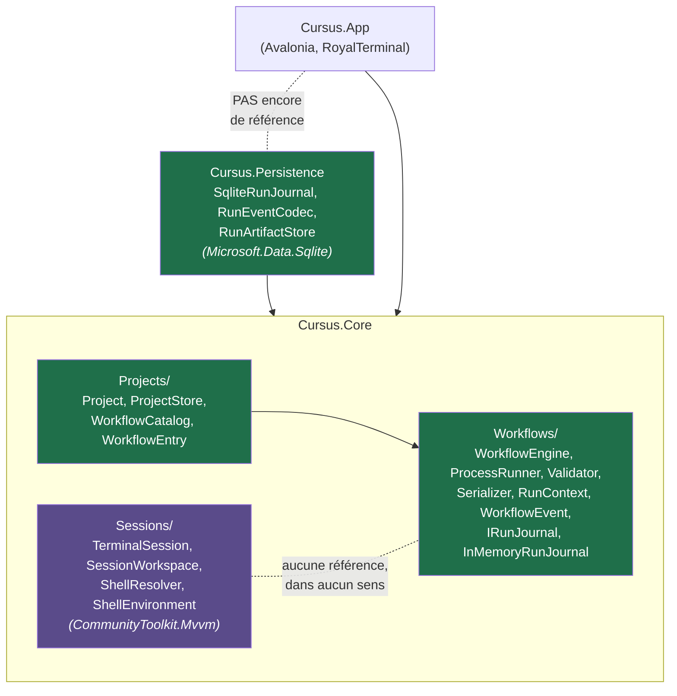
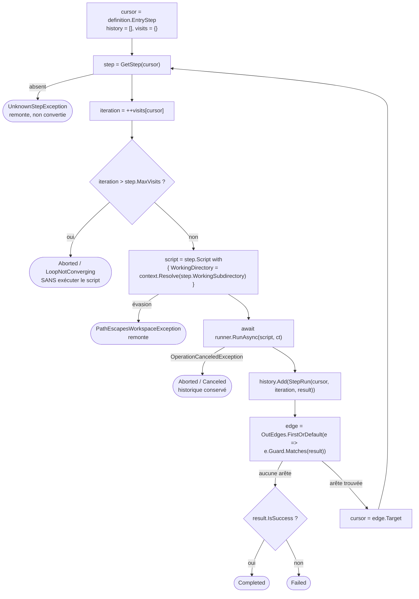
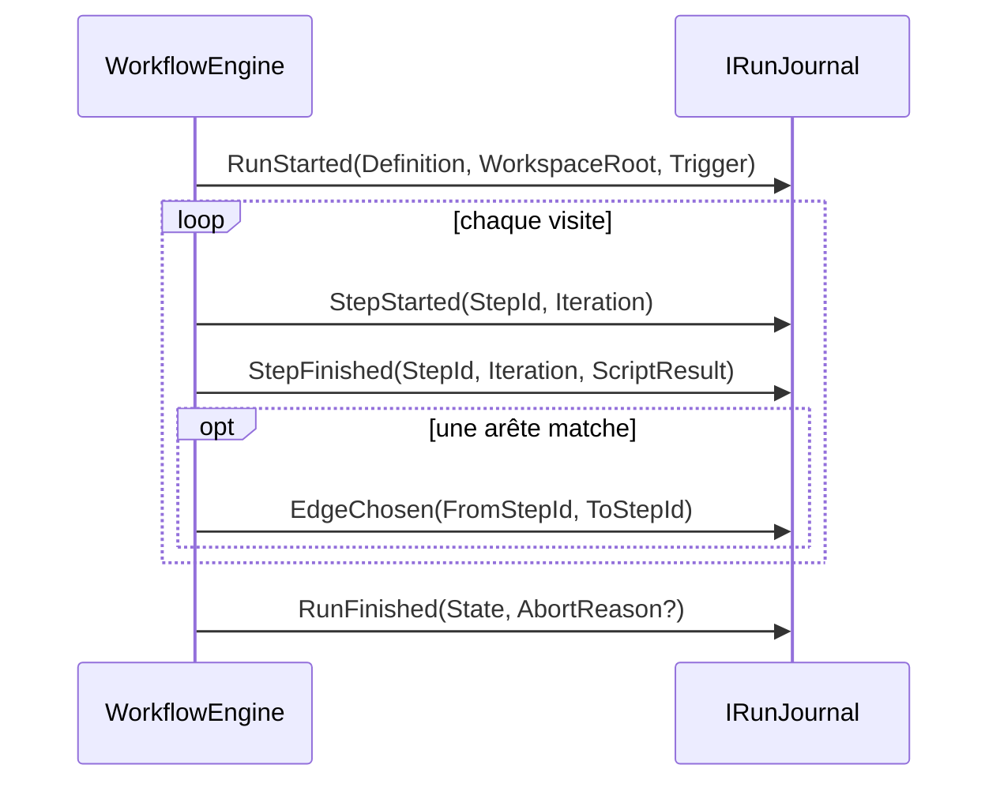

# Architecture de Cursus

> **Statut** : document vivant, à jour du commit `88ecfc4`. Dernier jalon de code : `88ecfc4` (*le projet minimal, jalon 5*). Suite de tests : **141 verts** (126 noyau + 15 persistance), build 0 warning.
>
> **Ce document détient l'état réel du dépôt** : ce qui est construit, où, et ce qui n'est pas relié. Il ne redit pas les autres documents :
> - `docs/design/noyau-deterministe.md` — le modèle cible du noyau v0 et ses questions ouvertes ;
> - `docs/design/modele-metier.md` — le modèle cible orienté agents (couches, entités, machines à états) ;
> - `docs/research/agentic-workflows-landscape.md` — les preuves externes (comparatifs, sandboxing, PTY) ;
> - `docs/reference/royalterminal-0.4.0.md` — l'API RoyalTerminal sondée, faute de documentation éditeur ;
> - `CLAUDE.md` (racine) — le contrat de travail, qui désigne le présent fichier comme référence et impose son entretien (§8).
>
> Trois registres tenus partout : **CONSTRUIT** / **TRANCHÉ, NON CONSTRUIT** / **QUESTION OUVERTE**.

## Sommaire

1. [État du dépôt et prise en main](#1-état-du-dépôt-et-prise-en-main)
2. [Les deux moitiés et la jonction manquante](#2-les-deux-moitiés-et-la-jonction-manquante)
3. [Le pivot : pourquoi un noyau déterministe d'abord](#3-le-pivot--pourquoi-un-noyau-déterministe-dabord)
4. [Le noyau déterministe](#4-le-noyau-déterministe)
5. [Ajouter un StepKind : la recette](#5-ajouter-un-stepkind--la-recette)
6. [La partie sessions/PTY](#6-la-partie-sessionspty)
7. [Décisions structurantes](#7-décisions-structurantes)
8. [Règles de contribution](#8-règles-de-contribution)
9. [Trous connus et questions ouvertes](#9-trous-connus-et-questions-ouvertes)

---

## 1. État du dépôt et prise en main

**Cursus** vise à devenir un manageur de workflow agentique : orchestrer des agents de code tournant dans de vrais terminaux, avec supervision humaine de première classe. La différence structurante avec le reste du champ : **l'unité d'exécution visée n'est pas un appel LLM, c'est une session — un PTY vivant exécutant un agent comme boîte noire**. Cela rend inapplicables les abstractions « Agent = LLM + tools + instructions », mais parfaitement réutilisable la couche d'orchestration des mêmes frameworks (graphe d'étapes, séparation définition/exécution, checkpoints, HITL).

### 1.1 Ce qui existe — CONSTRUIT

| Moitié | Emplacement | État |
|---|---|---|
| Noyau déterministe | `src/Cursus.Core/Workflows/` (28 fichiers) | Moteur de traversée, runner de process réel, contexte de run, validateur de graphe, format de fichier JSON bidirectionnel, vocabulaire d'événements de journal. **89 tests.** Fonctionne bout en bout, sans UI. |
| Projet & catalogue | `src/Cursus.Core/Projects/` (6 fichiers) | La disposition `.cursus/`, sa création et sa relecture, la liste et le chargement des workflows **depuis le disque**. **24 tests.** Voir §4.11. |
| Persistance | `src/Cursus.Persistence/` (3 fichiers) | Journal SQLite et magasin d'artefacts sur disque. **15 tests.** Un run survit au process. |
| Sessions / PTY | `src/Cursus.Core/Sessions/` (5 fichiers) + `src/Cursus.App/` | App Avalonia qui ouvre de vrais terminaux via RoyalTerminal ; logique de sessions testée (**13 tests**). Antérieure au pivot. |

Le noyau et la persistance se connaissent (le second implémente les contrats du premier) ; **ni l'un ni l'autre n'est relié à la moitié sessions/PTY** (§2), et **`Cursus.App` ne référence pas encore `Cursus.Persistence`**.

**Le dépôt est lui-même un projet Cursus** : `.cursus/` porte son `project.json` et deux workflows réels (`build`, `verifier`), gardés valides par `CursusProjectTests`.

### 1.2 Solution, projets, dépendances

`Cursus.slnx` (format XML .NET 10) regroupe `src/Cursus.App` (Avalonia, `OutputType=WinExe`), `src/Cursus.Core` (bibliothèque), `src/Cursus.Persistence` (bibliothèque) et deux projets de tests xUnit. Tous en `net10.0`, `Nullable` activé partout, `ImplicitUsings` sur tout sauf App.



Quatre faits non triviaux, le reste se lit dans les `.csproj` :

- **Le noyau déterministe a zéro dépendance externe** — mais c'est une propriété de `Workflows/` et `Projects/`, **pas du projet `Cursus.Core`**, qui référence `CommunityToolkit.Mvvm` pour `Sessions/` (voir plus bas). `System.Text.Json` et `System.Diagnostics.Process` sont dans le framework. C'est un argument explicite du choix JSON (§7.4), et la raison pour laquelle SQLite vit dans un projet séparé (§7.11).
- **`Cursus.Persistence` épingle `SQLitePCLRaw.bundle_e_sqlite3` en 2.1.12**, au-dessus de la 2.1.11 que tire `Microsoft.Data.Sqlite` 10.0.10 : c'est le **binaire natif** de cette 2.1.11 qui porte une faille de sévérité haute (NU1903). La raison et la condition de sortie sont dans le `.csproj`. C'est le standard « 0 warning » qui l'a fait apparaître.
- `CommunityToolkit.Mvvm` est référencé par `Cursus.Core` mais **utilisé uniquement par `SessionWorkspace`**, jamais par `Workflows/`.
- Le provider VT natif est `RoyalApps.RoyalTerminal.GhosttySharp.Native.OSX` : **`Cursus.App` ne tourne aujourd'hui que sur macOS**. `Cursus.Core` et les tests sont portables POSIX (macOS/Linux) ; le cross-platform revendiqué comme différenciateur est une **cible, pas un acquis** — il exigera un `INativeVtProcessorProvider` par OS.

### 1.3 Faire tourner

```bash
dotnet build                          # attendu : 0 warning
dotnet test                           # attendu : 141 verts (chiffre de référence de ce document)
dotnet run --project src/Cursus.App   # développement
build/package-macos.sh [--install]    # Cursus.app installable (§6.6)
```

Prérequis : SDK .NET 10, macOS pour l'app. Le SDK est **épinglé** par `global.json` (10.0.302, `rollForward: latestFeature`) depuis qu'un build produit un artefact installable — tolérable en `dotnet run`, beaucoup moins quand on distribue. Toujours absents : `Directory.Packages.props`, `NuGet.config`, CI, LICENSE.

### 1.4 Hygiène de dépôt

Branche `main`, seule branche, 28 commits (HEAD = `88ecfc4`). **Aucun remote configuré** : dépôt strictement local, sans sauvegarde hors machine — c'est le risque le plus concret du dépôt aujourd'hui.

**`README.md` a été refait** (jalon 0) : réduit à ce qu'il est seul à devoir dire — prérequis, commandes de développement, commande d'installation, et les deux pièges de l'application installée (signature ad-hoc, `PATH` tronqué). Il renvoie ici pour tout le reste, plutôt que de dupliquer un état qui se périmerait.

Périmé encore : le « Premier jalon recommandé » qui clôt `docs/research/agentic-workflows-landscape.md` (jalon 1 = détection d'état, jalon 2 = worktree…). Ce plan est **antérieur au pivot** et ne fait plus foi ; la trajectoire courante est celle du §9.

**Convention de langue** : code (classes, méthodes, identifiants) en **anglais**, prose, commentaires, messages de test et documentation en **français**, avec diacritiques complets. Seul écart du dépôt : les commentaires de template Avalonia restés en anglais dans `src/Cursus.App/Program.cs`.

---

## 2. Les deux moitiés et la jonction manquante

C'est le trou principal du dépôt, et la première chose à savoir avant d'y toucher.

Aucun fichier de `Workflows/` ne mentionne `Sessions`, `TerminalSession` ou `SessionWorkspace` ; aucun fichier de `Cursus.App/` ne mentionne `Workflow`. **`WorkflowEngine` n'est appelé que depuis les tests.**

Concrètement :

- **L'UI n'offre aucun moyen** de charger, valider, lancer, visualiser ou annuler un `WorkflowRun`.
- `SessionWorkspace` ne connaît que `AddShellSession()` : pas d'`AddWorkflowSession`, pas d'`AddStepSession`.
- `SessionKind.Agent` est un placeholder mort : jamais produit dans le dépôt, et `TerminalSession.Kind` n'est lu par aucun consommateur de production (seulement asserté dans un test) — bien que le constructeur public l'accepte.
- Les modèles de « où ça tourne » divergent : `TerminalSession.WorkingDirectory` est un chemin **absolu résolu à la création** ; `StepDefinition.WorkingSubdirectory` est **relatif**, absolutisé par `RunContext`. Rien ne fait le pont.

### 2.1 Deux mécanismes d'exécution de process qui s'ignorent

| | Côté UI | Côté noyau |
|---|---|---|
| Point d'entrée | `TerminalControl.StartPty(shellPath, wd, args)` | `IProcessRunner.RunAsync(ScriptSpec, ct)` |
| Nature | interactif, PTY | non interactif, tubes redirigés |
| Sortie | non capturée | stdout/stderr + code de sortie capturés, **en fin de process seulement** |
| Contrôle | aucun timeout, aucune annulation modélisée | timeout + annulation |
| Env | fusionné par-dessus l'app hôte ; `StartPty` **n'expose pas l'env** | surcharge clé par clé sur l'héritage |

**Aucun adaptateur entre les deux.**

### 2.2 Comment les recoudre — QUESTION OUVERTE

Deux coutures sont structurellement disponibles ; **aucune n'est tranchée**, et le choix a des conséquences opposées :

1. **Un `PtyProcessRunner` derrière `IProcessRunner`.** `IProcessRunner` est la seule couture d'exécution du noyau : y brancher RoyalTerminal ne toucherait pas une ligne de `WorkflowEngine`. Mais cela force un PTY interactif dans un contrat conçu pour du non-interactif — pas de code de sortie fiable sans convention supplémentaire, sortie qui n'est pas « rendue » mais « coulée ».
2. **Un `StepKind` distinct (`AgentStep`) avec son propre exécuteur**, derrière la même abstraction de routage. C'est le chemin annoncé par le pari central (§3) et par `noyau-deterministe.md`. Plus de code à écrire, mais chaque monde garde son contrat.

Ce qui manque pour trancher : savoir si un `AgentStep` doit rendre un `ScriptResult` (et donc être routable par les gardes existantes) ou un résultat d'une autre forme.

**Pièges déjà identifiés pour ce jour-là** (sources : `landscape.md`, mémoire de sonde) : `StartPty(shell, wd, args)` n'expose pas l'environnement → passer par `IPty.Start(...)` / `StartSessionAsync(PtyTransportOptions{Command, Environment})` pour injecter port, hooks et allowlist ; `execvp` échoué → exit **127**, même convention que `ProcessRunner` ; passer des chemins absolus ; sur macOS en GUI le `PATH` hérité est tronqué (d'où le `-l` du shell de login) et `SSH_AUTH_SOCK` est absent, ce qui cassera l'auth git/SSH des futurs agents ; préférer `posix_spawn` à `fork()` (deadlock fork-in-multithread) ; centraliser un `ShellEscape` unique.

---

## 3. Le pivot : pourquoi un noyau déterministe d'abord

La trajectoire initiale commençait par le plus visible : une app Avalonia affichant des sessions terminal réelles avec un moteur VT natif. Une phase de recherche a ensuite produit un modèle métier complet orienté agents (`Task > Workspace > Session`, quatre machines à états, HITL, capture de scrollback, confinement OS). Deux commits au même horodatage (`a74d3cc` doc, `e683139` code) actent alors le pivot : on met le modèle agent de côté et on construit d'abord un moteur qui parcourt un graphe d'étapes-scripts et route chaque étape sur son code de sortie, **sans jamais savoir ce qu'est un agent**.

**Les trois raisons**, dans l'ordre :

1. **Le cœur d'orchestration doit rester neutre.** Netflix/Orkes Conductor a greffé l'IA sans réécrire son moteur : les agents y sont de nouveaux *task types*. Câbler l'IA en dur dans le moteur, c'est se condamner à le réécrire.
2. **Le déterministe est intégralement testable.** Le contrat d'une étape-script est fermé : `(commande, args, env, cwd) → (code de sortie, stdout, stderr, durée)`. Aucun PTY, aucun timing, aucune heuristique : on stube `IProcessRunner` avec des codes de sortie en dur et on assert **la traversée du graphe**.
3. **On retire tout ce qui rend Cursus difficile, on garde le squelette** : séparation définition/exécution, `WorkflowRun`/`StepRun`, arêtes gardées, boucles bornées, journal — tout cela existe sans un seul agent.

**Ce que le pivot achète** : pas de PTY (un `Process` à sorties redirigées, pas de `forkpty` — le PTY n'est nécessaire *que* pour un agent interactif, et c'est exactement la frontière entre les deux mondes) ; aucune question de persistance de flux (« le flux **est** l'artefact ») ; une seule machine à états construite au lieu de quatre.

> Nuance de registre : `noyau-deterministe.md` §5.1 prévoit **deux** machines à états v0 (`StepRun` : `Pending→Running→Succeeded/Failed/TimedOut/LaunchFailed`, et `WorkflowRun`). Dans le code, **seule celle du run existe** : `StepRun` est un record `(StepId, Iteration, Result)` sans état ni identité ni horodatage. L'état d'une visite se déduit de son `ScriptResult`.

### 3.1 Limites d'une boucle sans agent

Une boucle déterministe **sait** faire retry, poll, until : une arête arrière n'a de sens que si ré-exécuter le script peut donner un autre résultat (retry d'un fetch réseau, polling d'un service).

Elle **ne sait pas** faire la boucle de dev auto-réparatrice. La boucle canonique `Verify → Dev` suppose qu'un acteur **change le monde entre deux tours** (l'agent corrige le code). Un back-edge purement scripté ré-exécuterait le même script à l'identique, pour un échec identique, jusqu'à `maxVisits`.

Conséquence pratique, aujourd'hui : **`maxVisits: 1` est le bon défaut** pour toute étape dont le résultat ne peut pas changer sans intervention. Une arête arrière qui n'est pas un retry est un bug de déclaration — et **le validateur ne le détecte pas**.

Le noyau déterministe fournit le mécanisme de boucle gardée ; l'agent fournira le seul acteur capable de la faire converger. Les deux moitiés sont complémentaires par construction, pas redondantes.

---

## 4. Le noyau déterministe

Namespace `Cursus.Core.Workflows` pour tout le noyau, plus `Cursus.Core.Projects` pour ce qui l'ancre sur un disque (§4.11). Le code est court et commenté : cette section donne la carte, l'artefact utilisateur, et ce qui n'est **pas** déductible d'une lecture.

### 4.1 Carte des fichiers

| Fichier | Rôle |
|---|---|
| `WorkflowDefinition.cs` | Le graphe : `EntryStep`, `Steps`, `GetStep(id)` |
| `StepDefinition.cs` | Un nœud : `Id`, `Name`, `Script`, `MaxVisits`, `OutEdges`, `WorkingSubdirectory?` (relatif) |
| `Edge.cs` · `Guard.cs` | `record Edge(Guard, string Target)` · garde abstraite `Matches(ScriptResult)` |
| `ScriptSpec.cs` | Ce qu'on lance : `FileName`, `Arguments`, `WorkingDirectory?`, `Environment?`, `Timeout?` |
| `ScriptOutcome.cs` · `ScriptResult.cs` | `Completed`/`TimedOut`/`LaunchFailed` · résultat + `IsSuccess` |
| `IProcessRunner.cs` · `ProcessRunner.cs` | La seule couture I/O · son implémentation réelle |
| `RunContext.cs` | Racine du workspace et résolution des sous-chemins |
| `WorkflowEngine.cs` | La traversée du graphe |
| `WorkflowRun.cs` · `StepRun.cs` | `RunState`, `AbortReason`, historique · une visite |
| `WorkflowValidator.cs` · `ValidationReport.cs` | Validité du graphe · `ValidationIssueKind` (9 valeurs), `ValidationIssue`, `ValidationReport` |
| `WorkflowSerializer.cs` · `WorkflowDocument.cs` | JSON ⟷ modèle, `LoadResult` · les DTO `internal` |
| `UnknownStepException.cs` · `PathEscapesWorkspaceException.cs` · `UnknownGuardException.cs` | Voir §4.6 |
| `WorkflowEvent.cs` · `JournalEntry.cs` | Les 5 événements (variantes imbriquées) · l'enveloppe `RunId`/`Seq`/`At` |
| `IRunJournal.cs` · `IRunJournalReader.cs` · `InMemoryRunJournal.cs` | Écrire · relire · l'implémentation volatile. Voir §4.10 |
| `RunSummary.cs` · `RunTrigger.cs` · `IClock.cs` | Un run listé · la cause d'un run · l'heure injectable |

Deux subtilités que les signatures ne disent pas :

- **`ScriptSpec` n'est jamais interprétée par le moteur** : elle est transmise telle quelle au runner. `FileName` est sans expansion de `~` ni de variable ; `Arguments` sont des tokens d'argv transmis verbatim (`ProcessStartInfo.ArgumentList`, aucun quoting à gérer).
- **`Guard.ExitCodeGuard` exige `Outcome == Completed`** : `exit:127` **ne matche pas** un `LaunchFailed`, alors que `OnFailure` et `Default` le matchent. `Guard` expose trois singletons statiques (`OnSuccess`, `OnFailure`, `Default`) et une fabrique paramétrée (`OnExitCode(int)`) ; les quatre variantes sont des records publics **pour être filtrables par motif** par le sérialiseur, pas pour être construites à la main.

### 4.2 Le format de fichier, par l'exemple

C'est aujourd'hui l'interface utilisateur du noyau. Deux exemples réels sont commités sous `.cursus/workflows/` (§4.11) ; en voici un plus complet, qui exerce des formes qu'ils n'utilisent pas :

```json
{
  "entryStep": "preparer",
  "steps": [
    {
      "id": "preparer",
      "name": "Préparer",
      "maxVisits": 1,
      "script": { "fileName": "/bin/sh", "arguments": ["-c", "make deps"] },
      "edges": [
        { "guard": "success", "target": "tester" },
        { "guard": "default", "target": "rapport" }
      ]
    },
    {
      "id": "tester",
      "name": "Tester",
      "maxVisits": 3,
      "workingSubdirectory": "backend",
      "script": {
        "fileName": "/bin/sh",
        "arguments": ["-c", "./run-tests.sh"],
        "environment": { "CI": "1" },
        "timeoutSeconds": 120
      },
      "edges": [
        { "guard": "exit:3", "target": "tester" },
        { "guard": "success", "target": "rapport" }
      ]
    },
    {
      "id": "rapport",
      "name": "Rapport",
      "maxVisits": 1,
      "script": { "fileName": "/bin/sh", "arguments": ["-c", "cat > rapport.txt"] },
      "edges": []
    }
  ]
}
```

Et les lignes qui le chargent et l'exécutent — information qui n'existe que dans les tests d'assemblage (`WorkflowExecutionTests` pour la variante « document en mémoire », `ProjectRunTests` pour la variante « fichier dans un projet », plus proche de l'usage réel) :

```csharp
var load = WorkflowSerializer.Read(json);          // rend une définition, ou des raisons
var run  = await new WorkflowEngine(new ProcessRunner(), journal)   // le journal est obligatoire (§4.10)
    .ExecuteAsync(load.Definition!, new RunContext("/chemin/absolu/du/workspace"));
```

Depuis un projet, les deux premières lignes deviennent `new WorkflowCatalog(project).Load("mon-workflow")` et `project.CreateRunContext()` (§4.11).

Règles du format, non devinables :

- Les gardes sont des **chaînes préfixées** : `"success"`, `"failure"`, `"default"`, `"exit:<n>"`. Le préfixe laisse la place à d'autres familles (`"stdout:…"`) sans changer la forme du document.
- Le document est délibérément distinct du modèle. Écarts : `edges` ⟷ `OutEdges` (**écart non justifié dans le dépôt** — ni commentaire, ni message de commit ; probablement stylistique) ; `timeoutSeconds` (double) ⟷ `Timeout` (TimeSpan), unité explicite dans le fichier ; **pas de `workingDirectory`** dans le document, le sous-chemin étant au niveau *step* et non *script* (§7.3).
- Retombées du mapping : `Name ?? Id ?? ""`, `EntryStep ?? ""`, `Steps ?? []`, `Arguments ?? []`.
- Les DTO (`WorkflowDocument.cs`) sont `internal` et **tous nullables sauf `StepDocument.MaxVisits` (`int`)** : un `maxVisits` omis vaut donc **0**, que le validateur transforme en `NonPositiveMaxVisits`. C'est le seul champ sans retombée — à assumer ou à rouvrir.
- Options JSON : camelCase, case-insensitive, `WriteIndented`, `Encoder = JavaScriptEncoder.Create(UnicodeRanges.All)` pour que « Préparer » reste lisible dans le fichier.

### 4.3 La traversée

`WorkflowEngine` : classe scellée, `ctor(IProcessRunner, IRunJournal)`, une seule méthode publique
`Task<WorkflowRun> ExecuteAsync(WorkflowDefinition, RunContext, RunTrigger? = null, CancellationToken = default)`.

Le schéma ci-dessous montre la **traversée** ; ce que chaque étape émet au journal est en §4.10.



Le `with` non destructif, juste avant l'appel au runner, est le **seul endroit du système** où un sous-chemin relatif devient un répertoire absolu : le moteur est le seul à connaître le contexte, donc le seul à pouvoir traduire.

**Ce que `RunState` ne dit pas.** Il ne reflète que **la dernière étape visitée**. Un run qui traverse une étape en échec puis emprunte son arête de rattrapage finit `Completed`, sans qu'aucun signal n'indique qu'une étape a échoué — c'est exactement ce que fait le test d'assemblage. Corollaires : il n'existe **pas de nœud terminal déclaré** (succès/échec) ; une étape dont aucune garde ne matche termine le run silencieusement, ce qui est **indiscernable d'un oubli d'arête** ; le validateur ne peut donc rien signaler. Faut-il des nœuds terminaux typés, ou une garde `Default` obligatoire ? **Non tranché.**

### 4.4 Le runner réel : les deux choses à savoir

`ProcessRunner` est la frontière I/O du noyau. Le reste de la méthode est du .NET ordinaire ; deux points ne se redécouvrent pas seuls :

**Pourquoi les lectures ne sont pas awaitées.** Les deux `ReadToEndAsync` sont lancées avant le `WaitForExitAsync` et awaitées seulement à la fin : lire l'un des tubes jusqu'au bout avant l'autre bloquerait le process dès que le tube non lu est plein (64 Kio). Aucun jeton n'est passé à ces lectures — à la mort du process les tubes se ferment, les lectures s'achèvent d'elles-mêmes et rendent la **sortie partielle**, y compris après un kill.

**Pourquoi le CTS est lié.** Un `CancellationTokenSource.CreateLinkedTokenSource(ct)` porte le `CancelAfter(timeout)`. Au réveil par annulation, le process est tué (`Kill(entireProcessTree: true)`) puis on appelle `cancellationToken.ThrowIfCancellationRequested()` : **c'est le lien qui distingue les deux causes**. Jeton d'origine annulé → l'exception remonte (le moteur en fait `Aborted/Canceled`). Sinon c'est le délai → `outcome = TimedOut`, une issue d'exécution ordinaire que `OnFailure` routera.

Convention : un binaire introuvable (`Win32Exception` au `Start`) rend `ScriptResult(127, LaunchFailed, Stderr: message)` — **pas d'exception**. 127 est la convention shell « command not found », la même que `execvp` côté PTY.

**Limites assumées du runner :**

- **Aucune sortie incrémentale** : `ReadToEndAsync` ne rend la sortie qu'à la mort du process. Impossible d'afficher la sortie d'une étape en cours — bloquant pour la jonction UI (§2.2), qui exigera un runner streamant ou un second contrat.
- **Capture non plafonnée** : stdout/stderr sont accumulés en `string` en mémoire et conservés dans `WorkflowRun.History` pour toute la durée du run. Un script bavard le fait grossir sans limite.
- **Pas de stdin** : `ScriptSpec` n'a aucun champ d'entrée.
- **Résolution de `FileName` non contrainte** : avec `UseShellExecute = false`, un nom sans séparateur est cherché dans le `PATH` et un chemin relatif n'est **pas** résolu contre le `WorkingDirectory` calculé par `RunContext` — le soin pris à absolutiser le cwd est donc contournable. `noyau-deterministe.md` §3 exige un chemin **absolu** ; ni `ScriptSpec`, ni `ProcessRunner`, ni le validateur ne l'imposent (le validateur ne vérifie même pas que `fileName` est non vide : une étape sans script ne se voit qu'à l'exécution, en `LaunchFailed`).
- **Course non gardée au kill** : `Kill` peut lever une `InvalidOperationException` si le process meurt entre le réveil et l'appel.
- **Aucune politique de concurrence documentée** : `WorkflowEngine` est sans état d'instance, mais rien ne spécifie ni ne teste plusieurs runs simultanés — première question au moment du câblage UI.
- **Aucune observabilité *dans le runner*** : pas d'`ILogger`. Le run, lui, émet désormais des événements (§4.10) — mais seulement aux frontières d'étape, jamais pendant qu'un script tourne.

### 4.5 Résolution des chemins et confinement

`RunContext(string workspaceRoot)` valide sa racine : non vide et **absolue** (`ArgumentException`), **existante** (`DirectoryNotFoundException`), stockée normalisée (`GetFullPath` + `TrimEndingDirectorySeparator`). `Resolve(string?)` combine, normalise, et exige soit l'égalité à la racine soit un préfixe `racine + séparateur` — le séparateur est nécessaire parce qu'un voisin `<racine>-autre` passerait une comparaison de préfixe naïve. Sont refusés les `../` et les **chemins absolus** (« un absolu ferait sortir du workspace sans même avoir l'air de remonter »).

> **Deux limites à ne pas oublier.**
> 1. La comparaison porte sur les chemins **normalisés** et **ne suit pas les liens symboliques**. Ce n'est donc **pas un confinement OS**, seulement un garde-fou contre les erreurs de déclaration. Un `WorkingSubdirectory` pointant vers un symlink sortant passera. Le vrai confinement est tranché mais non construit (§7.9).
> 2. `Resolve` **ne crée pas** le répertoire : un `workingSubdirectory` déclaré doit **préexister**, sinon l'étape échoue.

### 4.6 Validation et chargement

`WorkflowValidator.Validate(WorkflowDefinition) → ValidationReport` (classe statique) produit un rapport **agrégé et d'ordre déterministe**, verrouillé par un test qui fixe la séquence exacte : issues d'entrée (`MissingEntryStep` puis `UnknownEntryStep`, mutuellement exclusifs) → `DuplicateStepId` (une par Id dupliqué) → puis, **dans l'ordre de déclaration** des étapes : `EmptyStepId`, `NonPositiveMaxVisits` (`< 1`), une `UnknownEdgeTarget` par arête cassée → enfin `UnreachableStep` par DFS.

Trois subtilités qu'on ne devinerait pas :

- L'atteignabilité n'est calculée **que si le point d'entrée tient**, sinon tout le graphe serait rapporté inatteignable, en pure cascade.
- Elle est **structurelle** : elle ignore les gardes, donc une branche de rattrapage compte comme atteignable.
- Les étapes à Id vide en sont exclues, pour ne pas doubler `EmptyStepId`.

Pourquoi ce sont des erreurs : avec `MaxVisits < 1` le moteur interromprait le run **avant la première exécution** ; avec un Id dupliqué, `GetStep` retient silencieusement la première déclarée et l'arête devient ambiguë.

`WorkflowSerializer.Read(string) → LoadResult` / `Write(WorkflowDefinition) → string`. **Ne touche jamais au disque** : lire et écrire le fichier appartient à l'appelant. Invariant : `LoadResult.Definition != null ⟺ Report.IsValid` — « une définition ou des raisons, jamais les deux ».

```mermaid
flowchart LR
    J["JSON"] --> D["Deserialize&lt;WorkflowDocument&gt;"]
    D -->|JsonException<br/>ou document null| M["LoadResult(null,<br/>[MalformedDocument])"]
    D --> T["ToStep / ToEdge / ToGuard"]
    T -->|UnknownGuardException<br/>(internal)| U["LoadResult(null,<br/>[UnknownGuard])"]
    T --> V["WorkflowValidator.Validate"]
    V -->|IsValid| OK["LoadResult(definition, report)"]
    V -->|sinon| KO["LoadResult(null, report)"]
```

**Deux dettes connues sur ce chemin :**

- L'agrégation, principe structurant (§7.6), est **court-circuitée** sur deux familles : `ToGuard` lève à la **première** garde inconnue, et un JSON malformé sort immédiatement. Dans ces deux cas, le rapport ne contient **qu'une seule issue** — l'éditeur graphique n'y verra qu'un problème à la fois. À reprendre quand l'éditeur arrivera. (Ce sont aussi les deux seules valeurs de `ValidationIssueKind` que `WorkflowValidator` ne produit **jamais** : elles viennent du sérialiseur.)
- Le message porté par `MalformedDocument` est celui de `System.Text.Json`, donc **en anglais** — seule issue à échapper à la convention de langue, et précisément celle qu'un utilisateur verra.

**Exceptions** : `UnknownStepException(StepId)` et `PathEscapesWorkspaceException(Subdirectory, WorkspaceRoot)` sont **publiques et remontent** — ce sont des invariants, pas des issues d'exécution (la validation exhaustive les double désormais via `UnknownEntryStep`/`UnknownEdgeTarget` ; elles restent un filet runtime). `UnknownGuardException` est **`internal`** : l'appelant ne voit qu'un `ValidationIssue`.

### 4.7 Qui décide quoi

| Acteur | Décide | Ne décide pas |
|---|---|---|
| **Document JSON** | déclare le graphe et les gardes en chaînes | rien de sémantique |
| **`WorkflowSerializer`** | traduit document → modèle | le verdict de validité (délégué) |
| **`WorkflowValidator`** | la validité du graphe | le routage, l'exécution |
| **`RunContext`** | la légalité d'un sous-chemin | tout le reste |
| **`WorkflowEngine`** | routage, bornage de boucle, état terminal | comment un process se lance |
| **`IProcessRunner`** | l'issue : `Completed`/`TimedOut`/`LaunchFailed` | **le succès** (c'est `ScriptResult.IsSuccess`) et **le routage** |

### 4.8 Invariants à ne pas casser

1. **`ScriptResult.IsSuccess` est la source unique de vérité du succès.**
2. **L'ordre de déclaration des arêtes est la priorité** (`FirstOrDefault` : première déclarée gagnante).
3. **Aucun `Process.Start` hors de `ProcessRunner`.**
4. **`LoadResult.Definition != null ⟺ Report.IsValid`.**
5. **Le compteur de visites précède l'exécution** : dépasser `MaxVisits` n'ajoute aucun `StepRun`.
6. **La définition reste portable** : aucun chemin absolu ; `RunContext` n'en fait pas partie.
7. **L'annulation n'est pas une issue d'exécution**, c'est une interruption du run — et elle **conserve l'historique**.
8. **Le moteur ne connaît que `StepDefinition` + `IProcessRunner` + `IRunJournal`.** C'est le pari central du pivot ; §5 en donne le garde-fou vérifiable. Le journal n'y déroge pas : le moteur *émet*, il ne *lit* jamais — d'où deux interfaces séparées (§4.10).
9. **Aucune donnée ne circule d'une étape à l'autre** : aucune sortie de `StepRun` n'alimente le `ScriptSpec` suivant, il n'existe ni variables de run ni câblage de références. La seule mémoire partagée d'un run est **le système de fichiers du workspace** (c'est ce que fait le test d'assemblage avec `artefact.txt`). Le câblage par références façon Conductor (`${taskRef.output.champ}`) est relevé dans `landscape.md` comme vocabulaire à emprunter : **reporté, non écarté**. Il faudra le rouvrir pour l'`AgentStep`, dont le prompt voudra dépendre de la sortie de l'étape précédente.

### 4.9 Ce que seuls les tests spécifient

Certains comportements ne vivent que dans les tests : **c'est là qu'il faut aller les lire**, pas ici — les redire ici les rendrait faux au premier refactor.

| Fichier de test | Ce qu'il est le seul à fixer |
|---|---|
| `Workflows/ProcessRunnerTests.cs` (13) | Drainage concurrent des tubes sous forte charge, verbatim des argv (espaces et guillemets), héritage de l'env hôte sous surcharge, `LaunchFailed`+127 sans exception, kill sur timeout, annulation, durée mesurée. Adossés aux **binaires POSIX du système** (macOS/Linux) — non portables Windows, assumé. |
| `Workflows/WorkflowEngineTests.cs` (18) | La traversée sur `StubProcessRunner` : le stub **enregistre les `ScriptSpec` reçues** (donc assert de la composition du `WorkingDirectory`), **répète le dernier résultat** une fois la liste épuisée (« le runner réussit toujours »), et `CancelAfterRun` simule une annulation **pendant** le run. Boucle convergente, boucle bornée à `[1,2,3]`, `TimedOut` routé par `OnFailure`, `LaunchFailed` terminal. |
| `Workflows/WorkflowExecutionTests.cs` (2) | Assemblage **sans aucun double**, sur `/bin/sh` : un graphe déclaré en C#, puis la chaîne JSON → `Read` → `ExecuteAsync` **depuis un document en mémoire**, artefacts réellement écrits sur disque aux bons endroits. La variante partant d'un **fichier** est dans `ProjectRunTests`. |
| `Workflows/WorkflowSerializerTests.cs` (14) | L'aller-retour caractère pour caractère (`Read`→`Write`) et l'idempotence (`Write`→`Read`→`Write`), le document servant de référentiel de comparaison ; les formes de malformation ; « absence de timeout ≠ zéro ». |
| `Workflows/RunContextTests.cs` (10) | Les **justifications absentes du code** du refus d'une racine relative ou inexistante. |
| `Workflows/WorkflowValidatorTests.cs` (11) | La motivation de chaque règle et l'**ordre exact** d'un rapport multi-issues. |
| `SessionWorkspaceTests` · `ShellResolverTests` · `TerminalSessionTests` (13) | La politique de sélection après fermeture (`min(index, count-1)`, sinon `null`), la numérotation « Session N », la cascade `$SHELL` → `/bin/zsh` → `/bin/bash` avec prédicat d'existence injecté. |
| `Workflows/WorkflowJournalTests.cs` (15) · `Workflows/InMemoryRunJournalTests.cs` (6) | Ce que le moteur émet et dans quel ordre · l'enveloppe posée par le journal. |
| `Cursus.Persistence.Tests/` (15) | Le magasin d'artefacts, le journal SQLite, et les deux assemblages — tous les tests de durabilité **referment puis rouvrent** le journal avant de relire. `ProjectRunTests` est le seul où **aucun emplacement n'est composé par le test** : ils viennent tous du `Project`. |
| `Projects/ProjectStoreTests.cs` (14) · `Projects/WorkflowCatalogTests.cs` (8) | La disposition `.cursus/` **assertée en chemins littéraux**, puisqu'elle est versionnée donc contractuelle · l'identité par nom de fichier, et qu'un document cassé ne cache pas les autres. |
| `Projects/CursusProjectTests.cs` (2) | Que **ce dépôt** s'ouvre comme projet Cursus et que ses workflows commités valident. Le seul test qui lise le dépôt lui-même — garde-fou contre des exemples qui pourrissent. |

### 4.10 Le journal — CONSTRUIT (jalon 4)

Le moteur **raconte** désormais ce qu'il fait. `WorkflowEngine(IProcessRunner, IRunJournal)` : le journal est un paramètre **obligatoire**, jamais optionnel — un défaut muet rendrait le silence accidentel, alors que c'est précisément le trou qu'on referme ; un run qu'on ne veut pas relire prend simplement un `InMemoryRunJournal` qu'on ignore.

Cinq événements, **imbriqués dans `WorkflowEvent`** comme les variantes de `Guard` le sont dans `Guard` : leurs noms sont trop courants pour occuper le namespace.



Ce que la lecture du code ne donne pas d'emblée :

- **`Seq` et `At` sont posés par le journal**, jamais par l'émetteur. `Seq` est propre à chaque run et c'est **lui** qui fait foi sur l'ordre — jamais `At`, parce qu'une horloge peut reculer.
- **`RunStarted` emporte la définition entière**, figée. Relire un run six mois plus tard doit dire ce qui a tourné, pas ce que le fichier est devenu depuis. Même raison que le snapshot de colonne et d'étiquettes prévu au §7.10.5.
- **`EdgeChosen` est distinct de `StepFinished`** : c'est la seule *décision* du moteur, tout le reste est de l'observation. Une étape terminale n'en émet aucun.
- **`AbortReason.Faulted` n'apparaît que dans le journal.** Quand un invariant saute (`UnknownStepException`, `PathEscapesWorkspaceException`), le moteur clôt le run puis **laisse l'exception remonter inchangée** — la raison sert à ne pas laisser un run « en cours » à jamais, jamais à convertir une exception en résultat. `ExecuteAsync` enveloppe pour cela une `TraverseAsync` privée.
- **Dépasser `MaxVisits` n'émet aucun `StepStarted`** — corollaire de l'invariant 5 (§4.8), désormais observable.

`ExecuteAsync(definition, context, trigger = null, cancellationToken = default)` : le `RunTrigger` (§7.10.5) précède le jeton, qui reste en dernier par convention .NET. Le `RunId` est engendré **par le moteur, un par exécution**, et remonte dans `WorkflowRun.RunId` — le porter dans `RunContext` a été écarté, un contexte étant réutilisable d'un run à l'autre (deux runs auraient partagé une clé primaire).

**Côté persistance** (`src/Cursus.Persistence/`) : `run_events` est la source, `runs` une **projection dénormalisée** entretenue à l'écriture — sans elle, lister les runs exigerait de rejouer toute la base. Une transaction par événement, sans tampon ; `journal_mode=WAL` pour que l'interface puisse relire pendant qu'un run écrit.

`RunEventCodec` traduit vers des **DTO de payload, un par kind**, pour la même raison qu'au §7.5 — mais ici c'était aussi une obligation : les gardes d'une `WorkflowDefinition` sont des types abstraits que `System.Text.Json` ne sait pas reconstruire. La définition transite donc par `WorkflowSerializer` dans la colonne `definition_json`, et le codec l'y récupère à la relecture.

> **Trois conséquences à ne pas découvrir en production.**
> 1. **Un `StepFinished` relu a ses sorties vides.** Elles vivent dans `RunArtifactStore`, pas en base ; le payload n'en garde que les tailles. C'est au magasin qu'il faut aller les chercher.
> 2. **La définition figée repasse par le validateur à la relecture** (`WorkflowSerializer.Read` valide). Un durcissement futur des règles rendrait d'anciens runs **illisibles**.
> 3. **`state` à `NULL` = run non clos**, ce qui confond « en cours » et « tué par un crash machine ». La reprise après incident est hors v0 (§9.3).

**Aucun versionnement de schéma** : les tables se créent en `CREATE TABLE IF NOT EXISTS` et rien ne gère une évolution destructrice. Dette assumée, à traiter à la première migration réelle.

### 4.11 Le projet et le catalogue — CONSTRUIT (jalon 5)

`Cursus.Core.Projects` ancre le noyau sur un disque. Jusqu'ici aucun workflow n'était lu depuis un fichier : le sérialiseur travaillait sur des `string`, et le seul document JSON du dépôt était une chaîne littérale dans un test.

```
<racine>/.cursus/project.json          -- versionné : id, name
<racine>/.cursus/workflows/*.json      -- versionné : les définitions
<racine>/.cursus/.gitignore            -- versionné : exclut les deux lignes suivantes
<racine>/.cursus/cursus.db             -- observation, hors git
<racine>/.cursus/runs/<runId>/         -- observation, hors git
```

| Type | Rôle |
|---|---|
| `Project` | L'identité (`Id`, `Name`) et **où sont les choses**, ce qu'il sait seul : `Root`, `CursusDirectory`, `ProjectFilePath`, `WorkflowsDirectory`, `DatabasePath`, `ArtifactsRoot`, plus `CreateRunContext()` |
| `ProjectStore` | `Create` · `Open` · `Discover`. Le seul type du noyau qui écrive la disposition |
| `WorkflowCatalog` | `List()` rend des `WorkflowEntry(Id, Path)` · `Load(id)` rend un `LoadResult`. Apporte le disque et l'identité, délègue la traduction au sérialiseur |

Ce que la lecture du code ne donne pas d'emblée :

- **La racine du workspace n'est écrite nulle part** : c'est le dossier qui contient le `.cursus/`. `project.json` étant versionné, un chemin absolu y serait faux chez tout collègue (voir la rectification du §7.10).
- **L'identifiant d'un workflow est son nom de fichier**, sans extension. Un champ `id` dans le document a été écarté : deux sources de vérité qui divergeraient au premier renommage. Corollaire assumé — renommer le fichier change l'identité.
- **Un document de workflow invalide rapporte ; tout le reste lève.** Le contraste porte la décision : `ValidationReport` existe pour qu'un éditeur affiche tout d'un coup, or un projet qu'on n'ouvre pas n'a aucun écran à alimenter. Donc `LoadResult` pour un graphe cassé — mais des exceptions pour l'**absence** et le conflit : `ProjectNotFoundException`, `InvalidProjectException`, l'`InvalidOperationException` d'un `Create` sur un dossier qui porte déjà un projet, et le `FileNotFoundException` du framework pour un identifiant de workflow qu'aucun fichier ne porte (l'invariant violé y est celui du système de fichiers, pas celui du catalogue). Seule l'identité est exigée d'un `project.json` : le nom n'est qu'un libellé.
- **`List()` n'ouvre aucun fichier** et trie par identifiant. Un document cassé se découvre au `Load` — sinon un seul fichier fautif rendrait le projet entier inutilisable. L'ordre du système de fichiers n'étant garanti nulle part, le tri est explicite.
- **`Discover` remonte l'arborescence** jusqu'au premier **`.cursus/project.json`** — et non jusqu'au premier dossier `.cursus/` : un dossier sans fichier de projet est traversé sans arrêt. Reste distinct d'`Open`, qui exige la racine exacte.
- **`Project` expose des chemins, il ne construit ni journal ni magasin** : `Cursus.Core` ignore `Cursus.Persistence` (§7.11). C'est l'appelant qui assemble `new SqliteRunJournal(project.DatabasePath, new RunArtifactStore(project.ArtifactsRoot))` — ce que fait `ProjectRunTests`, et ce que fera le jalon 6.

**Le dépôt est son propre cobaye.** `.cursus/workflows/` porte les deux moitiés du standard de qualité de `CLAUDE.md` : `build` est une étape unique (`dotnet build -warnaserror`), `verifier` en enchaîne deux — compiler, puis `dotnet test` — reliées par une arête `success`. Ils lancent `/bin/sh -c "dotnet …"` et non `dotnet` : `ProcessRunner` ne lance aucun shell de login et `fileName` doit être un chemin exécutable, or celui de ce poste vient d'asdf. ⚠️ Cela **ne referme pas** le trou §9.2-15 — sous le `PATH` tronqué d'une app installée, ces mêmes workflows échoueraient en `LaunchFailed`.

`CursusProjectTests` garde ces exemples valides : sans lui, un durcissement du validateur les casserait en silence, et le premier écran du jalon 6 ouvrirait sur un projet mort.

**Ce qui n'est pas construit** : le registre machine et le trousseau (§7.10.1) — aucun consommateur avant le tracker ; le provider de tracker et les prédicats de disponibilité (§7.10.6) ; aucun versionnement du schéma de `project.json`, même dette qu'au journal.

---

## 5. Ajouter un StepKind : la recette

Le pari central promet que greffer un nouveau type d'étape sera une extension, pas une refonte. Voici ce que cela veut dire concrètement — **rien de ceci n'est construit** ; c'est le contrat que le prochain contributeur doit tenir.

> **Trois kinds sont désormais prévus, et l'ordre a changé** : `ScriptStep` (implicite aujourd'hui), puis **`TaskStep`** (§7.10), puis `AgentStep`. `TaskStep` passe devant parce qu'il est le cobaye idéal de cette recette : synchrone, au résultat binaire, sans PTY ni streaming. Éprouver l'extension sur lui avant d'affronter l'agent, c'est découvrir les frottements sur le cas facile.

**Ce qui bouge :**
1. `StepDefinition` — introduction d'un discriminant `StepKind` (aujourd'hui implicite et unique : script).
2. `WorkflowDocument.cs` + le mapping de `WorkflowSerializer` — un champ `kind` dans le document, avec sa retombée par défaut sur le script pour ne pas casser les fichiers existants.
3. Un **exécuteur** dédié, derrière une abstraction analogue à `IProcessRunner`, et le point de dispatch qui choisit l'exécuteur selon le `StepKind`.
4. `WorkflowValidator` — les règles propres au nouveau kind.
5. `RunEventCodec` — le payload de `StepFinished` est aujourd'hui celui d'un script (code de sortie, issue, tailles de sortie). Un `TaskStep` en voudra un autre (ticket, colonne cible). C'est **exactement pour cela** qu'aucun `exit_code` n'a été promu en colonne (§7.10.4) : le nouveau kind ajoute une branche au codec, il ne migre pas une table remplie.

**Ce qui ne doit PAS bouger :**
- la boucle de `WorkflowEngine.ExecuteAsync` (compteur de visites, sélection d'arête, états terminaux) ;
- `Guard.Matches` et les gardes existantes ;
- `ScriptResult.IsSuccess` comme unique source de vérité du succès.

**Le test qui prouve l'invariant** : les tests de traversée existants (`WorkflowEngineTests`) doivent rester verts **sans modification**, et le nouveau kind doit être routable par les gardes existantes. Si `ExecuteAsync` doit changer pour accueillir le nouveau kind, le pari est perdu — et c'est le signal qu'il faut rouvrir la conception, pas forcer le passage.

Question ouverte immédiate : un `AgentStep` rend-il un `ScriptResult` (donc routable tel quel), ou un résultat d'une autre forme qui obligerait à généraliser `Guard` ? **Non tranché** (voir aussi §2.2).

---

## 6. La partie sessions/PTY

### 6.1 `src/Cursus.Core/Sessions/` — la logique UI-agnostique

| Type | Rôle |
|---|---|
| `TerminalSession` | Classe scellée, **description immuable** hors `Title` : `Id` (Guid), `Title` (settable), `ShellPath`, `WorkingDirectory`, `Kind`, `CreatedAt`. Fabrique `CreateShell(title)`. **Aucune notion de process ou de PTY** — c'est une description, pas un runtime. |
| `SessionKind` | `{ Shell, Agent }` — `Agent` est un placeholder mort (§2). |
| `SessionWorkspace` | `ObservableObject` détenant `ObservableCollection<TerminalSession>` + `SelectedSession` ; politique d'ajout et de fermeture (voir §4.9). |
| `ShellEnvironment` | Adaptateur **en bordure** : lit `$SHELL`, délègue la politique à `ShellResolver` avec `File.Exists`, et rend le home comme répertoire par défaut. |
| `ShellResolver` | **Politique pure et testable** : le prédicat d'existence est **injecté** (`Func<string,bool>`). |

Frontière assumée : `SessionWorkspace` n'a pas de dépendance UI *framework*, mais hérite d'`ObservableObject` et expose une `ObservableCollection` — c'est un modèle taillé pour le binding MVVM. `ShellEnvironment` touche l'OS ; il est isolé exprès de `ShellResolver` pour que la politique reste testable.

### 6.2 `src/Cursus.App/` — l'app Avalonia

Fenêtre unique : barre latérale 260 px (liste des sessions bindée sur `Workspace.Sessions`, sélection two-way) / `GridSplitter` / panneau `TerminalHost`.

Tout le travail terminal est dans le code-behind `MainWindow.axaml.cs`, sans XAML : un dictionnaire `Guid → TerminalControl` garde **un contrôle terminal vivant par session, même masqué** (comportement « façon TMUX ») ; le basculement se fait par `IsVisible`, **jamais par recréation**. `EnsureTerminal` crée le contrôle (Menlo 13, invisible) et **démarre le PTY dans `Loaded`, une seule fois** : `terminal.StartPty(session.ShellPath, session.WorkingDirectory, new[] { "-l" })` — le PTY démarre au premier affichage réel, quand les bounds sont connues. Le `-l` demande un **shell de login** : sur macOS, une app GUI hérite d'un `PATH` tronqué, que seul un login shell ré-enrichit (`landscape.md`, Vague 2).

`App.axaml.cs` instancie `MainWindow` avec `new MainViewModel()` — **pas de DI**. `MainViewModel` est un adaptateur mince : deux `[RelayCommand]` qui délèguent à `SessionWorkspace`.

### 6.3 RoyalTerminal et le gotcha VT

RoyalTerminal fournit le contrôle terminal complet (rendu, PTY, moteur VT). Utilisé **uniquement dans `Cursus.App`**, en deux points : `MainWindow.axaml.cs` et `src/Cursus.App/Terminals/NativeTerminalFactory.cs`.

`NativeTerminalFactory.Create()` **n'utilise pas le constructeur sans paramètre** : il recompose manuellement toutes les dépendances du contrôle afin d'injecter le provider VT natif :

```csharp
var vtFactory = new DefaultVtProcessorFactory(
    new INativeVtProcessorProvider[] { new GhosttyVtProcessorProvider() });
```

**Pourquoi** : le ctor par défaut laisse une `DefaultVtProcessorFactory` vide → moteur managé → DECCKM (« application cursor keys ») mal suivi → **les flèches ne sont pas encodées comme les TUI l'attendent**. libghostty-vt est indispensable, pas un raffinement.

### 6.4 Absent côté sessions

Persistance, détach/rattach, layouts/splits, renommage, choix du shell ou du répertoire à la création, tout ce qui touche aux agents. Il n'y a **aucune interface d'abstraction du terminal** — l'`ITerminalSession` que le principe d'architecture appelait (abstraire le terminal pour ne pas se coupler dur à RoyalTerminal) n'a jamais été écrite, `Cursus.App` parle directement au type concret de RoyalTerminal. Et il n'existe **aucun projet de tests pour `Cursus.App`** — le point de contact session ↔ terminal, le moins abstrait du dépôt, est le moins couvert.

### 6.5 Sonde RoyalTerminal

Les quatre dépendances dures de la future détection d'état sont couvertes par `TerminalControl` 0.4.0 : écran rendu (`TryExportSnapshot`), titre OSC, événement d'octets, PID enfant. Bonus : OSC 133, injection de frappes (`SendInput`), persistance intégrée.

RoyalTerminal étant livré **sans aucune documentation**, cette connaissance a été obtenue par inspection des assemblies et lecture de la source. Elle est désormais **versionnée** dans `docs/reference/royalterminal-0.4.0.md` : méthode de re-sondage, API du contrôle, les quatre signaux de détection, l'injection d'environnement, et le fait que le PTY est lancé par `forkpty()` + `execvp()` direct — ce qui autorise à mettre `srt` ou `sandbox-exec` en process de PTY pour le confinement (§7.9).

⚠️ Ce document est valide **pour la version 0.4.0 seulement**, sans contrat de compatibilité : toute montée de version impose de re-sonder.

### 6.6 Le bundle macOS, et ce qu'il a mesuré — CONSTRUIT (jalon 0)

`build/package-macos.sh` produit `Cursus.app` (~123 Mo) : publication `osx-arm64` self-contained dans `Contents/MacOS`, `build/Info.plist` recopié, signature **ad-hoc**. `--install` copie en plus dans `/Applications`.

Trois choix à connaître : **pas de trimming** (il casse régulièrement Avalonia, qui résout contrôles et convertisseurs par réflexion) ; **signature ad-hoc et non notarisée**, suffisante sur la machine qui construit, refusée par Gatekeeper ailleurs — la distribution exigerait un compte développeur Apple ; et un **garde-fou qui échoue le build** si `libghostty-vt.dylib`, `libAvaloniaNative.dylib` ou `libSkiaSharp.dylib` manquent du bundle. Ce dernier existe parce que l'absence de la native VT est **silencieuse** : l'app se lance parfaitement et retombe sur le moteur managé, avec le bug DECCKM des flèches (§6.3).

**Ce que le jalon 0 a mesuré.** Il existait pour observer quatre risques d'environnement anticipés dans ce document sans preuve. Résultats sur Darwin 25.5.0 / Apple Silicon :

| Risque anticipé | Verdict |
|---|---|
| Natives absentes du bundle | **Infirmé** — `libghostty-vt.dylib` est bien publiée. Garde-fou ajouté quand même : la panne serait muette |
| `PATH` tronqué en GUI | **CONFIRMÉ** — `launchctl getenv PATH` est **vide**, donc une app lancée depuis le Finder hérite du défaut système. ⚠️ Piège de mesure : `open` depuis un terminal **propage le `PATH` du shell** et donne un faux négatif |
| `SSH_AUTH_SOCK` absent | **Infirmé** — défini au niveau launchd (`/var/run/com.apple.launchd.*/Listeners`), donc présent même depuis le Finder |
| cwd hérité = `/Applications` | **Corrigé** : le cwd d'une app GUI est **`/`**, pas `/Applications`. La conclusion tient et se renforce — hériter ce cwd est encore plus absurde que prévu (§7.3) |

**Conséquence non refermée, et c'est la trouvaille du jalon.** Le `PATH` tronqué ne gêne pas le terminal, dont le `-l` demande un shell de login qui le ré-enrichit — mais `ProcessRunner` ne lance **aucun shell** : il exécute directement, avec l'environnement hérité. Une étape déclarant `node`, `npm` ou un binaire d'`asdf` fonctionnera en `dotnet run` et **échouera en `LaunchFailed` une fois l'app installée**. Le mécanisme est déjà là (127, §4.4), le diagnostic sera clair ; la question de conception ne l'est pas : ré-enrichir le `PATH` dans `ProcessRunner` (au prix d'un shell de login par étape), le faire déclarer par `project.json`, ou exiger des chemins absolus dans les définitions. **À trancher au jalon 6**, où le dogfooding le rendra immédiat.

---

## 7. Décisions structurantes

Cette section existe pour éviter de refaire les mêmes débats. Une grande partie de ce raisonnement n'existe que dans les messages de commit. **Les décisions relevant du modèle cible agent ne sont pas redites ici** : elles sont dans `landscape.md` et `modele-metier.md`, et §7.9 n'en donne que l'index.

### 7.1 Séparation définition ⟷ exécution — TRANCHÉ, « non négociable »

L'abstraction la plus consensuelle du champ (LangGraph, Temporal, MAF, CrewAI, Conductor). Copiée telle quelle.

### 7.2 Un Step = un process — TRANCHÉ

« setup + run + archive » = **trois Steps distincts**. C'est ce qui garde le contrat fermé et testable. **Écarté** : le step multi-commande, qui rouvrirait le contrat et rendrait le code de sortie ambigu.

### 7.3 Déclaratif relatif vs opérationnel absolu — TRANCHÉ

`StepDefinition.WorkingSubdirectory` est **relatif**, `ScriptSpec.WorkingDirectory` **absolu** ; le point de traduction est unique (`ExecuteAsync`). **Pourquoi** : la définition doit rester portable d'un workspace à l'autre — deux projets, et plus tard un worktree git isolé. **Écarté** : hériter le cwd du process hôte — gotcha du commit `9c2c2c6`, cela donnerait `/Applications` une fois Cursus installé. Corollaire : `ScriptDocument` n'expose aucun `workingDirectory`.

### 7.4 JSON plutôt que YAML — TRANCHÉ (`ab1dc4e`)

> L'argument décisif n'est pas la lisibilité mais **l'aller-retour** : dès que l'éditeur graphique réécrira le fichier, un YAML perdrait commentaires et mise en forme à chaque sauvegarde.

Plus : `System.Text.Json` = zéro dépendance. **Écarté** : YAML, malgré sa meilleure lisibilité — c'est le format d'un fichier destiné à être réécrit par une machine.

### 7.5 DTO de document distincts du modèle — TRANCHÉ

Pour que le format survive aux refactors du noyau, et qu'un document syntaxiquement lisible mais sémantiquement faux produise un **rapport de validation** plutôt qu'une exception. Bénéfice : **un seul mode d'échec** pour l'appelant. **Écarté** : désérialiser directement dans `WorkflowDefinition`.

### 7.6 Rapport agrégé plutôt qu'exception au premier problème — TRANCHÉ

Justifié par **deux consommateurs, dont un qui n'existe pas encore** : le futur éditeur graphique, qui affichera les problèmes en continu. D'où l'**ordre stable** des issues et le fait qu'elles nomment **l'étape source** d'une arête cassée — c'est elle qu'on corrige et que l'éditeur mettra en évidence. Voir la dette du §4.6 : deux chemins échappent encore à l'agrégation.

### 7.7 `WorkflowDefinition` reste un record permissif — TRANCHÉ, décision de NE PAS faire (`dd8fb6e`)

La rendre valide par construction exigerait un second type pour l'état intermédiaire — qui est le modèle brouillon de l'éditeur. La décision est reportée **avec** sa raison : elle se rouvrira quand l'éditeur arrivera.

### 7.8 Domaine sans MVVM, contrat async — TRANCHÉ

Le **modèle** de `Workflows/` est fait de records immuables ; ses collaborateurs (`WorkflowEngine`, `ProcessRunner`, `RunContext`, les deux classes statiques) sont des classes scellées sans état mutable observable. Aucun n'hérite d'`ObservableObject`, contrairement à `SessionWorkspace` — **écarté délibérément**. Le passage async (`70b359c`) n'est pas cosmétique : il conditionne la lecture concurrente des tubes, l'annulation propre, et une UI Avalonia non bloquée.

### 7.9 Index des décisions du modèle agent — TRANCHÉ, NON CONSTRUIT

Rien de ce qui suit n'existe en code. Le raisonnement complet, les preuves externes et les pièges détaillés sont dans les documents cités — **ne pas les recopier ici**.

| Sujet | Décision, en une ligne | Où est le raisonnement |
|---|---|---|
| **Isolation** | git worktree local, **pas de container par agent** (validation externe : Sculptor/Imbue a fait machine arrière) ; container éventuel = l'app **entière**, en opt-in global. Injection de port déterministe par hash du chemin de worktree — ⚠️ pas `string.GetHashCode()`, randomisé par run | `landscape.md`, Vague 2 |
| **Confinement OS** | `srt` (`@anthropic-ai/sandbox-runtime`) comme implémentation par défaut de `IProcessConfinement`, SBPL maison en échappatoire, no-op en fallback. **Règle d'or : ne jamais double-sandboxer** (Seatbelt ne s'imbrique pas ; laisser le sandbox interne de Claude Code OFF). Posture : defense-in-depth, **pas** frontière de sécurité forte | `landscape.md` + `modele-metier.md` |
| **Détection d'état** | Hooks d'abord, OSC 133 en bonus, moteur screen-manifest pur (~300 l., candidat TDD) en fallback. **Jamais de scraping du flux brut** ; ⚠️ `AlternateScreen` n'est pas un signal fiable | `landscape.md` |
| **Persistance** | ✅ **CONSTRUIT au jalon 4** pour la partie déterministe (§4.10, §7.11) : journal append-only SQLite, écriture synchrone, artefacts sur disque. Reste non construit et propre au monde agent : le replay (**inapplicable** à un PTY) et la capture en deux phases — scrollback rendu, puis transcript JSONL via les hooks | `modele-metier.md` §7, §4.10 |
| **HITL** | Suspension durable + reprise par injection de valeur, charges typées, approbations collantes, trois canaux façon Temporal | `modele-metier.md` |
| **Multi-provider** | Plugin à capacités typées ; deux constructeurs d'env : `BuildTerminalEnv` (hérite tout) vs `BuildAgentEnv` (**allowlist stricte**) | `landscape.md` |
| **Tracker / MCP / remote** | ⚠️ **révisé par §7.10.2** : le tracker est désormais la source de vérité de l'état des tâches, Cursus ne le réplique pas. MCP délégué à l'agent host ; `IExecutionContext` prévu tôt, SSH plus tard | `modele-metier.md`, §7.10 |
| **Stack .NET** | `Microsoft.Extensions.AI` pour les appels que **Cursus lui-même** fait ; MAF Workflows comme référence de conception, backend optionnel. Écartés : SK Process Framework, `AgentGroupChat`, AutoGen | `landscape.md` |
| **Serveur détaché** | Reporté : v1 mono-process Avalonia. Cible de trajectoire : la primitive `wait agent-status` qui transforme Cursus de *viewer* en *orchestrateur* | `landscape.md` |
| **Versionnement de définition** | ⚠️ **partiellement construit.** `RunId` et la **version figée** existent (la définition entière est snapshotée dans `RunStarted`, §4.10) ; `StartedAt` aussi, porté par le journal. Restent absents : `version`, `contentHash`, et `StepRunId` | `noyau-deterministe.md` §2-3, §4.10 |

**Explicitement écarté du produit** : scale distribuée (Kafka/Cassandra/RBAC), replay déterministe pur, couplage fort à un SaaS de tracking, Mac-only comme parti pris, télémétrie non opt-in. **Positionnement** : Cursus **orchestre** les frameworks de swarms autonomes, il ne les remplace pas ; jumeau conceptuel désigné : Herdr.

**Couches du modèle cible** (`modele-metier.md` §1) : A (définition) et B (exécution) existent partiellement dans `Workflows/` ; **C (état & journal) est ouverte depuis le jalon 4** (§4.10) — un run survit au process et se relit. Ce qui manque encore à C : la reprise après incident, la purge, et tout ce qui touche au monde agent (transcripts, scrollback).

### 7.10 Le projet, le tableau de tâches et les trois niveaux de stockage — PARTIELLEMENT CONSTRUIT

Conception issue de la conversation préparatoire au jalon 4. Le **niveau projet** existe depuis le jalon 5 (§4.11) — dans sa forme minimale : identité, définitions, emplacements. Le reste (registre machine, trousseau, tracker) reste **TRANCHÉ, NON CONSTRUIT**.

⚠️ **Une rectification, tranchée au jalon 5** : le tableau ci-dessous listait « racine du workspace » parmi le contenu de `project.json`. Elle n'y est pas et n'y sera pas — ce fichier est versionné, un chemin absolu y serait faux chez tout collègue. La racine est **déduite** : c'est le dossier qui contient le `.cursus/`, ce qui rejoint la formule « l'identité d'un projet est l'emplacement de son `.cursus/` » deux paragraphes plus bas.

#### 7.10.1 Trois niveaux de stockage, distingués par ce qui les rend inaptes aux autres

| Niveau | Où | Quoi | Pourquoi pas ailleurs |
|---|---|---|---|
| **Projet** | `.cursus/project.json` + `.cursus/workflows/*.json`, **versionnés** | *construit* : identité du projet (`id`, `name`) et les définitions · *prévu* : provider de tracker, board/équipe, prédicats de disponibilité | c'est l'intention d'une équipe : elle doit se partager et se relire dans une PR |
| **Machine** | `~/Library/Application Support/Cursus/registry.json` | la liste des projets importés | dépend de cet ordinateur ; n'a aucun sens pour un collègue |
| **Trousseau** | Keychain macOS, libsecret ailleurs | les tokens Linear/Jira | un secret ne s'écrit pas sur disque en clair, même hors dépôt |

Le journal (`.cursus/cursus.db`) et les artefacts (`.cursus/runs/<runId>/`) vivent **dans le projet mais hors de git**. Base et sorties au même endroit, sauvegardées ou détruites ensemble : un journal qui référence des artefacts disparus est pire qu'un journal absent, parce qu'il prétend être complet. La coupe versionné / ignoré passe entre l'**intention** (configuration, définitions) et l'**observation** (ce qui s'est passé sur une machine) — les mélanger dans git rendrait tout merge conflictuel.

Conséquence structurante : **une base = un projet**, donc **aucune table `projects`** et aucune colonne `project_id`. L'identité d'un projet est l'emplacement de son `.cursus/`. Aucune requête ne peut mélanger deux projets.

Deux pièges à ne pas rater le jour venu :

- **Le registre ne peut pas indexer par chemin seul** : déplacer le dossier casserait le lien en silence. D'où un `id` stable dans `project.json`, le registre portant `(id, chemin, dernière ouverture)` — c'est ce qui permet de distinguer « projet déplacé » de « projet supprimé », deux situations qui appellent des réponses opposées. « Importer » se réduit alors à ajouter une ligne au registre, et « retirer de Cursus » ne touche jamais le dépôt.
- **Le token appartient au compte, pas au projet** : clé `cursus:<provider>:<workspace>`. Cinq dépôts pilotés depuis le même Linear partagent une seule saisie. L'indexer par projet multiplierait les copies du même secret et imposerait une ressaisie à chaque import.

**Écarté** : mettre le registre en SQLite (une poignée d'entrées, aucune requête à faire) ; un repli sur fichier en clair quand le trousseau est indisponible — un fallback silencieux est exactement la façon dont les secrets finissent commités. L'implémentation s'adossera à `/usr/bin/security` et `secret-tool`, cohérent avec la convention d'adosser les I/O aux binaires POSIX du système.

#### 7.10.2 Le déclenchement est un état observé, pas une transition

Modèle **pull** : on lit le tableau, et `(colonne, étiquettes)` détermine par prédicat les workflows proposés pour une tâche. L'écran « tâches et actions disponibles » est une **projection pure**, calculée à la lecture — le tableau est la source, on ne le duplique pas.

Ce choix vient de l'observation du terrain (les tickets ne vont que dans un sens, l'information de complétion est portée par des étiquettes comme `Done` / `Comments`) et il fait disparaître trois problèmes d'un coup : pas de webhooks à recevoir, donc ni serveur ni garantie de livraison ; pas de journal de transitions à tenir, puisque l'état courant suffit ; et pas d'ordonnancement d'événements à reconstituer.

**Écarté** : le modèle *push* par transitions `(type, état source, état cible) → workflows`. Plus expressif — il distinguerait « entrer en revue depuis le développement » de « y revenir depuis un rejet » — mais sans objet ici, puisque le tableau ne recule pas.

⚠️ **Révise une décision antérieure.** `modele-metier.md` posait « SQLite interne = source de vérité, `IIssueSource` en adaptateur ». C'est l'inverse ici : **le tracker est la source de vérité de l'état des tâches**, Cursus ne le réplique pas. Seuls les *runs* sont à nous.

#### 7.10.3 Un workflow tire la carte, et il le fait par des étapes

Le cycle a **trois moments**, et le premier est le seul à rester hors du graphe :

1. **Disponibilité** — prédicat sur `(colonne, étiquettes)`. Précède le run, donc ne peut pas en être une étape : c'est ce qui reste dans `project.json`.
2. **Entrée** — une **étape** qui déplace la carte (« En cours de dev » → « En cours de review »).
3. **Sortie** — une **étape** qui appose l'étiquette d'issue (`Done` ou `Comments`), rendant la carte éligible au workflow suivant.

Faire des effets 2 et 3 des **étapes ordinaires** plutôt qu'une couche d'orchestration au-dessus du run est la décision centrale, et elle résout deux problèmes sans écrire une ligne :

- **L'ordre n'a plus à être garanti par du code.** Le déplacement est la première étape : si elle échoue, le graphe ne va pas plus loin. Un run ne peut pas commencer sans que la carte ait bougé.
- **La rejouabilité de l'effet final cesse d'être un sujet.** Une étape qui échoue est visible dans le journal, routable par une arête de secours, bornée par `maxVisits`, et affichée à l'écran. Tout ce mécanisme existe déjà et il est testé.

Formulation à ne pas confondre : ce n'est pas le *workflow* qui ignore le tableau — il nomme une colonne. C'est le **moteur**. La connaissance du tableau descend dans les *données* d'une étape au lieu de monter dans le *code* d'une couche ; c'est la thèse du noyau déterministe, et sa première mise à l'épreuve.

Contrepartie **assumée** : une définition contenant « déplacer vers En review » n'est plus exécutable sans tracker. La portabilité protégée au §7.3 l'était vis-à-vis du **workspace**, pas du monde extérieur.

Vertu émergente, à préserver : entre l'entrée et la sortie, **la carte affiche le travail en cours** — bonne colonne, aucune étiquette. Si la machine meurt, cet état reste visible de toute l'équipe et signale qu'il faut reprendre. L'absence d'étiquette est un statut, pas un trou.

Contrainte qui en découle : **ces étapes doivent être idempotentes**. Relancer un workflow dont la carte est déjà déplacée doit réussir, sinon toute reprise après incident est bloquée par sa propre première étape.

#### 7.10.4 `TaskStep` natif plutôt qu'un exécutable `cursus-task` — TRANCHÉ

Un binaire externe piloté comme un script ordinaire ne coûterait **rien** au noyau : le code de sortie route déjà, le contexte de tâche s'injecterait par variable d'environnement. Argument séduisant, et **écarté** — parce qu'il compte le coût du `StepKind` sans compter celui-là :

le client Linear/Jira **existe de toute façon**, puisque calculer l'écran des actions disponibles impose d'interroger le tableau. Le binaire serait donc une *seconde* implémentation du même client, à distribuer, à mettre dans le `PATH`, et à qui il faudrait rouvrir l'accès au trousseau depuis un process séparé. Le `StepKind` natif réutilise le client, la résolution de secret et la configuration déjà présents — et offre en prime une visualisation de résultat propre à son type, là où un script ne rend que du texte.

**Conséquence directe sur le jalon 4** : le journal ne doit **pas** promouvoir `exit_code` en colonne dédiée. Les colonnes communes portent ce que tout type d'étape observe (issue, durée) ; le payload JSON porte le spécifique — code de sortie et tailles de sortie pour un script, ticket et colonne cible pour une tâche. Sinon la première étape non-script imposerait de migrer une table déjà remplie. Même ligne pour les gardes : `success`, `failure`, `default` valent pour tous les kinds, `exit:<n>` reste propre au script.

#### 7.10.5 Ce que tout cela imposait au jalon 4 : deux colonnes — CONSTRUIT

Le noyau n'apprend rien du kanban, à une exception près, désormais en place :

```
runs.trigger_kind      -- 'Manual' | 'Task'
runs.trigger_task_key  -- 'ENG-1234', ou NULL
```

Portées côté modèle par `RunTrigger`, passé à `ExecuteAsync` et embarqué dans `RunStarted`. Aujourd'hui toujours `Manual`/`NULL` faute de tracker. Les ajouter maintenant a coûté deux champs ; les ajouter après coup aurait rendu tous les runs antérieurs orphelins de leur cause, sans moyen de la reconstituer.

⚠️ **Reporté** : le **snapshot de la colonne et des étiquettes** au moment du déclenchement. Il n'y a rien à snapshoter tant qu'aucun client de tracker n'existe (jalon 7) ; l'ajouter demandera un champ de plus dans `RunStarted` et son payload — extension propre, pas migration.

#### 7.10.6 Questions ouvertes de cette section

- **Auto-déclenchement** — cible acceptée, **reportée**. Configuration *par workflow* (jamais globale), par un cron de sondage de l'ordre de 5 minutes, ajouté en surcharge du manuel une fois celui-ci éprouvé. Ce qui empêche aujourd'hui toute boucle carte → run → carte n'est pas une propriété du modèle mais **le fait que le déclenchement soit humain** : c'est la garantie, pas une commodité d'interface. Le jour où elle tombe, il faudra un invariant explicite (un workflow auto-déclenché doit déplacer vers une colonne strictement postérieure, sinon il se rend éligible à lui-même). Atténuation naturelle déjà en place : les étiquettes sont effacées au passage d'une colonne à la suivante, donc une carte qui avance perd ce qui la rendait éligible.
- **Forme des prédicats de disponibilité** dans `project.json` — non conçue.
- **Un journal ou deux ?** Si un historique de board apparaît un jour, ses durées de vie divergent de celles des runs : un run est purgeable après quelques semaines, l'historique d'un projet est sa mémoire. Deux tables reliées par `trigger_task_key`, pour ne pas amputer l'un en nettoyant l'autre.

### 7.11 SQLite dans un projet séparé plutôt que dans le noyau — TRANCHÉ (`7f86a74`)

`Workflows/` revendique le **zéro dépendance externe** (§1.2) et le journal du jalon 4 avait besoin de SQLite. Deux façons d'en sortir : faire tomber la propriété, ou déplacer l'implémentation.

Retenu : **`Cursus.Persistence`**, qui référence le noyau et implémente ses contrats. Le noyau définit `IRunJournal` / `IRunJournalReader` et embarque `InMemoryRunJournal` ; lui seul est nécessaire pour exécuter un workflow. Trois gains concrets, dans l'ordre où ils comptent :

- **La frontière devient vérifiable par le compilateur** au lieu d'être une convention. Une régression qui ferait fuiter du SQL dans le moteur ne compile pas.
- **Le noyau reste testable sans base** — aucun test de `Cursus.Core.Tests` ne touche un fichier `.db`, ce qui les garde rapides et sans nettoyage.
- Un futur consommateur du noyau (un `Cursus.Cli`, un test d'intégration, un service) peut l'embarquer sans traîner un binaire natif.

**Écarté** : SQLite directement dans `Cursus.Core`. Un projet de moins, mais le zéro-dépendance de `Workflows/` tombait, et avec lui l'argument qui avait fait choisir `System.Text.Json` contre YAML (§7.4) — on aurait perdu la cohérence d'un principe pour économiser un `.csproj`.

> ⚠️ **Nuance à ne pas confondre.** `Cursus.Core` *en tant que projet* n'a jamais eu zéro dépendance : `CommunityToolkit.Mvvm` y est référencé pour `Sessions/`. La propriété protégée ici est celle de `Workflows/`, et le découpage en projets ne la rend vérifiable qu'entre projets — **rien n'empêche aujourd'hui `Workflows/` d'utiliser `CommunityToolkit.Mvvm`**, sinon la discipline. La séparation `Sessions/` ⟷ `Workflows/` en deux projets distincts n'a pas été faite ; elle deviendra pertinente au moment de la jonction (§2.2).

**Coût assumé** : deux projets de plus (bibliothèque + tests), et une native `e_sqlite3` que le bundle macOS devra embarquer le jour où `Cursus.App` référencera la persistance — même piège que `libghostty-vt` (§6.3, §6.6). Le contrôle correspondant dans `build/package-macos.sh` est **volontairement absent** tant que cette référence n'existe pas : il échouerait sur un faux positif.

---

## 8. Règles de contribution

Ces règles sont **prescrites par `CLAUDE.md`** (racine du dépôt), pas déduites de l'historique. Le présent fichier est le `docs/design/architecture.md` que ce contrat désigne comme référence à lire avant toute intervention non triviale.

**Entretien de ce document.** Il doit être mis à jour **dans le même commit ou immédiatement après** dès qu'un développement : ajoute/supprime/renomme un type structurant ; déplace une responsabilité ou change une frontière ; **tranche une question ouverte** listée ici (la déplacer alors vers les décisions) ; **écarte une alternative** après discussion (l'écart mérite d'être écrit autant que le choix) ; referme un trou connu ; introduit une dépendance externe ou un invariant que le code seul ne rend pas évident. Y maintenir les trois registres : un « prévu » présenté comme un « fait » désoriente le lecteur suivant. Ne pas y consigner ce que git et le code disent déjà : ce document raconte **le pourquoi et le découpage**.

**Méthode.** TDD discipliné, sans exception sur la logique métier : jamais de code de production sans un test rouge **observé** (et rouge pour la bonne raison) ; un test à la fois ; au vert, l'implémentation la plus simple, quitte à tricher ; refactor une fois vert, sur le test comme sur le testé. Dès qu'un changement crée ou supprime une classe, traverse plusieurs modules, ou implique une découpe non évidente : **plan validé avant d'écrire le moindre test**.

**Conventions.** Titres de test : `étant donné <état>, quand <action>, alors <conséquence observable>`. Corps de test sectionné en `// arrange`, `// act`, `// assert`. Tests d'I/O adossés aux binaires POSIX du système — non portables Windows, **assumé**. Les commentaires expliquent **pourquoi**, jamais **quoi**.

**Qualité, non négociable, à chaque commit** : `dotnet build` sans le moindre warning, y compris dans les tests ; `dotnet test` entièrement vert.

**Commits.** Un commit = un comportement terminé. **Un commit = une idée** : les refactors de forme sont commités seuls (le passage sync → async l'a été, sans changer un comportement, les tests de traversée restant verts). Message argumenté en français : le pourquoi et les alternatives écartées. Travail sur `main`, **ne jamais pousser sans demande explicite**.

> Cette dernière règle est à préserver pour une raison technique, pas de style : **une part significative du raisonnement d'architecture n'existe que dans les messages de commit**. Le blocage des tubes à 64 Kio, l'argument de l'aller-retour JSON/YAML, la racine obligatoire à cause de `/Applications`, le fait que le garde-fou de chemin n'est pas un confinement — rien de tout cela n'est déductible du code seul.

Les comptes de tests cités dans l'historique (13 → 27 → 40 → 43) sont des jalons, **pas l'état courant** : la suite est aujourd'hui à **141 verts**, chiffre à réobtenir par `dotnet test`. La mention « build 0 warning » figure explicitement aux clôtures des jalons 1 et 2 (`e683139`, `873a525`).

---

## 9. Trous connus et questions ouvertes

### 9.1 Trajectoire — CONSTRUIT

| Jalon | Livré |
|---|---|
| **Phase 0 — amorçage terminal** | App Avalonia, sessions terminal réelles, VT natif. **Pré-pivot.** |
| **Phase recherche** | Cartographie du champ, sandboxing, sonde RoyalTerminal, modèle métier orienté agents. |
| **Pivot + jalon 1** | Moteur de traversée testable sur double : routage par code de sortie, boucles bornées. |
| **Jalon 2 — exécution réelle** | Contrat async + annulation, `ProcessRunner` sur `System.Diagnostics.Process`, test d'assemblage sans double. **Terminé.** |
| **Jalon 3 — déclaration hors du C#** | `RunContext`, `WorkflowValidator` + `ValidationReport`, `WorkflowSerializer` + DTO JSON. Un workflow **peut désormais se décrire en JSON**, lu depuis une chaîne. |
| **Jalon 0 — packaging** | Bundle `.app` macOS installable, et les quatre mesures d'environnement qu'il a permises (§6.6). |
| **Jalon 4 — journal & persistance** | `WorkflowEvent` + `IRunJournal` dans le noyau, `Cursus.Persistence` (SQLite + artefacts disque), `IClock`, `RunTrigger`, `RunId`. **Un run survit au process et se relit.** |
| **Jalon 5 — le projet minimal** | `Cursus.Core.Projects` : la disposition `.cursus/`, `ProjectStore`, `WorkflowCatalog`, et le `.cursus/` de ce dépôt. **Un workflow se lit enfin depuis le disque.** |

⚠️ **Toujours aucun humain dans la boucle** : le catalogue existe, mais rien ne l'appelle en dehors des tests. Ni CLI (écartée, §9.4) ni UI ne permet encore de choisir un workflow et de le lancer — c'est l'objet du jalon 6.

### 9.2 Les trous, en un endroit unique

1. **Les deux moitiés du dépôt ne sont pas reliées** (§2) : aucun adaptateur entre `StartPty` et `IProcessRunner`, aucune UI de workflow, `SessionKind.Agent` mort. La couture elle-même est une question ouverte (§2.2).
2. ~~**Aucun point d'entrée qui lise un fichier**~~, ~~**aucun exemple commité**~~ — **refermés au jalon 5** (§4.11). Reste ouvert : **aucun schéma JSON publié** pour outiller un éditeur, et aucun consommateur du catalogue hors des tests.
3. ~~**Aucune persistance**~~ — **refermé au jalon 4** (§4.10). Restent ouverts : pas de `StepRunId` ni de `contentHash`, **aucun versionnement de schéma**, aucune purge, et un `state` à `NULL` qui confond « en cours » et « tué par un crash ».
4. **Aucune sortie incrémentale pendant un run** : le journal n'émet qu'aux **frontières d'étape** (§4.10), et `ReadToEndAsync` ne rend la sortie qu'à la mort du process (§4.4). Voir une étape avancer *pendant* qu'elle tourne reste hors d'atteinte — c'est le coût caché du jalon 6.
5. **Aucun passage de données entre étapes** (§4.8, invariant 9) : la seule mémoire partagée est le disque.
6. **Le refus d'évasion de chemin ne suit pas les symlinks** — garde-fou de déclaration, **pas** confinement OS (§4.5).
7. **`RunContext.Resolve` ne crée pas les répertoires** : un `workingSubdirectory` déclaré doit préexister.
8. **Le validateur ne contrôle ni la présence ni l'absoluité de `fileName`** : une étape sans script ne se voit qu'à l'exécution, en `LaunchFailed`.
9. **`RunState` ne reflète que la dernière étape** ; pas de nœud terminal typé, terminaison implicite indiscernable d'un oubli d'arête (§4.3).
10. **L'agrégation des issues est court-circuitée** sur les gardes inconnues et le JSON malformé ; le message de `MalformedDocument` est en anglais (§4.6).
11. **Aucun test sur `Cursus.App`** — le point de contact le moins abstrait du dépôt est le moins couvert.
12. **Aucune interface d'abstraction du terminal** alors que le principe d'architecture la prévoyait ; couplage direct au type concret de RoyalTerminal.
13. **L'app est de fait macOS-only** (provider VT natif OSX) alors que le cross-platform est revendiqué comme différenciateur (§1.2).
14. **Pas de politique de concurrence** documentée ni testée pour `WorkflowEngine`.
15. **Le `PATH` d'une app installée est tronqué**, et `ProcessRunner` ne le ré-enrichit pas : une étape utilisant un binaire d'`asdf` ou de Homebrew échoue en `LaunchFailed` hors développement (§6.6). À trancher au jalon 6.
16. **Le bundle n'est pas notarisé** (signature ad-hoc) : installable sur la machine qui le construit, refusé par Gatekeeper ailleurs (§6.6).
17. Hygiène : plan de jalons de `landscape.md` caduc, aucun remote git, pas de CI ni de LICENSE, pas d'icône d'application (§1.3-1.4).
18. **La définition figée d'un run repasse par le validateur à la relecture** : durcir une règle de validation rendrait d'anciens runs illisibles (§4.10).
19. **La native `e_sqlite3` n'est pas contrôlée dans le bundle macOS**, faute de référence de `Cursus.App` vers `Cursus.Persistence` (§7.11). À poser au jalon qui crée cette référence.

### 9.3 Questions ouvertes

Le détail et les alternatives vivent dans les documents de conception ; ceci est l'index, avec le statut réel.

**Périmètre v0 déterministe** (`noyau-deterministe.md` §9) — cinq des sept questions sont désormais **répondues par le code** : `maxVisits` par Step (le plafond global évoqué comme filet **n'existe pas**) ; `TimedOut ⇒ OnFailure` ; env hôte + overrides, l'allowlist stricte restant réservée au monde agent ; workspace du run comme cwd par défaut, surchargeable par Step ; séquentiel strict, un seul `cursor`. Restent ouvertes :

| Question | Statut |
|---|---|
| Expressivité des gardes : `OnStdoutMatch(regex)` pour les outils qui sortent 0 en imprimant `FAILED` ? | Inclination : non en v0 ; le préfixe `stdout:` est **déjà réservé** dans le format, `Guard` reste extensible |
| `Fork`/`Join` (dont `DynamicFork`) et `SubWorkflow` comme `StepKind` | Tranché sur le principe (extension propre du routage), non construit, non planifié |
| Idempotence et reprise après crash de Cursus | « Journaliser d'abord » est **fait** (§4.10). La reprise reste ouverte, et le journal en montre le premier obstacle : un run non clos est indiscernable d'un run en cours |
| Nœuds terminaux typés (`Success`/`Failure`) ou garde `Default` obligatoire ? | **Ouvert** (§4.3) — soulevé par le comportement actuel de `RunState` |
| Câblage de données entre étapes (`${step.output}`, variables de run) | **Reporté, non écarté** (§4.8) — se rouvrira avec l'`AgentStep` |

**Projet, tracker et déclenchement** — trois questions ouvertes, argumentées au **§7.10.6** : l'auto-déclenchement par cron (cible acceptée, reportée, et ce qui devra le rendre sûr), la forme des prédicats de disponibilité, et l'unification ou non du journal des runs avec un futur historique de board.

**Modèle métier étendu** (`modele-metier.md` §8) — 15 questions, dont trois structurantes pour la suite :

- **Cardinalité `Task`–`Workspace`–`Session`** — marquée « à trancher, ça change tout le reste ». Inclination : `Task → N Workspace` (tentatives parallèles = branches/PR séparées), `Workspace → N Session` séquentielles ; alternative plus simple façon Emdash : `Task → N Conversation`, Workspace en attribut.
- **Reprise vs session fraîche à chaque itération de boucle** (cardinalité `Session` ↔ `StepRun`) — **explicitement non tranché**. Note clé : moins il y a de continuité de session, plus il faut réinjecter de contexte explicitement.
- **Rédaction des secrets dans les captures** — quoi masquer, à quel niveau, selon quelle politique. **Ouvert**, et c'est **la seule précaution commune aux deux modèles** : elle survit intacte dans le noyau déterministe, où « le flux est l'artefact ».

Les autres (nommage `Session`/`Conversation`, où vit `Paused`, où se définit `ConfinementPolicy`, granularité de l'event-sourcing, référencer vs ingérer le transcript, ce que l'agent sait de sa position dans le graphe, renderer classic imposé ou non) sont listées et argumentées dans `modele-metier.md` §8 ; ne pas les recopier ici.

**À valider empiriquement, avant de s'appuyer dessus :**
- **Gotcha Darwin 25.x** : des échecs d'initialisation Seatbelt sont rapportés (issues Claude Code #55849, #26095) — à tester sur la machine cible avant de compter sur le confinement.
- **`TryExportSnapshot`** doit pouvoir exporter **toute la plage de scrollback**, pas seulement le viewport. Question d'API d'export, pas de faisabilité : l'émulateur détient les lignes.

### 9.4 Trajectoire — TRANCHÉE

Le plan d'origine en cinq jalons ne tient plus : les décisions du §7.10 ajoutent un socle (projet, tracker, trousseau) qu'il ignorait, et éclatent son « jalon 5 — visualisation » en trois écrans distincts.

| # | Jalon | Ce qu'il rend possible |
|---|---|---|
| ~~**0**~~ | ~~**Packaging `.app` macOS**~~ — **FAIT**, résultats au §6.6 | rien de fonctionnel — il a validé l'**environnement d'exécution réel**, et confirmé le piège du `PATH` |
| ~~**4**~~ | ~~**Journal & persistance**~~ — **FAIT**, détails au §4.10 et §7.11 | un run survit au process ; on peut relire ce qui s'est passé |
| ~~**5**~~ | ~~**Le projet, minimal**~~ — **FAIT**, détails au §4.11 | `project.json` et des workflows lus **depuis le disque** |
| **6** | **La jonction UI** | un humain choisit un workflow, le lance, voit le run avancer |
| **7** | **Tracker & `TaskStep`** | l'écran des actions disponibles ; un workflow tire et annote une carte |
| **8+** | Éditeur de graphe · auto-déclenchement · `AgentStep` | |

**Pourquoi le packaging passe en premier, alors qu'il n'apporte aucune fonction.** Quatre risques d'environnement sont déjà écrits dans ce document sans avoir jamais été observés : les binaires natifs de RoyalTerminal arrivent-ils dans le bundle (sinon retombée silencieuse sur le moteur managé et le bug DECCKM, §6.3) ; le `PATH` tronqué en GUI, ré-enrichi par le `-l` du terminal mais **pas** par `ProcessRunner` qui ne lance aucun shell de login ; `SSH_AUTH_SOCK` absent ; et le cwd hérité de `/Applications` — l'argument même qui a rendu `RunContext` obligatoire (§7.3). Les découvrir sur une app qui ne fait rien coûte moins cher que de les découvrir au jalon 6, mêlés à trois nouveautés. Ce chantier est **hors TDD** : aucune logique métier, donc script et vérification manuelle.

**Le jalon 5 remboursait la dette du §9.2, point 2** (personne ne lisait un fichier depuis le disque). Fusionner cette couture avec le projet minimal plutôt qu'en faire un patch isolé s'est vérifié à l'usage : le `Project` est devenu le point de rendez-vous du workspace, du catalogue et des emplacements de journal, là où un « ouvrir un fichier » aurait été à refaire. Le registre machine et le trousseau (§7.10.1) en ont bien été tenus à l'écart, faute de consommateur avant le tracker.

**Deux coûts cachés du jalon 6.** Le runner ne sait pas streamer (`ReadToEndAsync` ne rend la sortie qu'à la mort du process, §4.4) : voir un run avancer exige un second contrat ou une évolution de l'existant, et c'est là que se repose la couture PTY du §2.2. Et le **layout de graphe** est un algorithme, pas un contrôle Avalonia : recommandation retenue, une **liste chronologique de `StepRun`** au jalon 6 — 80 % de la valeur pour 10 % du coût, directement construite sur le journal — le graphe devenant un jalon à lui seul, partagé avec l'éditeur dont il est le vrai coût.

**Ordre interne du jalon 7** : l'écran des actions **avant** `TaskStep`. Il ne fait que lire, valide le client et les prédicats sans rien mutiler en cas d'erreur, et rend `TaskStep` presque gratuit — c'est l'argument même qui a écarté `cursus-task` (§7.10.4).

**Écartés, avec leur raison :**

- **`Cursus.Cli`** — une centaine de lignes qui auraient permis de faire tourner de vrais workflows sur ce dépôt dès le jalon 5, sans attendre l'UI. Écarté par l'utilisateur : pas assez d'urgence pour justifier un **second point d'entrée à maintenir** en parallèle de l'interface. Le dogfooding attend donc le jalon 6.
- **Le tracker avant l'UI** — on empilerait quatre jalons de plomberie sans qu'un humain ait jamais lancé un workflow depuis Cursus, alors que le moteur n'est appelé que par les tests depuis trois jalons.
- **L'éditeur de graphe avant le jalon 7** — l'éditeur suppose de savoir ce qu'on édite ; les workflows d'équipe écrits au jalon 7 diront quelles formes il doit rendre faciles.
