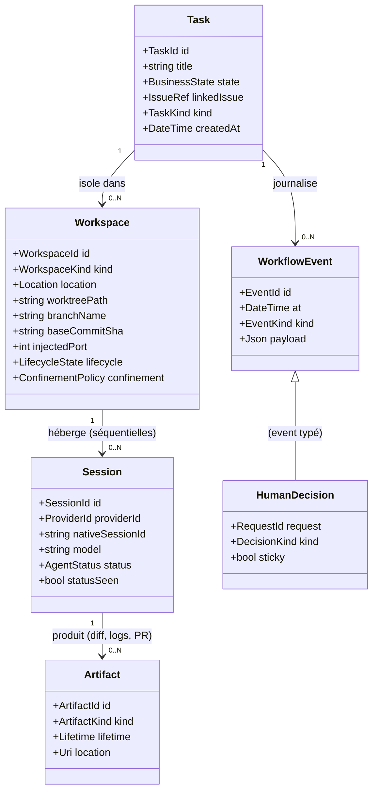
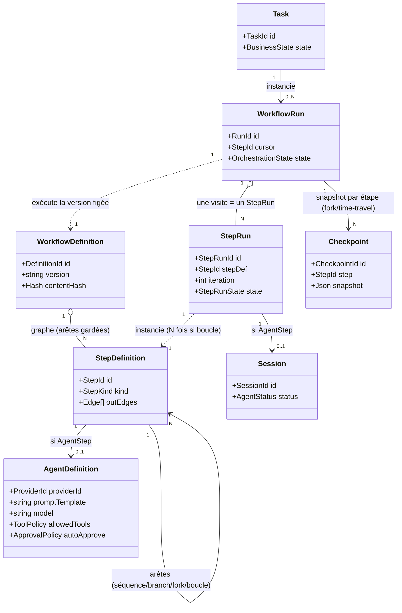
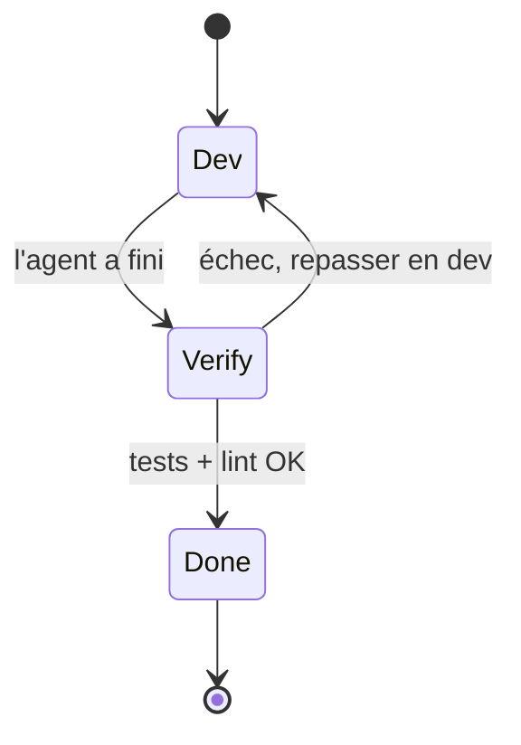
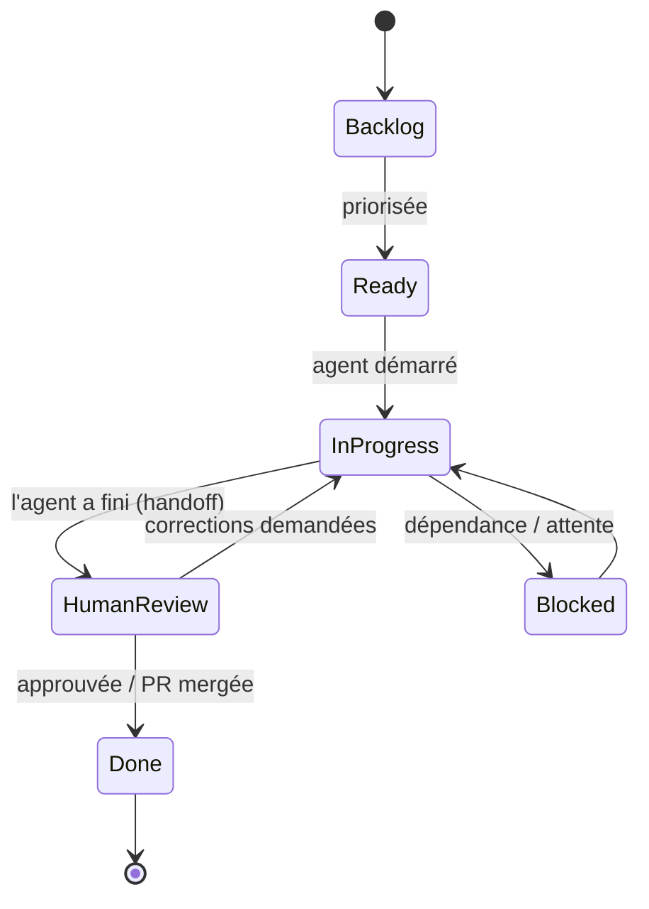
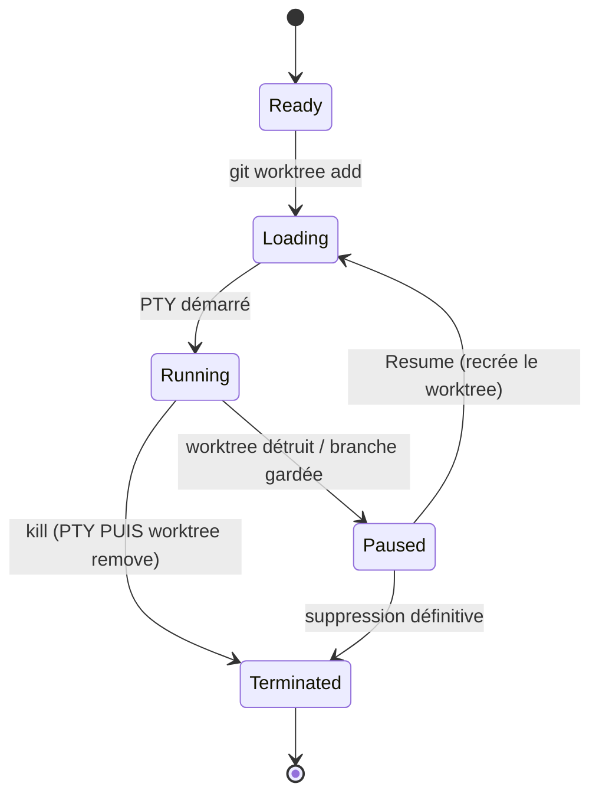
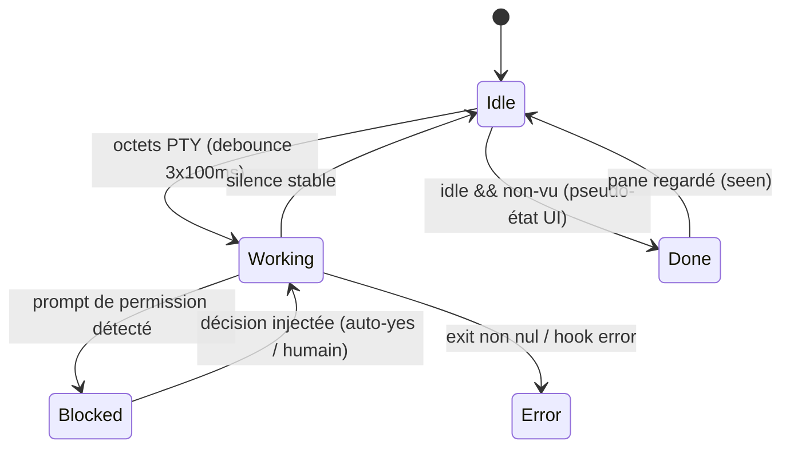
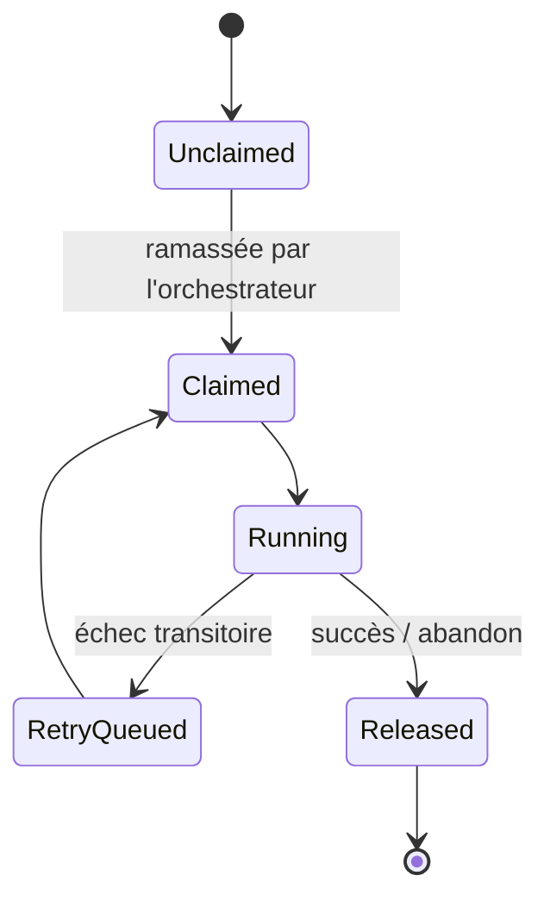
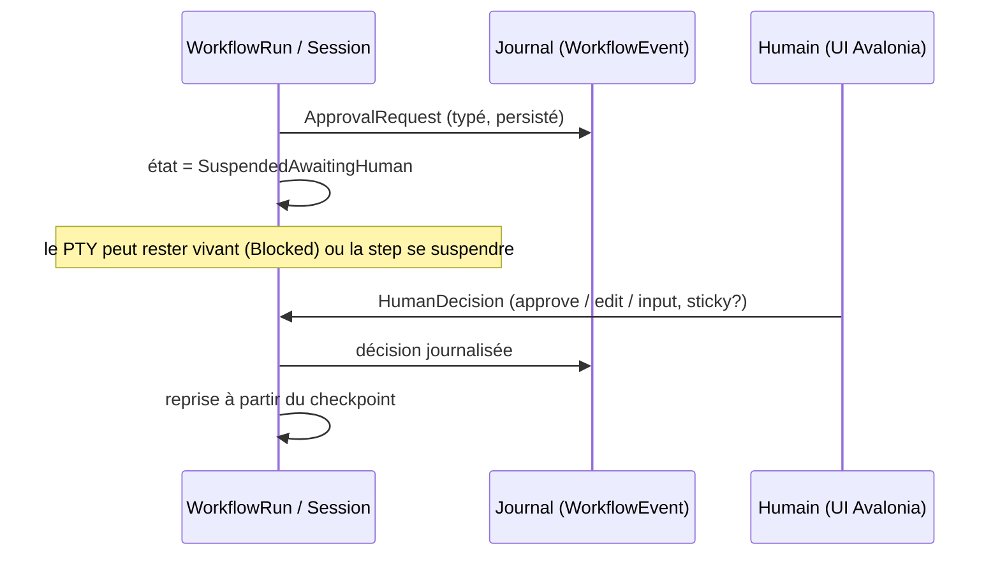

# Modèle métier de Cursus — premier jet (à discuter)

> **Statut : brouillon de discussion, 2026-07-19.** Synthèse des entités issues de la recherche (`docs/research/agentic-workflows-landscape.md`) en un modèle cohérent. Les choix par défaut sont explicités et **discutables** — les points ouverts sont listés en fin de document. Rien ici n'est figé ; c'est le support de notre conversation de conception.

---

## 0. Le cadrage qui commande tout le reste

**La différence structurante de Cursus** (vs LangGraph, Temporal, MAF, CrewAI…) : l'unité d'exécution n'est **pas** un appel LLM/`IChatClient`. C'est une **session = un PTY vivant** exécutant un agent de code (type Claude Code) comme **boîte noire**.

Conséquence sur le modèle :
- Les abstractions « Agent = LLM + tools + instructions » **ne mappent pas** directement → on ne modélise pas des prompts/tools/messages, on modélise un **process opaque et son cycle de vie**.
- Les abstractions de la **couche orchestration** (graphe d'étapes, checkpoint, HITL, séparation définition/exécution) **mappent très bien** → à condition de traiter une session PTY comme un *executor/activity opaque et durable*.

**Modèle mental retenu :** *un graphe d'étapes durables au-dessus de sessions PTY traitées comme des activités opaques journalisées, avec état checkpointé par étape et HITL de première classe par suspension durable + reprise sur injection de décision.*

---

## 1. Les trois couches du modèle

Le modèle se lit en **trois couches**, du déclaratif vers l'exécution :

| Couche | Rôle | Nature | Entités |
|---|---|---|---|
| **A. Définition** | *Ce qu'on veut faire* — réutilisable, versionné, reviewable en Git | Déclaratif, immuable (hashable) | `WorkflowDefinition`, `StepDefinition`, `AgentDefinition` |
| **B. Exécution / Domaine** | *Ce qui tourne réellement* — l'unité durable de supervision | Vivant, muté par machines à états | `Task`, `Workspace`, `Session`, *(`WorkflowRun`, `StepRun`)* |
| **C. État & journal** | *Ce qui s'est passé* — audit, reprise, supervision humaine | Append-only + snapshots | `WorkflowEvent`, `Checkpoint`, `HumanDecision`, `Artifact` |

Transverses (stratégies, **pas** des entités persistées) : `IAgentProvider` (config→commande), `IProcessConfinement` (confinement OS), `IExecutionContext` (local/remote).

---

## 2. Vue d'ensemble — noyau v1 (Task > Workspace > Session)

C'est **l'enseignement le plus fort** de la recherche : la **Tâche** est l'unité durable de supervision ; la **session** est un détail d'exécution jetable. Le graphe de workflow (couche Définition complète) est la *trajectoire* — voir §3.



**Cardinalités par défaut proposées** (⚠️ point à discuter, cf. §6) :
- **Task → N Workspace** : chaque tentative *parallèle* d'une tâche prend son propre worktree + branche → produit sa propre PR (« 1 tâche → N PR »). Le cas nominal = 1 Workspace.
- **Workspace → N Session** : dans un même worktree, les sessions sont *séquentielles* (relance après crash, reprise `--resume`, ou « essaie un autre agent sur le même code »). Une seule session *active* à la fois par worktree.

---

## 3. Vue étendue — la couche orchestration (trajectoire, pas v1)

Pour passer de *viewer* à *orchestrateur* (un agent superviseur qui découpe et attend des sous-agents), on ajoute la couche Définition complète + `WorkflowRun`. **Proposition v1 : cette couche existe mais reste « dormante »** — une Task simple = un *workflow implicite à une seule étape* (Task → 1 Session). On ne l'active que lorsqu'on veut de vrais graphes.



- `StepKind` = `AgentStep` (lance un agent) · `HumanStep` (gate HITL) · `ScriptStep` (setup/run/archive, ex. tests+lint) · `Fork`/`Join` (parallélisme, y compris **DynamicFork** = N branches décidées au runtime) · `SubWorkflow`.
- `WorkflowDefinition` est **versionnée et hashable** : un run s'exécute contre une version *figée* (reproductibilité de la définition, même si l'exécution PTY n'est pas rejouable).
- `Checkpoint` + `RunId` monotone → **time-travel / fork** d'un run à une étape donnée.

### Le `Step`, le `StepRun` et les boucles de rétro-action

Le graphe n'est pas qu'une séquence : ses arêtes peuvent être **gardées** (conditionnelles) et **reboucler**. Exemple canonique — on ne sort de la boucle de dev que si le code passe tests + lint :



- La **boucle vit dans la Définition** (arête gardée `Verify → Dev` si échec, façon `DO_WHILE`).
- À l'exécution, chaque passage matérialise un **`StepRun`** distinct → un même `StepDefinition` « dev » engendre **N `StepRun`** (`iteration` = 1, 2, 3…).
- Un `StepRun` de type **AgentStep** porte **0..1 `Session`** ; les `ScriptStep`/`HumanStep` n'en portent aucune.
- Relation `Session`↔`StepRun` : **1:1** si on redémarre un agent frais à chaque tour, **1:N** si une même session couvre plusieurs itérations (agent gardé vivant) — non tranché (cf. §8 Q10).
- ⚠️ **Garde-fou** : un `maxIterations` sur la boucle → au-delà, bascule vers un `HumanStep` (« la boucle ne converge pas ») plutôt que boucler sans fin.

---

## 4. Les entités en détail

### Couche A — Définition

| Entité | Responsabilité unique | Attributs clés | Cycle de vie |
|---|---|---|---|
| **`WorkflowDefinition`** | Décrire *quoi faire* comme graphe versionné et reviewable | `contentHash`, `version`, graphe de steps | Immuable (nouvelle version = nouveau hash) |
| **`StepDefinition`** | Un nœud du graphe et son type | `kind`, arêtes sortantes | Immuable |
| **`AgentDefinition`** | Config d'un agent (le *quoi*, pas le *comment* de lancement) | `providerId`, `promptTemplate`, `model`, `allowedTools`, `autoApprove`, `confinement` | Immuable / versionnée |

> `AgentDefinition` (données de config) ≠ `IAgentProvider` (stratégie qui traduit la config en commande concrète). Dualité type/instance façon SK `Agent`/`AgentThread`.

### Couche B — Exécution / Domaine

| Entité | Responsabilité unique | Attributs clés | Machine à états |
|---|---|---|---|
| **`Task`** | **L'unité durable de supervision humaine.** Ce que l'humain suit et priorise. | `title`, `state` (métier), `linkedIssue?`, `kind` (`Task`/`AutomationRun`) | **États métier** (§5.1) |
| **`Workspace`** | *Où* ça tourne + son isolation. 1 worktree + branche (ou project-root / BYOI). | `kind`, `location` (local/remote), `worktreePath`, `branchName`, `baseCommitSha`, `injectedPort`, `confinement` | **Cycle de vie worktree** (§5.2) |
| **`Session`** | *Une* exécution d'un agent dans un PTY, jetable/relançable. **Portée par un `StepRun` de type AgentStep** (0..1 par StepRun). | `providerId`, `nativeSessionId` (pour resume), `model`, `status`, `statusSeen` | **État d'agent** (§5.3) |
| **`WorkflowRun`** *(trajectoire)* | Une instance d'exécution d'un `WorkflowDefinition`. | `RunId`, `cursor` (étape courante) | **Orchestration** (§5.4) |
| **`StepRun`** *(trajectoire)* | Une **visite** d'un `StepDefinition` dans un run (N si boucle). Instancie une étape ; porte 0..1 `Session`. | `stepDef`, `iteration`, `state` | **Orchestration** (§5.4) |

> ⚠️ Le **handle PTY n'est jamais persisté** (runtime seul). On stocke de quoi *reconstruire* (`worktreePath`, `branchName`, `baseCommitSha`, `nativeSessionId`).

### Couche C — État & journal

| Entité | Responsabilité unique | Attributs clés |
|---|---|---|
| **`WorkflowEvent`** | Journal **append-only typé** : audit, reprise fine, alimentation UI | `at`, `kind`, `payload` (changement de statut, décision, artefact produit…) |
| **`Checkpoint`** | Snapshot de l'état d'un run **par étape** (reprise/fork) | `step`, `snapshot` |
| **`HumanDecision`** | La décision humaine injectée pour reprendre un run suspendu | `request`, `kind` (approve/edit/input), `sticky` |
| **`Artifact`** | Sortie de 1ʳᵉ classe (diff, logs, lien PR) avec **durée de vie** | `kind`, `lifetime` (ephemeral/task/durable), `location` |

---

## 5. Les machines à états (séparées — ne jamais les mélanger)

Enseignement Symphony : **états métier** (visibles) et **états d'orchestration** (internes) sont deux plans distincts. Cursus en a **quatre**, portés par des entités différentes.

### 5.1 — États **métier** (portés par `Task`, visibles dans l'UI)



> Clé (Symphony) : **le succès d'un agent ≠ fermeture de la tâche**. `HumanReview` est un état de première classe — l'humain reste dans la boucle.

### 5.2 — Cycle de vie **worktree** (porté par `Workspace`, modèle Claude Squad)



> `Paused` = worktree *détruit*, branche *conservée* (peu coûteux). **Ordre de teardown critique : tuer le PTY AVANT `git worktree remove`** (verrous).

### 5.3 — **État d'agent** (porté par `Session`, moteur de détection — cf. jalon 1)



> `Done` est un **pseudo-état purement UI** (`idle && !seen`) → alimente la sidebar « qui attend d'être regardé ». Détecté via hooks Claude Code (primaire) + OSC 133 + moteur screen-manifest (fallback).

### 5.4 — **Orchestration** interne (porté par `WorkflowRun`/étape — trajectoire, invisible)



---

## 6. HITL — le cœur de la supervision

Pattern identique dans tous les frameworks : **suspension durable + reprise par injection de valeur**.



- **Trois canaux distincts** (façon Temporal Signals/Queries/Updates) : *pousser* un input · *lire* l'état sans le perturber (pour l'UI temps réel) · *muter + attendre*.
- **Approbations collantes** (`sticky` = « don't ask again ») → règle de politique réutilisée.
- Charges typées : `ApprovalRequest` · `EditRequest` · `InputRequest`.

---

## 7. Persistance & audit (capture des sorties)

> Objectif : pouvoir **relire ce qui s'est passé** (ce que l'agent a fait, ce que les tests ont dit, ce qui aurait pu être mieux) sans payer le coût du flux brut. Principe directeur : **on ne persiste jamais le flux d'octets brut ; on persiste ce que l'émulateur a déjà *cuit* (texte rendu) et ce que le provider expose de structuré.**

### Les trois grains de sortie

Un terminal transforme un flux de *dessin* en une grille de caractères. On en tire trois grains, de plus en plus utiles et de moins en moins bruyants :

| Grain | Ce que c'est | Nature | Persistance |
|---|---|---|---|
| **1 — Flux VT brut** | octets du PTY (échappements, repaints, spinner, curseur) | rendu, illisible | ❌ jamais durable — **ring buffer runtime** (redraw à la reconnexion, alimente la détection). RoyalTerminal le gère (`ScrollbackLimit`). |
| **2 — Scrollback rendu** | le texte *déwrappé* de ce qui a défilé, dédupliqué des repaints (`TryExportSnapshot`) | semi-structuré, lisible | ✅ **capturable** — la sortie « telle qu'affichée » |
| **3 — Transcript structuré** | les *messages* du provider (prompt, réponses, tool calls + résultats) en JSONL | structuré | ✅ **la meilleure source d'audit** (re-traitable, re-passable à un LLM) |

> Rappel mécanique : le **grain 1 nourrit l'émulateur** en temps réel ; l'émulateur produit le **grain 2** (sa grille + son scrollback). On n'a donc **jamais besoin de stocker le grain 1** — on lit la grille quand on veut. Le grain 3 vient **hors terminal**, du provider lui-même.

### Ce qu'on persiste, et sous quelle forme

- **Durable, toujours** : le journal sémantique (`WorkflowEvent` — transitions d'état, décisions humaines, verdicts, événements OSC 133/hooks) + des **snapshots rendus aux frontières** (fin de `StepRun`, erreur, `blocked-awaiting-human`, fin de session).
- **Durable, en artefact** (`Artifact` avec `Lifetime` + GC, façon Swamp) : la **capture de sortie** d'un `StepRun` — grain 2 par défaut, grain 3 pour les providers qui l'exposent. Clé de liaison = `nativeSessionId`.
- **Éphémère** : le flux brut (grain 1), ring buffer runtime, jamais écrit sur disque.

C'est la distinction **State éphémère vs Memory durable** appliquée aux sorties : le flux = State, le journal + les artefacts de capture = Memory.

### Stratégie en deux phases

**Phase 1 — capture « directe », uniforme pour tous les `StepKind`.**
Un seul mécanisme : capturer le **grain 2** (`TryExportSnapshot` de la plage scrollback) en fin de `StepRun`. Vaut pour :
- `ScriptStep` (tests/lint/build) → c'est le log ligne-à-ligne ;
- `AgentStep` (Claude Code & co) → c'est la conversation *rendue*.

Simple, un seul chemin de code, marche même pour un provider inconnu. **Dégradation gracieuse** : ce niveau reste le fallback permanent pour tout provider sans transcript structuré.

**Phase 2 — capture « smart », spécifique aux providers à transcript.**
Pour Claude Code : ingérer le **grain 3** (JSONL structuré) **via les hooks**. Un hook Claude Code reçoit dans son payload `session_id` **et** `transcript_path` → il donne le chemin du JSONL à ingérer et sert de déclencheur. **Réutilise l'infra de hooks déjà nécessaire à la détection d'état** (jalon 1/5) — pas une brique en plus.

### ⚠️ Décision v1 induite : *classic renderer* sur les `AgentStep`

Pour que la Phase 1 marche uniformément, Claude Code doit être lancé en **renderer classic** (défaut, ou forcé via `CLAUDE_CODE_DISABLE_ALTERNATE_SCREEN=1`) :
- **classic** → la conversation s'accumule dans le **scrollback** → une capture en fin de session = tout le transcript-texte ;
- **fullscreen** (`/tui fullscreen`) → alt screen, **pas de scrollback** → `TryExportSnapshot` ne rend que l'écran visible à l'instant T, pas l'historique.

**Décision v1 assumée : forcer le classic sur les AgentSteps.** On troque les bénéfices du fullscreen (flicker-free, mémoire plate) contre la simplicité + l'audit uniforme. Bonus : la preview d'une session non-affichée et le moteur de détection lisent le même texte inline.

### Le renderer est un lever transverse

Le choix du renderer, décidé au lancement de la session, arbitre **trois préoccupations à la fois** — à ne pas trancher isolément :

| | **Classic (choix v1)** | **Fullscreen** |
|---|---|---|
| Audit | conversation dans le scrollback (grain 2 gratuit) | via JSONL/hooks seulement |
| Détection | heuristique `AlternateScreen` inopérante | `AlternateScreen==true` = agent actif |
| UX live | flicker possible, mémoire croissante | flicker-free, mémoire plate, souris |

*(Note : les sessions background / `claude attach` sont **toujours** en fullscreen — hors de notre contrôle si on s'y branche.)*

### Sécurité

La sortie terminal peut contenir des secrets (tokens, contenus de fichiers). Toute capture durable (grain 2 ou 3) doit passer par une **politique de rétention/rédaction** — cohérent avec l'ethos local-first/ownership et avec la couche de confinement (`IProcessConfinement`).

### Dépendance technique à confirmer

`TryExportSnapshot` doit pouvoir exporter **toute la plage de scrollback** (pas seulement le viewport visible) — mini re-sonde par réflexion/source, comme celle du PTY. L'émulateur détient les lignes (on peut scroller), donc c'est une question d'API d'export, pas de faisabilité.

---

## 8. Questions ouvertes — à trancher ensemble

Ce sont les vrais points de conception. Je donne mon inclinaison, mais rien n'est décidé.

1. **Graphe de workflow dès v1, ou `Task > Session` seul ?**
   *Inclinaison :* poser l'infra graphe mais la garder dormante (v1 = workflow implicite à 1 étape). Risque : sur-modéliser trop tôt.

2. **Cardinalité `Task`–`Workspace`–`Session`.**
   *Inclinaison :* `Task → N Workspace` (tentatives parallèles = branches/PR séparées), `Workspace → N Session` séquentielles. Alternative Emdash plus simple : `Task → N Conversation` directement, le Workspace étant un attribut. **À trancher — ça change tout le reste.**

3. **Nommage : `Session` vs `Conversation`.**
   *Inclinaison :* `Session` (on modélise un PTY, pas un fil de chat). Emdash dit `Conversation`. Éviter la confusion avec la « session terminal » RoyalTerminal.

4. **Où vit le cycle de vie `Paused` (worktree) ?**
   *Inclinaison :* sur `Workspace` (c'est le worktree qui est détruit/recréé) ; la `Session` reste purement jetable. À valider.

5. **Le confinement (`ConfinementPolicy`) : attribut de `Workspace` ou de `Session` ?**
   *Inclinaison :* défini sur `Workspace` (le profil dépend des chemins du worktree) mais *appliqué* au lancement de la `Session`.

6. **`Task` = source de vérité, ou miroir d'une issue externe ?**
   *Inclinaison :* store interne SQLite = source de vérité ; Linear/GitHub en adaptateurs `IIssueSource` optionnels (`linkedIssue`). Symphony fait l'inverse (re-dérive du tracker) — à discuter selon l'usage visé.

7. **Granularité de l'event-sourcing.**
   Que met-on exactement dans `WorkflowEvent` (tout changement de statut ? seulement les jalons ?) et quand crée-t-on un `Checkpoint` ? Impacte le coût de reprise et la taille du journal.

8. **`AutomationRun` vs `Task` interactive.**
   Emdash distingue `type: task|automation-run`. Doit-on modéliser dès maintenant les runs automatisés (non supervisés) comme un sous-type, ou plus tard ?

9. **La `Task` porte-t-elle un `WorkflowDefinition`, ou l'inverse ?**
   Une définition réutilisable peut engendrer plusieurs Tasks (template), ou chaque Task a sa définition ad hoc. Lien avec la question 1.

10. **Reprise vs session fraîche à chaque itération de boucle (cardinalité `Session`↔`StepRun`).**
    Sur une arête de rétro-action (Verify→Dev), reprend-on la même Session — agent vivant qui garde son contexte, 1 Session couvre N StepRun — ou en démarre-t-on une fraîche (1:1) ? *Non tranché.* Couplé aux Q11/Q12 : **moins il y a de continuité de session, plus il faut réinjecter de contexte explicitement.**

11. **Que sait l'agent de sa propre position dans le graphe ?**
    Projette-t-on dans le contexte de l'agent la conscience du process — p.ex. « tu es à l'étape *dev*, itération 3, les tests A/B échouent toujours » ? L'`iteration` a-t-elle de la valeur *pour l'agent* (pas que pour l'UI) ? *Inclinaison :* oui — permet de **changer de stratégie** après N échecs au lieu de répéter, et de sentir le garde-fou `maxIterations` approcher.

12. **Injecte-t-on l'historique des étapes en contexte, et comment ?**
    Passe-t-on un **résumé curé** des `StepRun` précédents (ce qui a été tenté, les verdicts de Verify) en entrée de l'agent ? Push (bloc de contexte dans le prompt/fichier) vs pull (outil MCP « donne-moi les tentatives précédentes ») ? Projection *curée* du journal `WorkflowEvent`, pas un dump brut. Lien fort avec Q10/Q11.

13. **Référencer vs ingérer le transcript** (§7).
    Pointer vers le fichier du provider (`~/.claude/…` : léger, mais fragile — purge utilisateur, exécution remote) ou **copier** le JSONL dans l'artefact store de Cursus (owned, durable, marche en SSH) ? *Inclinaison :* ingérer au moins un snapshot en fin de `StepRun`.

14. **Classic imposé pour toujours, ou fullscreen réactivable ?** (§7)
    La v1 force le classic (Phase 1). Quand/comment réoffrir le fullscreen (meilleure UX live) une fois la Phase 2 (JSONL) en place et l'audit découplé du scrollback ? Par session ? Réglage global ? Lien avec le moteur de détection (l'heuristique `AlternateScreen` ne vaut qu'en fullscreen).

15. **Rédaction des secrets dans les captures** (§7).
    Que masque-t-on, à quel niveau (au moment de la capture ? à la relecture ?), selon quelle politique ? Lien avec `IProcessConfinement`.

---

## 9. Ce que ce modèle NE dit pas encore (hors périmètre de ce jet)

- Le détail des **`IAgentProvider`** (capacités typées, `BuildStandardCommand`) — voir addendum Vague 2 du rapport.
- Le **remote/SSH** (`IExecutionContext`, `PortForward`) — prévu dans l'archi, pas dans ce modèle v1.
- La couche **UI/ViewModels** Avalonia (ce document est le domaine pur, testable, sans UI).
- Le **protocole ACP** (transport chat structuré) — trajectoire v2.
```
