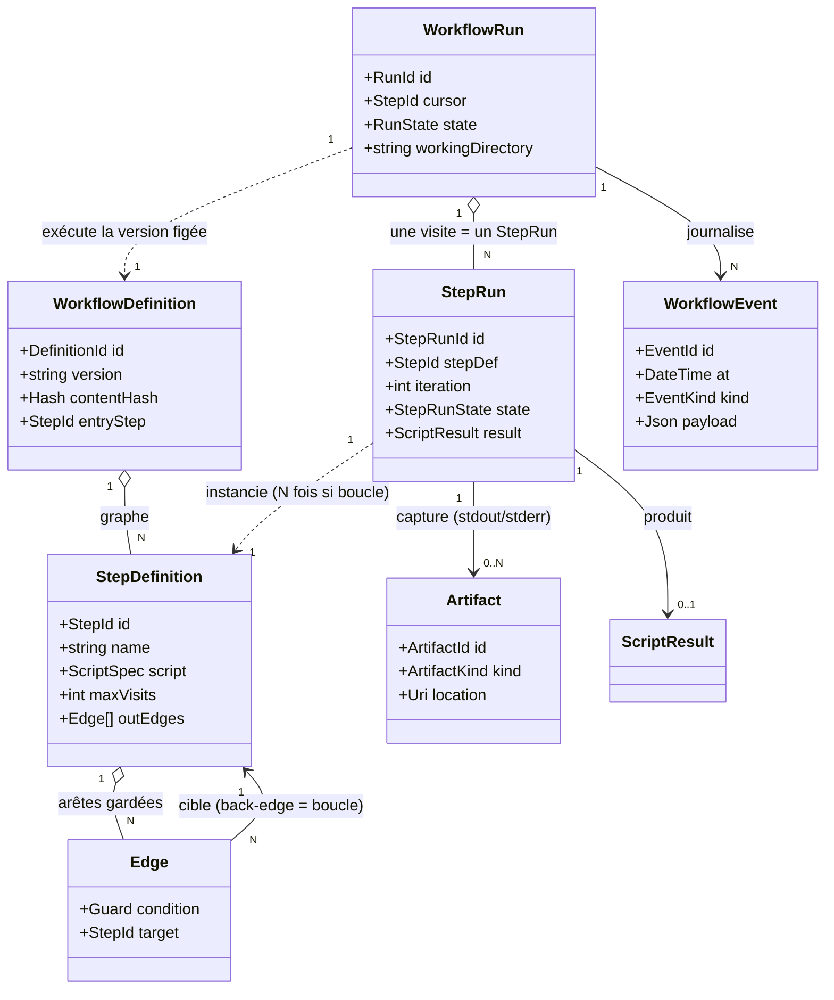
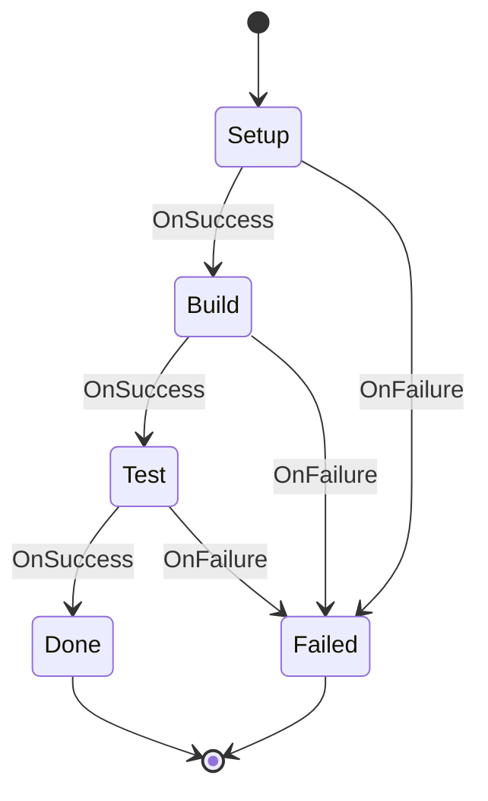
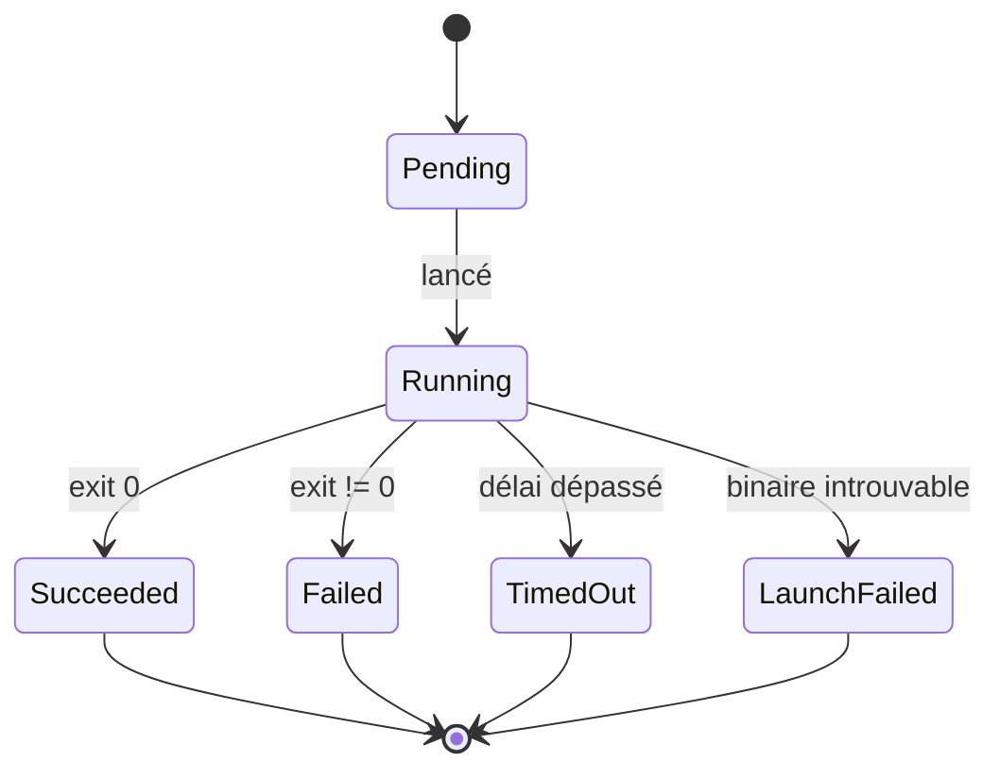
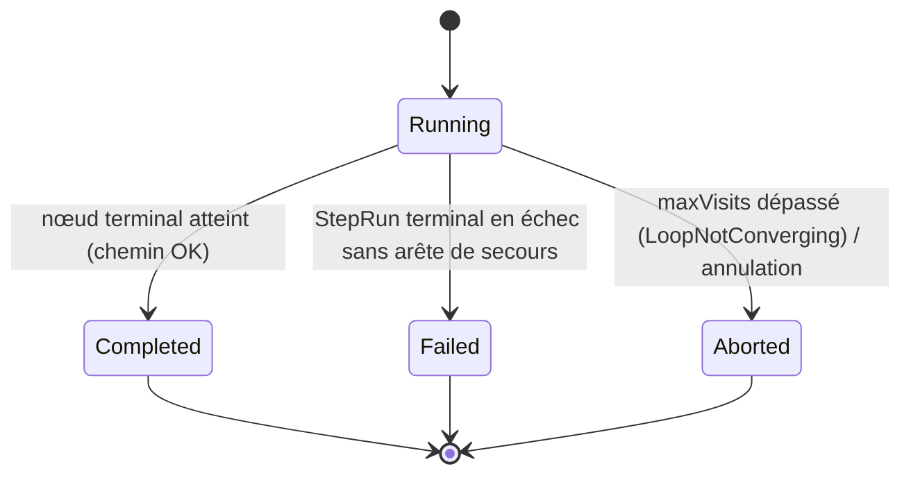

# Noyau déterministe — Workflow, Step, Run (v0, sans agents)

> **Statut : brouillon de conception, 2026-07-19.** Ce document définit le **socle déterministe** de Cursus : des workflows composés d'étapes qui ne sont **que des scripts** (un process, un code de sortie). Toute la complexité « agent de développement » — session PTY, détection d'état, renderer, HITL par injection, confinement — est **délibérément exclue ici** et traitée dans `modele-metier.md` (le modèle étendu). L'objectif : bâtir d'abord le moteur d'orchestration *neutre et entièrement testable*, puis y greffer l'agent comme un simple type d'étape de plus.

---

## 0. Pourquoi commencer par le déterministe

Trois raisons, dans l'ordre d'importance :

1. **Le cœur d'orchestration doit être neutre.** Enseignement de la recherche (Netflix Conductor a greffé l'IA sans réécrire son moteur) : *une étape agent n'est qu'un type d'étape parmi d'autres*. Si le moteur sait déjà router un graphe d'étapes-scripts avec des boucles gardées, ajouter `AgentStep` plus tard = ajouter un `StepKind`, pas refondre le noyau.
2. **Le déterministe est intégralement testable (cible TDD idéale).** Le contrat d'une étape-script est fermé : `(commande, args, env, cwd) → (code de sortie, stdout, stderr, durée)`. Aucun PTY, aucun timing, aucun scraping d'écran, aucune heuristique. Le moteur se teste sur un `IProcessRunner` stubé qui renvoie des codes de sortie en dur → on assert la **traversée du graphe**.
3. **On retire tout ce qui rend Cursus difficile, on garde le squelette d'orchestration.** Séparation définition/exécution, `WorkflowRun`/`StepRun`, arêtes gardées, boucles, journal append-only : tout ce squelette existe déjà sans un seul agent.

**Modèle mental de ce document :** *un graphe d'étapes déterministes routées par le code de sortie, exécutées comme des process à stdout/stderr redirigés, journalisées de bout en bout.*

---

## 1. Vocabulaire (dans ce périmètre)

Mêmes mots que le modèle étendu, restreints au sous-ensemble déterministe :

| Terme | Définition (v0 déterministe) | Correspondance modèle étendu |
|---|---|---|
| **Workflow** | *La définition* : un graphe d'étapes reliées par des arêtes gardées. Versionné, reviewable en Git. | `WorkflowDefinition` (identique) |
| **Step** | *Un nœud du graphe* : **un** script déterministe (un lancement de process) + ses arêtes sortantes. | `StepDefinition` avec `kind = ScriptStep` (le seul type ici) |
| **WorkflowRun** | *Une exécution* d'un workflow, du nœud d'entrée à un nœud terminal. | `WorkflowRun` (identique) |
| **StepRun** | *Une visite* d'un Step dans un run. Un même Step engendre **N StepRun** s'il est dans une boucle (compteur `iteration`). | `StepRun` (identique, mais ne porte **jamais** de `Session`) |

> Un Step = **un** process. On ne met pas « setup + run + archive » dans un seul Step : ce sont **trois Steps** distincts du graphe. L'atome reste un lancement unique → le contrat reste fermé et testable.

---

## 2. Le modèle réduit



**Ce qui a disparu par rapport au modèle étendu** : `AgentDefinition`, `Session`, `IAgentProvider`, `HumanDecision`, `Checkpoint`, les machines à états « agent » et « worktree ». Ne restent que les briques dont un graphe de scripts a strictement besoin.

---

## 3. Le contrat d'exécution d'un Step

Le point qui rend tout le reste simple. Une étape déterministe **n'a pas besoin de PTY** : c'est un process à `stdout`/`stderr` **redirigés** (`System.Diagnostics.Process`, pas `forkpty`). Le PTY n'est nécessaire que pour un agent interactif (modèle étendu) — c'est *précisément* ce qui distingue les deux mondes.

### Entrée — `ScriptSpec` (immuable, dans la définition)

| Champ | Rôle |
|---|---|
| `FileName` | Chemin **absolu** de l'exécutable (pas d'expansion `~`/`$VAR`). |
| `Arguments` | `string[]` — tokens d'argv, aucun quoting/globbing à gérer. |
| `WorkingDirectory` | `cwd` du process (défaut : le `workingDirectory` du `WorkflowRun`). |
| `Environment` | Dictionnaire fusionné par-dessus l'env hôte (ou allowlist stricte — cf. §9). |
| `Timeout?` | Délai max avant kill (optionnel). |

### Sortie — `ScriptResult` (dans le StepRun)

| Champ | Rôle |
|---|---|
| `ExitCode` | Code de sortie du process. **`0` = succès** par convention. |
| `Outcome` | `Completed` · `TimedOut` · `LaunchFailed` (binaire introuvable, etc.). |
| `Stdout` / `Stderr` | Capture **intégrale** (redirigée), rangée en `Artifact`. |
| `StartedAt` / `Duration` | Pour le journal et l'UI. |

### L'abstraction testable — `IProcessRunner`

```
IProcessRunner : ScriptSpec → ScriptResult
```

Une seule dépendance à l'I/O système. Le **moteur de workflow est pur au-dessus d'elle** : en test, on stube `IProcessRunner` pour renvoyer des `ScriptResult` en dur (exit 0, exit 1, `TimedOut`…) et on vérifie la traversée du graphe — sans lancer un seul vrai process.

> Corollaire audit : comme `stdout`/`stderr` sont **redirigés** (pas peints sur une grille VT), la capture est **triviale et totale**. Aucun des trois grains / débat scrollback vs alt-screen du modèle étendu (§7 de `modele-metier.md`) ne s'applique ici : le flux **est** l'artefact.

---

## 4. Arêtes gardées et boucles de rétro-action

Le graphe route sur le **résultat** de chaque StepRun. Une arête = une **garde** + une **cible**.

### Vocabulaire des gardes (v0 — volontairement minimal)

| Garde | Vraie si |
|---|---|
| `OnSuccess` | `ExitCode == 0` |
| `OnFailure` | `ExitCode != 0` |
| `OnExitCode(n)` | `ExitCode == n` |
| `Default` | toujours (fallback) |

**Règle de routage (déterministe) :** à la fin d'un StepRun, on évalue les arêtes sortantes **dans l'ordre de déclaration** ; la **première** garde vraie l'emporte → sa cible devient le `cursor`. Si aucune arête ne matche → le run se termine sur ce nœud (terminal implicite).

### Boucle = arête arrière + garde-fou

Une arête dont la cible est un nœud **déjà visité** est une **boucle**. Chaque réentrée matérialise un nouveau `StepRun` (`iteration = 1, 2, 3…`). Garde-fou obligatoire : `maxVisits` par Step → au-delà, le run **échoue** avec la raison `LoopNotConverging` (jamais de boucle infinie).



### ⚠️ Ce qu'une boucle déterministe peut et ne peut PAS faire

Point de conception **structurant** — et honnête :

- **Ce qu'elle sait faire : retry / poll / until.** Une arête arrière n'a de sens que si ré-exécuter le script peut donner **un autre résultat** : ré-essayer un `fetch` réseau qui a flanché, *poller* un service jusqu'à ce qu'il réponde (`OnFailure → self`, `maxVisits` + délai), attendre une condition. Cas parfaitement déterministe-compatible.
- **Ce qu'elle ne sait PAS faire : la boucle de dev auto-réparatrice.** La boucle canonique `Verify → Dev` du modèle étendu suppose qu'**un acteur change le monde entre deux tours** (l'agent corrige le code). Un back-edge purement scripté ré-exécuterait *le même script à l'identique* → échec identique jusqu'à `maxVisits`. **Cette boucle-là est précisément ce qui exige l'agent** — elle arrive avec `AgentStep`, pas ici.

C'est la meilleure illustration du découpage : le noyau déterministe fournit *le mécanisme de boucle gardée* ; l'agent fournit *le seul acteur capable de la faire converger*.

---

## 5. Machines à états (réduites à deux)

Le modèle étendu en a quatre ; ici il n'en reste que deux, toutes deux **internes / orchestration** (l'état métier `Task` est hors périmètre de ce document).

### 5.1 — `StepRun`



### 5.2 — `WorkflowRun`



---

## 6. Persistance & audit (trivialisée)

Ici, la persistance est **sans débat** (contrairement au §7 du modèle étendu) :

- **`WorkflowEvent` (journal append-only)** : un événement par décision observable — `StepRun` démarré, terminé (avec `ExitCode`/`Outcome`), **arête choisie** (garde évaluée → cible), incrément d'`iteration`, terminaison du run. Rejoue toute la trajectoire.
- **`Artifact` par StepRun** : `stdout` et `stderr` capturés **intégralement et directement** (flux redirigé). C'est *le* log de l'étape — pour un `ScriptStep` de tests/lint, c'est exactement ce qu'on veut relire.
- **Aucun flux brut éphémère à gérer**, aucun ring-buffer VT, aucun grain 2/3 : le process n'a pas de terminal, donc pas de repaints à « cuire ».

> La **rédaction des secrets** (un `stdout` peut contenir des tokens) reste la seule précaution commune avec le modèle étendu — politique de rétention à appliquer à toute capture durable.

---

## 7. Ce qui est volontairement exclu (et où ça atterrit ensuite)

| Exclu ici | Pourquoi | Où c'est traité |
|---|---|---|
| `AgentStep` / `AgentDefinition` | pas de LLM, pas de prompt, pas d'agent interactif | `modele-metier.md` §3 |
| `Session` / PTY | un script n'a pas besoin de TTY (process redirigé suffit) | `modele-metier.md` §2, §4 |
| Moteur de détection d'état | le « state » d'un script **est** son code de sortie — rien à détecter | `modele-metier.md` §5.3, jalon 1 |
| Renderer classic/fullscreen, grains 1/2/3 | pas de terminal → pas de scrollback à capturer | `modele-metier.md` §7 |
| HITL par injection dans le PTY | pas d'interaction ; un `HumanStep` de type « gate » pourra venir plus tard comme `StepKind` | `modele-metier.md` §6 |
| Confinement OS (`IProcessConfinement`) | applicable mais orthogonal ; un script peut être confiné de la même façon | `modele-metier.md` §1, addendum Vague 3 |
| **Boucle auto-réparatrice** `Verify → Dev` | exige un acteur qui change le monde entre deux tours = l'agent | arrive avec `AgentStep` (cf. §4) |

**Invariant de conception à préserver :** le moteur v0 ne connaît que `StepDefinition` + `IProcessRunner`. Ajouter `AgentStep` plus tard doit se faire en **ajoutant un `StepKind`** (et son exécuteur) derrière la même abstraction de routage, **sans toucher** la logique de traversée du graphe.

---

## 8. Pourquoi c'est le bon premier jalon TDD

Le moteur de traversée est **pur** au-dessus d'`IProcessRunner` stubé → chaque comportement est un test déterministe sur des codes de sortie en dur. Aperçu de test list (indicatif, non gaté) :

**Contexte : traversée séquentielle**
- étant donné un graphe A→B→C tout en `OnSuccess` et un runner qui renvoie exit 0, quand on exécute le run, alors les StepRun sont A, B, C dans l'ordre et le run est `Completed`
- étant donné une étape qui renvoie exit 1 sans arête `OnFailure`, quand on l'exécute, alors le run est `Failed` sur cette étape

**Contexte : arêtes gardées**
- étant donné deux arêtes `OnSuccess→B` puis `OnFailure→C`, quand l'étape renvoie exit 1, alors la cible retenue est C
- étant donné des arêtes `OnExitCode(2)→B` puis `Default→C`, quand l'étape renvoie exit 2, alors la cible est B ; quand elle renvoie exit 5, alors la cible est C

**Contexte : boucles et garde-fou**
- étant donné une arête arrière `OnFailure→self` et `maxVisits=3`, quand l'étape échoue à chaque fois, alors on observe 3 StepRun (`iteration` 1,2,3) puis le run est `Aborted (LoopNotConverging)`
- étant donné la même boucle mais un runner qui renvoie exit 1 puis exit 0, quand on exécute, alors on observe 2 StepRun et le run est `Completed`

**Contexte : résultats non nominaux**
- étant donné un runner qui renvoie `TimedOut`, quand on route, alors l'étape est traitée comme un échec (`OnFailure`)
- étant donné un `LaunchFailed`, quand on route, alors le run est `Failed` avec la raison propagée

> Aucun de ces tests ne lance un vrai process : ils vérifient **la logique d'orchestration**, pas l'I/O. L'I/O réel (`IProcessRunner` concret sur `System.Diagnostics.Process`) se teste séparément, en petit nombre, contre de vrais mini-binaires.

---

## 9. Questions ouvertes (périmètre v0)

Petit lot, spécifique au déterministe :

1. **Expressivité des gardes.** On s'arrête à `ExitCode` en v0. Faut-il déjà prévoir un `OnStdoutMatch(regex)` (certains outils sortent 0 mais impriment `FAILED`) ? *Inclinaison :* non en v0, `ExitCode` d'abord ; garder l'interface `Guard` extensible.
2. **`maxVisits` : par Step, par boucle, ou global au run ?** *Inclinaison :* par Step (simple, local, suffisant pour retry/poll). Un plafond global au run en filet de sécurité.
3. **Parallélisme (`Fork`/`Join`) dès v0, ou séquentiel strict ?** *Inclinaison :* séquentiel strict d'abord (un seul `cursor`) ; le fork est une extension propre du modèle de routage.
4. **Sémantique du `Timeout`.** Kill dur du process à l'échéance → `Outcome = TimedOut` traité comme `OnFailure` ? Ou un canal de garde distinct `OnTimeout` ? *Inclinaison :* `TimedOut` ⇒ `OnFailure` en v0, garde dédiée plus tard si besoin.
5. **Héritage d'environnement.** Un `ScriptStep` hérite-t-il de tout l'env hôte (façon terminal) ou d'une **allowlist stricte** (façon agent) ? *Inclinaison :* env hôte + overrides pour un script « de confiance » commité ; l'allowlist stricte reste réservée au monde agent.
6. **Répertoire de travail partagé entre Steps.** Tous les Steps d'un run tournent-ils dans le même `workingDirectory` (le workspace), ou chacun peut-il pointer un sous-chemin ? *Inclinaison :* défaut = le workspace du run, surchargeable par Step.
7. **Idempotence / reprise.** Rejoue-t-on un run à partir du dernier StepRun réussi après un crash de Cursus (checkpoint léger) ? Ou relance-t-on du début ? *Inclinaison :* hors v0 — journaliser d'abord, la reprise viendra avec les `Checkpoint` du modèle étendu.

---

## 10. En une phrase

> *Un moteur qui parcourt un graphe de scripts, route chaque étape sur son code de sortie, boucle sous garde-fou, et journalise tout — sans jamais savoir ce qu'est un agent.* C'est le substrat ; l'agent est un `StepKind` de plus, ajouté sans le réécrire.
