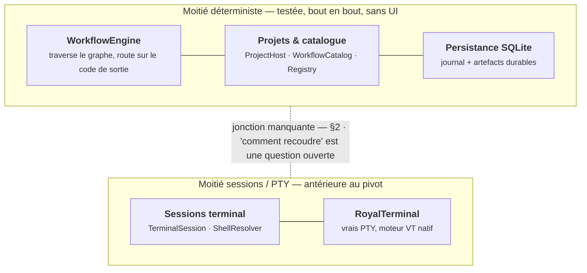
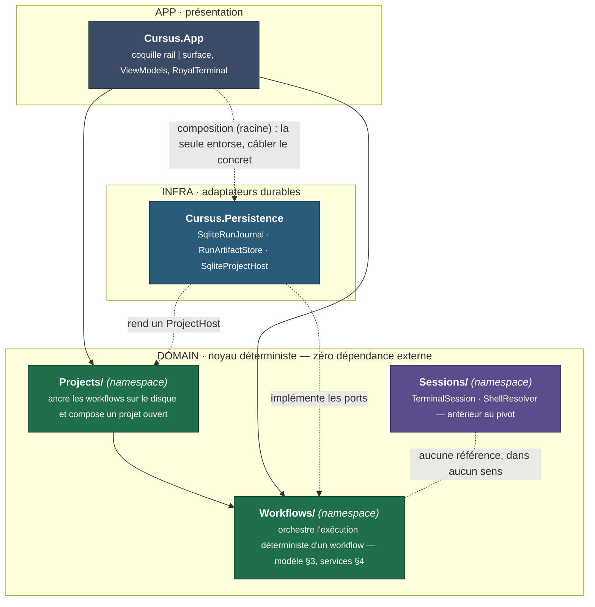
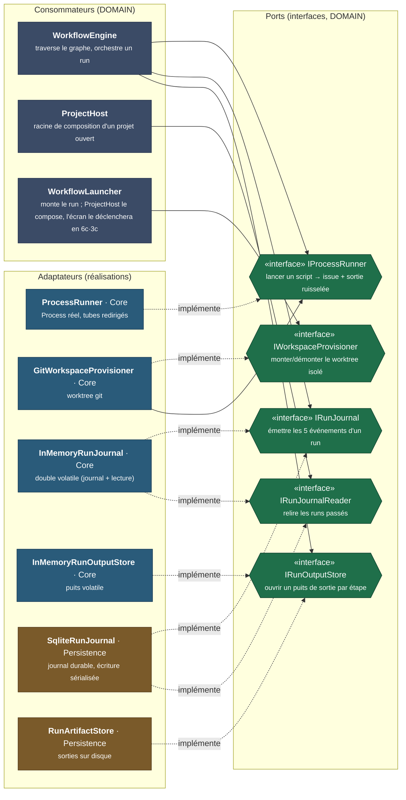
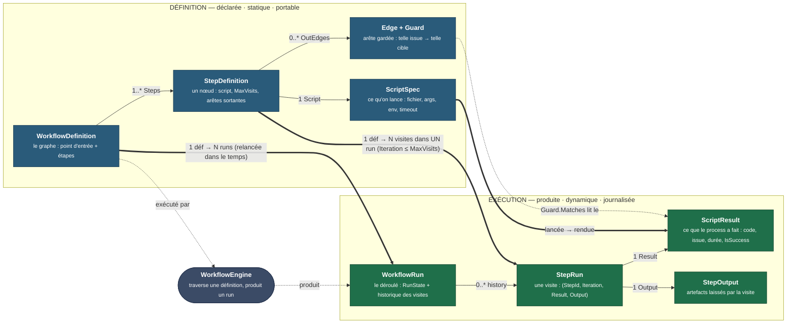
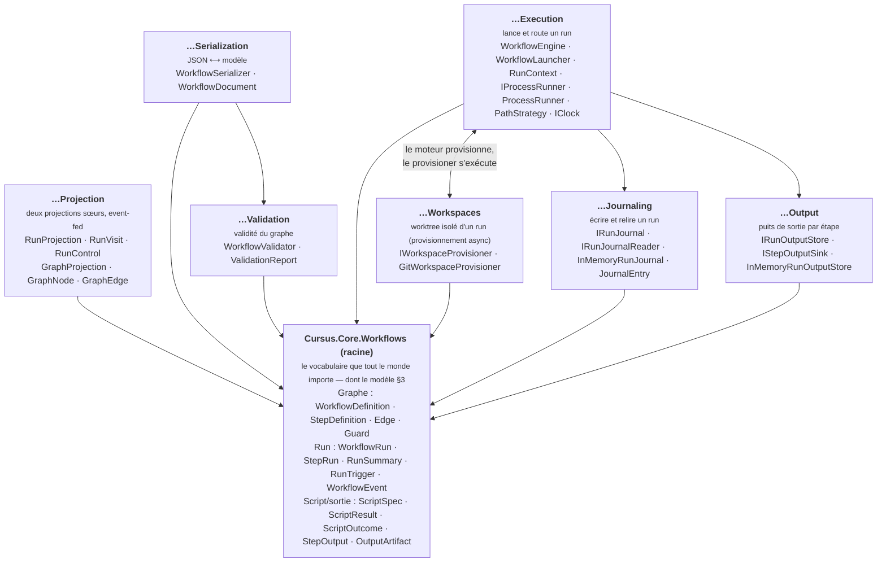
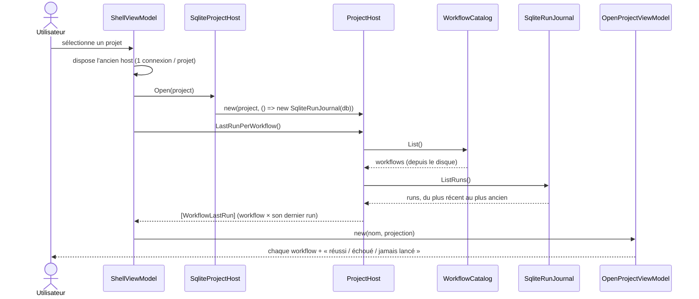
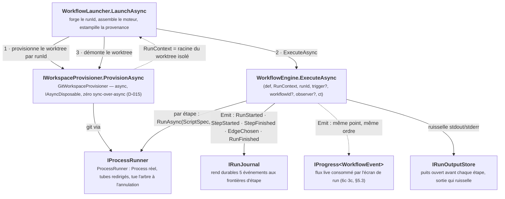
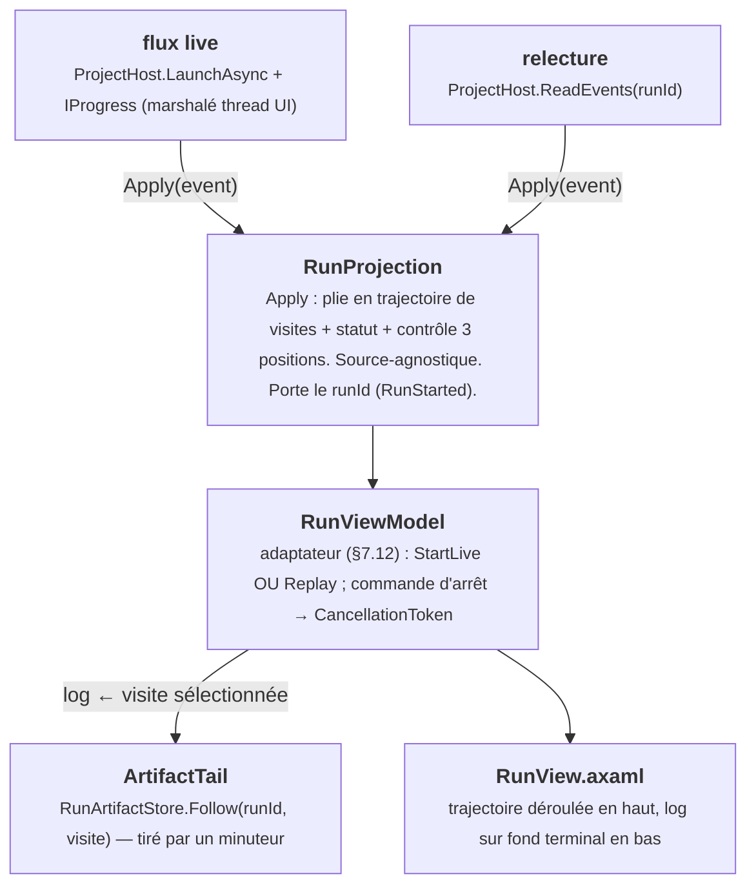
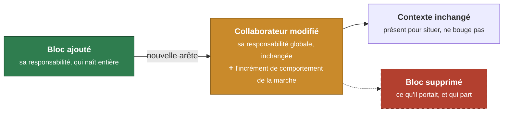
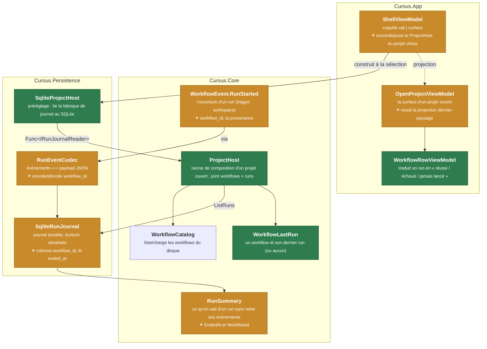

# Schémas d'architecture — la carte visuelle de Cursus

> **Statut** : compagnon visuel de `architecture.md`, à jour du commit `8f2c961`
> (jalon 6c·3c — l'écran de run, la projection à deux alimentations). Rendu par
> l'aperçu Markdown de Rider, GitHub et VS Code (Mermaid natif, aucune étape de
> build).
>
> **Ce que ce document est, et n'est pas.** `architecture.md` détient la vérité en
> prose — le *pourquoi*, les invariants, les registres. Ce fichier-ci n'ajoute
> **aucune décision** : il donne l'image de ce qui existe, pour les lecteurs qui
> scannent un schéma plus vite qu'un paragraphe. En cas de divergence,
> `architecture.md` fait foi.
>
> **Deux natures de schéma, à ne pas confondre** (voir la légende) :
> - les **cartes d'état** (§1–§5) montrent *ce qui existe aujourd'hui* — elles
>   datent, et se mettent à jour avec le code, comme le graphe de `architecture.md`
>   §1.2 ;
> - la **convention de schéma-delta** (§6) est *permanente* : c'est le gabarit des
>   schémas qu'on met dans les plans de marche, où la couleur dit *ce qui change*.

---

## 0. Comment lire ces schémas — la légende

### 0.1 La couleur

Elle ne veut pas dire la même chose selon la nature du schéma. **C'est la seule
règle à retenir.**

| Contexte | Vert | Ambre | Rouge (pointillé) | Neutre / teinté |
|---|---|---|---|---|
| **Carte d'état** (§1–§5) | — la couleur code la *couche* (APP / DOMAIN / INFRA), pas un changement — | | | |
| **Schéma-delta** (§6, plans) | **ajouté** — le bloc naît dans cette marche | **modifié** — collaborateur touché | **supprimé** | inchangé (contexte) |

Trait plein = référence de compilation (« A connaît B »). Trait pointillé annoté =
relation *absente*, *logique*, ou une **implémentation** de port (« l'adaptateur
réalise l'interface »). Trait épais `==>` = **correspondance définition ↔ exécution**
(§3).

### 0.2 L'anatomie d'un nœud

Chaque classe se lit sur deux ou trois lignes, du général au précis :

```
┌─────────────────────────────────┐
│ NomDeClasse            (gras)    │  ← qui c'est
│ sa responsabilité globale (petit)│  ← ce qu'elle fait, toujours
│ + l'incrément de la marche       │  ← DELTA seulement : le comportement neuf
└─────────────────────────────────┘
```

La phrase de responsabilité globale donne le contexte ; sur un schéma-delta, la
ligne `+ …` dit **le seul comportement que cette marche ajoute** à la classe. Les
deux ensemble : on sait ce qu'était la classe et ce qui vient de bouger, sans lire
le plan.

Les **interfaces (ports)** portent la forme hexagonale `⬡` et le stéréotype
`«interface»`.

---

## 1. Vue d'ensemble — les deux moitiés et la jonction manquante

Le fait le plus structurant du dépôt (`architecture.md` §2) : deux moitiés
cohérentes, **aucun pont entre elles**. `WorkflowEngine` n'est appelé que par les
tests ; aucun fichier de `Sessions/` ne mentionne `Workflow`, et réciproquement.



L'app touche **une** de ces moitiés côté noyau depuis 6c·3a : elle *lit* le journal
d'un projet (surface en lecture seule). Le **lanceur** existe côté noyau (6c·3b),
mais l'app ne le *déclenche* pas encore — le câblage à l'écran de run est 6c·3c.

---

## 2. Les couches — APP / DOMAIN / INFRA

La bonne lecture des dépendances. Le domaine (noyau déterministe) ne dépend de
**rien** ; l'app le consomme *par le haut* ; l'infra l'implémente *par le bas*.
Toutes les flèches de dépendance **convergent vers le domaine** — c'est l'inversion
de dépendance, et c'est pourquoi `Persistence` n'est pas « entre » App et Core mais
**dessous**.



- Le domaine a **zéro dépendance externe** — sauf `Sessions/`, seul à tirer
  `CommunityToolkit.Mvvm`. Les adaptateurs *réels* (SQLite) vivent en INFRA ; mais
  certains adaptateurs (`ProcessRunner`, `GitWorkspaceProvisioner`, les doubles
  `InMemory…`) **vivent dans l'assembly Core** tout en étant infra *par rôle* —
  ils ne tirent que le framework (voir §2.1).
- L'unique `App → Persistence` est l'**entorse de la racine de composition** :
  `App.axaml.cs` est le seul lieu autorisé à nommer le concret, pour l'injecter à
  ce qui ne connaît que des ports (`architecture.md` §7.12).

### 2.1 Ports & adaptateurs — le couplage par interfaces

Le domaine **définit** les interfaces (ports) ; consommateurs et implémentations
s'y accrochent sans se connaître. Ce schéma montre, pour chaque port, **qui en
dépend** (flèche pleine, dans le domaine) et **qui le réalise** (flèche pointillée
`implémente`, depuis un adaptateur). Le rôle de chaque adaptateur — Core ou
Persistence — est étiqueté.



Ce que le schéma rend lisible d'un coup :

- **Chaque port a au moins deux réalisations** (une `InMemory…`/Core pour les tests,
  une durable/Persistence) — c'est ce qui rend le domaine testable sans I/O.
- **`GitWorkspaceProvisioner` est à la fois adaptateur et consommateur** : il réalise
  `IWorkspaceProvisioner` *et* dépend d'`IProcessRunner` (il lance `git` via le même
  port que le moteur). L'invariant « aucun `Process.Start` hors de `ProcessRunner` »
  tient donc jusque dans le provisionnement.
- **`IRunJournal` (écrire) et `IRunJournalReader` (lire) sont deux ports séparés** :
  le moteur *émet* et ne *lit* jamais (`architecture.md` invariant 8) ; `ProjectHost`
  ne fait que lire. Un même objet (`SqliteRunJournal`, `InMemoryRunJournal`) réalise
  les deux, mais aucun consommateur ne voit les deux faces.

---

## 3. Le modèle du domaine — définition vs exécution

Le cœur du noyau, et la structure à avoir en tête pour reviewer un plan. « Workflow »
n'est pas une classe : c'est une **paire**. À gauche, ce qu'on **déclare** (statique,
portable, versionné dans `.cursus/`) ; à droite, ce que la traversée **produit**
(dynamique, jetable, journalisé). Le même dédoublement se rejoue à l'étage *étape* —
et c'est ce parallélisme qui dit, pour un delta, si on touche le déclaré ou le
produit.



Trois faits que le parallélisme rend évidents (`architecture.md` §3, §4.1) :

- **Deux multiplicités, à deux échelles — à ne pas confondre.** *Dans le temps*, une
  `WorkflowDefinition` se relance autant qu'on veut : chaque lancement est un nouveau
  `WorkflowRun` (`1 → N`, le lien étant la provenance `workflow_id` posée en 6c·3a).
  *À l'intérieur d'un seul run*, une même `StepDefinition` peut être revisitée — la
  boucle gardée — donnant autant de `StepRun`, d'où `Iteration`, borné par
  `MaxVisits`. La première multiplicité, c'est « relancer un workflow » ; la seconde,
  « boucler dans un run ».
- **Le `Guard` est le seul pont déclaré → produit.** Une arête (côté définition) lit
  un `ScriptResult` (côté exécution) pour choisir la suite : `Guard.Matches(result)`.
  C'est là, et nulle part ailleurs, que le graphe consulte le déroulé.
- **`StepRun` n'a ni état, ni identité, ni horodatage** : c'est un simple record
  `(StepId, Iteration, Result, Output)`. L'état d'une visite se *déduit* de son
  `ScriptResult`. La seule machine à états du dépôt est celle de `WorkflowRun`
  (`Completed` / `Failed` / `Aborted`).

---

## 4. Le noyau — vocabulaire racine et sept services

`Cursus.Core.Workflows` range le fourre-tout d'origine (43 fichiers, jadis à plat) en
un **vocabulaire racine** que tout le monde importe (le modèle §3 en fait partie), plus
**sept sous-namespaces** de services. Chaque service dépend de la racine ; les
exceptions suivent l'invariant qu'elles protègent (`architecture.md` §4).



---

## 5. Les coutures vivantes

### 5.1 La couture de lecture — ce qui tourne bout en bout aujourd'hui (6c·3a)

Sélectionner un projet dans le rail ouvre sa surface et affiche, pour chaque
workflow, son dernier passage. C'est la **première** chaîne noyau → UI complète
(l'écran de run en est la seconde, §5.3). La règle de sens unique tient : la
surface reçoit la *projection*, jamais le host.



Le verdict français (`réussi`/`échoué`/`jamais lancé`) est calculé par
`WorkflowRowViewModel` — **présentation, non testée** (`architecture.md` §7.12).

### 5.2 La couture d'exécution — le moteur et ses collaborateurs

Construite et testée dans le noyau ; le **lanceur** (`WorkflowLauncher`, 6c·3b) en
est désormais l'appelant de production, composé par `ProjectHost.LaunchAsync`.
L'**observateur** est câblé à l'écran de run (6c·3c, §5.3) : c'est le flux live.
Le lanceur provisionne le worktree *avant* et le démonte *après* : l'isolation
n'entre pas dans le moteur (invariant 8).



### 5.3 La couture de l'écran de run — une projection, deux alimentations (6c·3c)

L'écran d'un run *en cours* et celui d'un run *passé* sont **le même écran** : une
seule `RunProjection` (Core testable) plie une séquence de `WorkflowEvent` en
trajectoire + statut + contrôle, sans savoir d'où elle vient. Deux alimentations
entrent par la **même porte** `Apply` — le flux live (§5.2) ou la relecture
`ReadEvents` — et donnent la même projection (`D-013`, prouvé end-to-end). Le
**log**, lui, est un second flux, distinct du pipeline : il tail le fichier
d'artefact de la **visite sélectionnée** (vif si elle tourne, figé sinon).



Tout ce qui est *au-dessus* de `RunViewModel` (la vue, le câblage) est
**présentation non testée** (§7.12) ; `RunProjection`, le contrôle 3 positions, le
tail et la coïncidence des deux alimentations sont, eux, du noyau/persistance
**testé**.

---

## 6. La convention de schéma-delta pour les plans

C'est la partie **permanente** de ce document. Un schéma-delta accompagne le plan
d'une marche : il colorie la table « Objets impactés » (*ajouté / modifié /
supprimé*) pour qu'on voie d'un coup d'œil **ce qui naît, ce qui bouge autour, ce
qui ne bouge pas** — et, sur chaque bloc modifié, **le comportement neuf** (ligne
`+ …`, cf. l'anatomie §0.2). Il se lit sur le vocabulaire du modèle §3 : un delta
qui touche `StepDefinition` (le déclaré) ne dit pas la même chose qu'un delta sur
`StepRun` (le produit).

### 6.1 Les trois registres et l'anatomie d'un nœud



Bloc de couleurs à recopier tel quel à la fin d'un schéma-delta :

```
classDef added   fill:#2f7d4f,stroke:#1c4d30,color:#fff;
classDef changed fill:#c98a2b,stroke:#8a5d16,color:#fff;
classDef removed fill:#b3402f,stroke:#7a2a1e,color:#fff,stroke-dasharray:5 5;
class <NoeudsAjoutés>   added;
class <NoeudsModifiés>  changed;
class <NoeudsSupprimés> removed;
```

### 6.2 Exemple travaillé — la marche 3a (déjà faite)

Voici le schéma-delta qu'aurait porté le plan de 6c·3a. Sur chaque bloc modifié, la
ligne `+ …` isole le seul comportement que la marche ajoute — le reste de la classe
est déjà décrit par sa responsabilité globale au-dessus.



On lit sans prose : trois blocs naissent (vert), la moitié persistance et
l'événement de run se font retoucher pour **porter l'identité de workflow** (ambre,
la ligne `+ …` dit précisément quoi), et `WorkflowCatalog` ne bouge pas. C'est
l'information de la table « Objets impactés » d'un plan — ici scannable.

### 6.3 Où le schéma-delta vit, et quand il périme

- **Dans le plan de marche** (`.claude/plans/<nom>.md`) : je le mets en tête, tu
  l'ouvres dans Rider pendant la validation. Je peux aussi publier le plan en
  Artifact si tu veux le voir colorié dans un navigateur.
- **Dans la §4.x de `architecture.md`** qui décrit la marche, *si* elle aide — mais
  un delta a une durée de vie d'une marche ou deux : au bout de deux marches,
  « ajouté » ne l'est plus. Les cartes d'état §1–§5 ci-dessus, elles, sont
  permanentes et se maintiennent. **Ne pas laisser un vieux delta traîner en carte
  d'état** : c'est la seule façon pour ce document de mentir.
